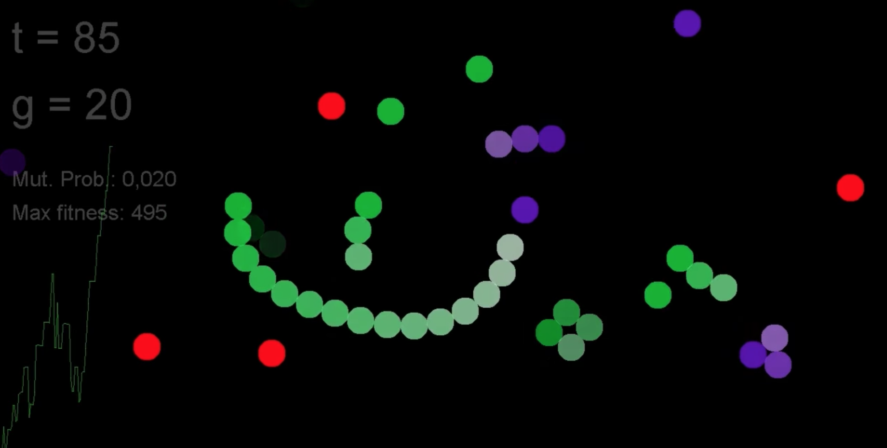
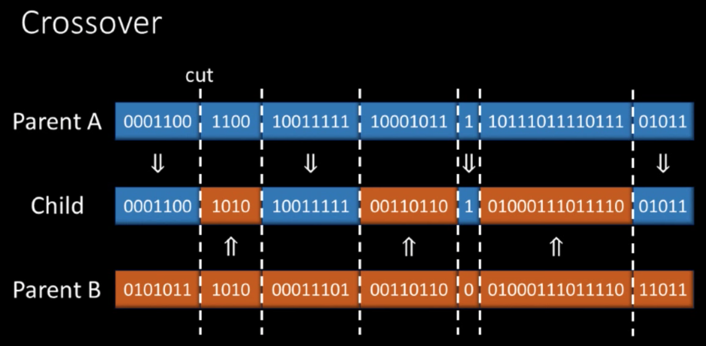
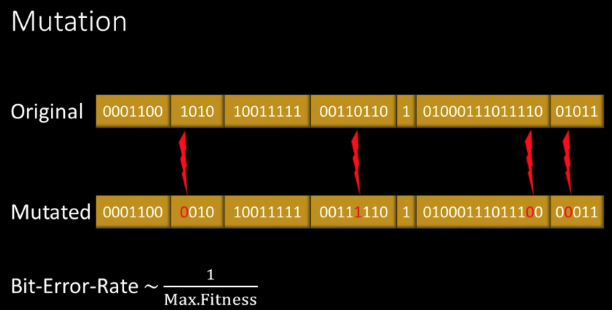

## 多角度贪吃蛇

项目地址：https://github.com/emgoz/Neural-network-snake

### 游戏玩法


（来源: [Snakes, Neural Networks and Genetic Algorithms](https://www.youtube.com/watch?v=BBLJFYr7zB8)）

游戏界面如上图。其中红色是食物，其它颜色都是正在存活的蛇。我们的目的是培育出最聪明的蛇。

### 环境互动

为了能够定义这样一只蛇，我们需要定义从环境中收集到的信息。我们可以把整个环境作为一个Bitmap输出。但是在这里，我们使用了蛇的视觉的方法。


（来源: [Snakes, Neural Networks and Genetic Algorithms](https://www.youtube.com/watch?v=BBLJFYr7zB8)）

如上图所示，我们让蛇在120度的范围内去观察，在16个扇区内看自己到墙、自己、食物的距离，于是得到了48个变量作为输入。

### 神经网络


（来源: [Snakes, Neural Networks and Genetic Algorithms](https://www.youtube.com/watch?v=BBLJFYr7zB8)）

将48个变量作为输入，我们可以进一步构建16和16的两层神经网络，最后输出是两个结果。并且在其中使用了非线性的Logistic的激励函数。这两个结果的差表示蛇的偏移角度。

### 基因算法

每条蛇的DNA由1091个byte构成，主要内容是神经网络的权重。

当一条蛇撞墙、装住自己，或者饿死后，会生成一只新的蛇。这条蛇的基因构建分为三步：选择、交叉、突变。

#### 选择

一条蛇的适应度函数有它的长度和健康度共同构成，健康度就是这条蛇有多么饥饿。一条一只抢不到食物的蛇的健康度会逐渐下降。


（来源: [Snakes, Neural Networks and Genetic Algorithms](https://www.youtube.com/watch?v=BBLJFYr7zB8)）

当我们要创建一只新的蛇的时候，我们首先以适应度为权重，选择出两条蛇，然后基于他们的DNA进行后续的操作。

#### 交叉


（来源: [Snakes, Neural Networks and Genetic Algorithms](https://www.youtube.com/watch?v=BBLJFYr7zB8)）

如上图所示，我们会首先对DNA进行随机切片，然后使用相同的概率选择任何一个父母的DNA切片，从而构建成新的DNA。这里有意思的是，切片可能在一个Byte内发生，所以能够部分引发更大的变异。

#### 突变


（来源: [Snakes, Neural Networks and Genetic Algorithms](https://www.youtube.com/watch?v=BBLJFYr7zB8)）

最后一步是在把父母基因拷贝到后代时的突变。这里的核心是如何决定突变的概率？越是初期，蛇的适应度越低，越应该更多的突变，以寻求更大的探索空间。因此突变的概率与当前蛇的最大适应度成反比。

### 系统架构


整个项目的架构如上图。位于正中间的是我们的蛇，它从右上角获得了构建自己每个球形节点的能力，从右下角获得了神经网络判断能力，从下方获得了DNA的能力。

左侧中间的GameLoop控制了游戏的运行，从上方构建了世界，然后从右方把蛇导入。最后左下方的游戏主程序负责启动整个项目。

让我们分别查看这些核心的代码：


#### MainWindow.java

```java

package main;

import gameEngine.GameLoop;
import helpers.KeyboardListener;
import javax.swing.JFrame;

public class MainWindow extends JFrame {
	/**
	 * 游戏的主程序
	 */
	public static void main(String[] args) {
		new MainWindow();
	}
	/**
	 * 基于JFrame创建界面
	 */
	public MainWindow() {
		setDefaultCloseOperation(EXIT_ON_CLOSE);
		setSize( 1000, 600);
		setExtendedState(MAXIMIZED_BOTH);
		setTitle("Neural Net Snake Genetic Algorithm");
		KeyboardListener keyb = new KeyboardListener();
		addKeyListener(keyb);
		add(new GameLoop(keyb));
		setVisible(true);
	}
}

```

#### World.java


```java

package gameEngine;

import java.awt.Color;
import java.awt.Graphics;
import java.util.LinkedList;
import java.util.concurrent.Semaphore;

public class World {
	/**
	 * 构建游戏的墙、食物、全局时钟
	 */
	public int height, width;
	public long clock;
	public int maxNibbles = 20;
	private Semaphore nibbleProtect = new Semaphore(1);
	private LinkedList<PhysicalCircle> nibbles = new LinkedList<PhysicalCircle>();

	public void newNibble(int n) { //创建食物
		try {
			nibbleProtect.acquire();
		} catch (InterruptedException e) {
			e.printStackTrace();
		}
		for (int i = 0; i < n; i++) {
			if (nibbles.size() >= maxNibbles)
				break;
			PhysicalCircle nibble = new PhysicalCircle(0, 0, GameLoop.globalCircleRadius);
			nibble.x = Math.random() * (width - 2 * nibble.rad) + nibble.rad;
			nibble.y = Math.random() * (height - 2 * nibble.rad) + nibble.rad;

			nibble.vx = 2 * (Math.random() - .5);
			nibble.vy = 2 * (Math.random() - .5);
			nibble.t = 0;
			nibbles.add(nibble);
		}
		nibbleProtect.release();
	}

	public LinkedList<PhysicalCircle> getNibbles() {
		return nibbles;
	}

	public int calcValue(PhysicalCircle p) {
		return (int) (5 + (8d * Math.min(Math.exp(-(double) (p.t - 800) / 2000d), 1)));
	}

	public void update(int w, int h) {
		this.width = w;
		this.height = h;
		for (PhysicalCircle p : nibbles) {
			p.updatePosition();
			p.collideWall(50, 50, w - 50, h - 50);
		}
		clock += GameLoop.UPDATEPERIOD;
	}

	public void draw(Graphics g) {
		g.setColor(Color.RED);
		for (PhysicalCircle nibble : nibbles) {
			g.fillOval((int) (nibble.x - nibble.rad), (int) (nibble.y - nibble.rad), (int) (2 * nibble.rad + 1), (int) (2 * nibble.rad + 1));
		}
	}

	public void removeNibbles(LinkedList<PhysicalCircle> rem) {
		try {
			nibbleProtect.acquire();
		} catch (InterruptedException e) {
			e.printStackTrace();
		}
		for (PhysicalCircle p : rem) {
			nibbles.remove(p);
		}
		nibbleProtect.release();
	}

	public void reset() {
		try {
			nibbleProtect.acquire();
		} catch (InterruptedException e) {
			e.printStackTrace();
		}
		nibbles.clear();
		nibbleProtect.release();
		clock = 0;
	}
}

```


#### PhysicalCircle.java

```java

package gameEngine;
import java.awt.Point;

public class PhysicalCircle {
	/*
	 * 创建一个球形，拥有位置、速度、半径等特征
	 */
	public double x;
	public double y;
	public double vx = 0;
	public double vy = 0;
	public double rad;
	public long t = 0;

	/**
	 * @return point
	 */

	public Point toPoint() {
		return new Point((int) x, (int) y);
	}

	/**
	 *
	 * @param x
	 * @param y
	 * @param rad	半径
	 */

	public PhysicalCircle(double x, double y, double rad) {
		this.x = x;
		this.y = y;
		this.rad = rad;
	}

	/**
	 *
	 * @param p		初始化用的点
	 */

	public PhysicalCircle(Point p) {
		this.x = p.x;
		this.y = p.y;
	}

	/**
	 * 计算和墙壁的碰撞
	 *
	 * @param xmin	left border
	 * @param ymin	top border
	 * @param xmax	right border
	 * @param ymax	bottom border
	 */

	public void collideWall(double xmin, double ymin, double xmax, double ymax) {
		if (x - rad < xmin) {
			x = xmin + rad;
			vx = -vx * .9;
		}
		if (x + rad > xmax) {
			x = xmax - rad;
			vx = -vx * .9;
		}
		if (y - rad < ymin) {
			y = ymin + rad;
			vy = -vy * .9;
		}
		if (y + rad > ymax) {
			y = ymax - rad;
			vy = -vy * .9;
		}
	}
	/**
	 * 限制速度
	 *
	 * @param maxspeed	最高速度
	 * @param fadeout	衰减因子
	 */
	public void constrainSpeed(double maxspeed, double fadeout) {
		vx *= fadeout;
		vy *= fadeout;
		if (Math.abs(vx) < .001)
			vx = 0;
		if (Math.abs(vy) < .001)
			vy = 0;
		if (vx > maxspeed)
			vx = maxspeed;
		if (vx < -maxspeed)
			vx = -maxspeed;
		if (vy > maxspeed)
			vy = maxspeed;
		if (vy < -maxspeed)
			vy = -maxspeed;
	}
	/**
	 * 基于速度更新位置
	 */
	public void updatePosition() {
		x += vx;
		y += vy;
	}

	/**
	 * 判断球形的相互碰撞
	 *
	 * @param o		另一个球形
	 */

	public void collideStatic(PhysicalCircle o) {
		if (this == o)
			return;
		double s = this.rad + o.rad;
		double d = Math.sqrt((this.x - o.x) * (this.x - o.x) + (this.y - o.y) * (this.y - o.y));
		double a = Math.atan2(this.y - o.y, this.x - o.x);

		if (d < s) {
			this.x = o.x + s * Math.cos(a);
			this.y = o.y + s * Math.sin(a);
		}

	}

	/**
	 * 判断和另一个球形的碰撞，并且弹开
	 *
	 * @param o		另一个球形
	 * @param speed	限速
	 */
	public void collideBouncy(PhysicalCircle o, double speed) {
		if (this == o)
			return;
		double s = this.rad + o.rad;
		double d = Math.sqrt((this.x - o.x) * (this.x - o.x) + (this.y - o.y) * (this.y - o.y));
		double a = Math.atan2(this.y - o.y, this.x - o.x);

		if (d < s) {
			this.x = o.x + s * Math.cos(a);
			this.y = o.y + s * Math.sin(a);
			this.vx -= (o.x - this.x) * 2 / d * speed / 5;
			this.vy -= (o.y - this.y) * 2 / d * speed / 5;
		}

	}

	/**
	 * 让球形跟着跑
	 *
	 * @param o 另一个球
	 */
	public void followBouncy(PhysicalCircle o) {
		if (this == o)
			return;
		double s = this.rad + o.rad;
		double a = Math.atan2(this.y - o.y, this.x - o.x);
		this.vx += (o.x + s * Math.cos(a) - this.x) / s / 32;
		this.vy += (o.y + s * Math.sin(a) - this.y) / s / 32;
		this.x += (o.x + s * Math.cos(a) - this.x) / s * 24 + o.vx * .24;
		this.y += (o.y + s * Math.sin(a) - this.y) / s * 24 + o.vy * .24;
	}
	/**
	 * 让球形挨着跑
	 *
	 * @param o 另一个球
	 */
	public void followStatic(PhysicalCircle o) {
		if (this == o)
			return;
		double s = this.rad + o.rad;
		double a = Math.atan2(this.y - o.y, this.x - o.x);
		this.x = (o.x + s * Math.cos(a));
		this.y = (o.y + s * Math.sin(a));
	}
	/**
	 * 判断两个球是否足够接近
	 *
	 * @param o	另一个球
	 * @param thresholdDistance		最近距离
	 * @return	是否足够接近
	 */
	public boolean isColliding(PhysicalCircle o, double thresholdDistance) {
		double d = Math.sqrt((this.x - o.x) * (this.x - o.x) + (this.y - o.y) * (this.y - o.y));
		double s = this.rad + o.rad;
		return d < s + thresholdDistance;
	}

	public double getAbsoluteVelocity() {
		return Math.sqrt(vx * vx + vy * vy);
	}

	public double getDistanceTo(PhysicalCircle o) {
		return Math.sqrt((this.x - o.x) * (this.x - o.x) + (this.y - o.y) * (this.y - o.y)) - (this.rad - o.rad) / 2;
	}

	public double getAngleTo(PhysicalCircle o) {
		return Math.atan2(o.y - this.y, o.x - this.x);
	}
}

```

#### Snake.java

```java

package gameEngine;

import genetics.DNA;
import helpers.DoubleMath;

import java.awt.Color;
import java.awt.Graphics;
import java.util.ArrayList;
import java.util.LinkedList;
import java.util.List;

import neuralNetwork.NeuralNet;
import neuralNetwork.Stage;

public class Snake {

	// 移动相关的常量
	public static final double maximumForwardSpeed = 5;
	public static final double maximumAngularSpeed = Math.PI / 32d;
	public static final double wallCollisionThreshold = 4;
	// 视野的常量:
	public static final double maximumSightDistance = 600;
	public static final double fieldOfView = Math.PI * 2 / 3;
	// 神经网络的常量:
	public static final int FOVDIVISIONS = 8;
	public static final int FIRSTSTAGESIZE = FOVDIVISIONS * 2 * 3;
	public static final int stageSizes[] = new int[] { FIRSTSTAGESIZE, 16, 16, 2 };
	public static final boolean isNNSymmetric = false;

	// 分数常量:
	public static final double nibblebonus = 20;
	public static final int healthbonus = 10; // 吃到食物后增加
	public static final double healthdecrement = .02; // 固定时间降低的比例

	// 彩蛋
	public final boolean displayCuteEyes = false; // 小彩蛋，是否有眼睛
	public final boolean snakeInertia = false;

	// 蛇的基本变量
	public ArrayList<PhysicalCircle> snakeSegments = new ArrayList<PhysicalCircle>(100);
	public DNA dna;
	public NeuralNet brainNet;
	public double age = 0;
	public double angle;
	public double score;
	public boolean isDead;
	public float hue;
	public double deathFade = 180;
	public double health;

	/**
	 * 用一个DNA初始化一条蛇
	 *
	 * @param dna
	 *            如果为null，随机生成DNA
	 * @param world
	 *            世界
	 */

	public Snake(DNA dna, World world) {
		double x = Math.random() * (world.width - 2 * wallCollisionThreshold - 2 * GameLoop.globalCircleRadius) + wallCollisionThreshold
				+ GameLoop.globalCircleRadius;
		double y = Math.random() * (world.height - 2 * wallCollisionThreshold - 2 * GameLoop.globalCircleRadius) + wallCollisionThreshold
				+ GameLoop.globalCircleRadius;

		int dnalength = NeuralNet.calcNumberOfCoeffs(stageSizes, isNNSymmetric) + 1;
		if (dna == null) {
			this.dna = new DNA(true, dnalength);
		} else {
			this.dna = dna;
		}
		snakeSegments.clear();
		for (int i = 0; i < 1; i++) {
			snakeSegments.add(new PhysicalCircle(x, y, GameLoop.globalCircleRadius));
		}
		this.angle = Math.atan2(world.height / 2 - y, world.width / 2 - x);
		// 初始化大脑的神经网络
		brainNet = new NeuralNet(stageSizes);
		reloadFromDNA();
		score = 0;
		deathFade = 180;
		isDead = false;
		health = healthbonus * 3 / 2;
		age = 0;
	}

	/**
	 * 从DNA导入数据
	 */
	public void reloadFromDNA() {
		if (isNNSymmetric)
			brainNet.loadCoeffsSymmetrical(this.dna.data);
		else
			brainNet.loadCoeffs(this.dna.data);
		this.hue = (float) this.dna.data[this.dna.data.length - 1] / 256f;
	}

	/**
	 * 移动、老化、碰撞
	 *
	 * @param world
	 *            游戏的世界
	 * @return 是否死掉
	 */
	public boolean update(World world) {
		if (isDead) {
			deathFade -= .6;
			return true;
		}
		age += .1;
		double slowdown = 49d / (48d + snakeSegments.size());
		PhysicalCircle head = snakeSegments.get(0);
		// 通过神经网络计算移动的角度偏移
		double angleIncrement = brain(world);

		angle += slowdown * angleIncrement;
		angle = DoubleMath.doubleModulo(angle, Math.PI * 2);

		// 碰墙
		if (head.x - head.rad < wallCollisionThreshold) {
			score /= 2;
			isDead = true;
		}
		if (head.x + head.rad > world.width - wallCollisionThreshold) {
			score /= 2;
			isDead = true;
		}
		if (head.y - head.rad < wallCollisionThreshold) {
			score /= 2;
			isDead = true;
		}
		if (head.y + head.rad > world.height - wallCollisionThreshold) {
			score /= 2;
			isDead = true;
		}
		// 主要的移动
		head.vx = maximumForwardSpeed * slowdown * Math.cos(angle);
		head.vy = maximumForwardSpeed * slowdown * Math.sin(angle);

		PhysicalCircle previous = head;
		for (int i = 0; i < snakeSegments.size(); i++) {
			PhysicalCircle c = snakeSegments.get(i);
			if (snakeInertia){
				c.followBouncy(previous);
			} else {
				c.followStatic(previous);
			}

			c.updatePosition();
			for (int j = 0; j < i; j++) {
				c.collideStatic(snakeSegments.get(j));
			}
			previous = c;
			if (i > 1 && head.isColliding(c, 0)) {
				isDead = true;
				score /= 2;
				break;
			}
		}
		// 吃食物
		LinkedList<PhysicalCircle> nibblesToRemove = new LinkedList<PhysicalCircle>();
		int nibbleEatCount = 0;
		for (PhysicalCircle nibble : world.getNibbles()) {
			if (head.isColliding(nibble, -10)) {
				score += world.calcValue(nibble);
				snakeSegments.add(new PhysicalCircle(snakeSegments.get(snakeSegments.size() - 1).x, snakeSegments.get(snakeSegments.size() - 1).y, nibble.rad));
				nibblesToRemove.add(nibble);
				nibbleEatCount++;
			}
		}
		score += nibbleEatCount * nibblebonus;
		world.newNibble(nibbleEatCount);
		world.removeNibbles(nibblesToRemove);

		// 健康度更新
		health += nibbleEatCount * healthbonus;
		if (health > 3 * healthbonus) // 吃饱了
			health = 3 * healthbonus;
		health -= healthdecrement;
		if (health <= 0) {
			isDead = true;
			score /= 2;
		}
		return !isDead;
	}

	/**
	 * 适应度函数
	 *
	 * @return 计算一条蛇的适应度
	 */
	public double getFitness() {
		return score + health / 4;
	}

	/**
	 * 用于视野的结构体
	 */
	public class Thing {
		public double distance = maximumSightDistance;
		public int type = 0;
		// 墙 = 0;
		// 自身 = 1;
		// 食物 = 2;
	}

	/**
	 * 大脑的计算
	 *
	 * @param world
	 *            游戏世界
	 * @return 角度的偏移量
	 */
	public double brain(World world) {
		// c初始化
		Thing input[] = new Thing[FOVDIVISIONS * 2];
		for (int i = 0; i < FOVDIVISIONS * 2; i++)
			input[i] = new Thing();
		// 看食物
		input = updateVisualInput(input, world.getNibbles(), 2);
		// 看自己
		input = updateVisualInput(input, snakeSegments, 1);
		// 看墙
		int step = (int) (maximumSightDistance * Math.sin(fieldOfView / (FOVDIVISIONS * 1d))) / 20;
		LinkedList<PhysicalCircle> walls = new LinkedList<PhysicalCircle>();
		for (int x = 0; x < world.width; x += step) {
			walls.add(new PhysicalCircle(x, 0, 1));
			walls.add(new PhysicalCircle(x, world.height, 1));
		}
		for (int y = 0; y < world.height; y += step) {
			walls.add(new PhysicalCircle(0, y, 1));
			walls.add(new PhysicalCircle(world.width, y, 1));
		}
		input = updateVisualInput(input, walls, 0);

		// 转化为神经网络的输入
		double stageA[] = new double[FIRSTSTAGESIZE]; // zeros initialized ;)
		if (isNNSymmetric) {
			for (int i = 0; i < FOVDIVISIONS; i++) {
				stageA[input[i].type * FOVDIVISIONS + i] = Stage.signalMultiplier * (maximumSightDistance - input[i].distance) / maximumSightDistance;
				stageA[FIRSTSTAGESIZE - 1 - (input[i + FOVDIVISIONS].type * FOVDIVISIONS + i)] = Stage.signalMultiplier
						* (maximumSightDistance - input[i + FOVDIVISIONS].distance) / maximumSightDistance;
			}
		} else {
			for (int i = 0; i < FOVDIVISIONS; i++) {
				stageA[input[i].type * FOVDIVISIONS * 2 + i] = Stage.signalMultiplier * (maximumSightDistance - input[i].distance) / maximumSightDistance;
				stageA[input[i + FOVDIVISIONS].type * FOVDIVISIONS * 2 + FOVDIVISIONS * 2 - 1 - i] = Stage.signalMultiplier
						* (maximumSightDistance - input[i + FOVDIVISIONS].distance) / maximumSightDistance;
			}
		}
		double output[] = brainNet.calc(stageA);
		double delta = output[0] - output[1];
		double angleIncrement = 10 * maximumAngularSpeed / Stage.signalMultiplier * delta;
		if (angleIncrement > maximumAngularSpeed)
			angleIncrement = maximumAngularSpeed;
		if (angleIncrement < -maximumAngularSpeed)
			angleIncrement = -maximumAngularSpeed;
		return angleIncrement;
	}

	/**
	 * 把看到的东西转化为可以后续计算的数组
	 *
	 * @param input
	 *            蛇看到的东西
	 * @param objects
	 *            需要检查的物体
	 * @param type
	 *            类型： 0: 墙, 1: 自己, 2: 食物
	 * @return 更新后的数组
	 */
	private Thing[] updateVisualInput(Thing input[], List<PhysicalCircle> objects, int type) {
		PhysicalCircle head = snakeSegments.get(0);
		for (PhysicalCircle n : objects) {
			if (head == n)
				continue;
			double a = DoubleMath.signedDoubleModulo(head.getAngleTo(n) - angle, Math.PI * 2);
			double d = head.getDistanceTo(n);
			if (a >= 0 && a < fieldOfView) {
				if (d < input[(int) (a * FOVDIVISIONS / fieldOfView)].distance) {
					input[(int) (a * FOVDIVISIONS / fieldOfView)].distance = d;
					input[(int) (a * FOVDIVISIONS / fieldOfView)].type = type;
				}
			} else if (a <= 0 && -a < fieldOfView) {
				if (d < input[(int) (-a * FOVDIVISIONS / fieldOfView) + FOVDIVISIONS].distance) {
					input[(int) (-a * FOVDIVISIONS / fieldOfView) + FOVDIVISIONS].distance = d;
					input[(int) (-a * FOVDIVISIONS / fieldOfView) + FOVDIVISIONS].type = type;
				}
			}
		}
		return input;
	}

	/**
	 * 把蛇画出来
	 *
	 * @param g
	 *            画的地方
	 */
	public void draw(Graphics g) {
		// 蛇的蛇体
		int alpha = (int) deathFade;
		for (int i = 0; i < snakeSegments.size(); i++) {
			Color c = new Color(Color.HSBtoRGB(hue, 1 - (float) i / ((float) snakeSegments.size() + 1f), 1));
			g.setColor(new Color(c.getRed(), c.getGreen(), c.getBlue(), alpha));
			PhysicalCircle p = snakeSegments.get(i);
			g.fillOval((int) (p.x - p.rad), (int) (p.y - p.rad), (int) (2 * p.rad + 1), (int) (2 * p.rad + 1));
		}
		// 眼睛
		if (displayCuteEyes) {

			PhysicalCircle p = snakeSegments.get(0); // 头
			double dist = p.rad / 2.3;
			double size = p.rad / 3.5;
			g.setColor(new Color(255, 255, 255, alpha));
			g.fillOval((int) (p.x + p.vy * dist / p.getAbsoluteVelocity() - size), (int) (p.y - p.vx * dist / p.getAbsoluteVelocity() - size),
					(int) (size * 2 + 1), (int) (size * 2 + 1));
			g.fillOval((int) (p.x - p.vy * dist / p.getAbsoluteVelocity() - size), (int) (p.y + p.vx * dist / p.getAbsoluteVelocity() - size),
					(int) (size * 2 + 1), (int) (size * 2 + 1));
			size = p.rad / 6;
			g.setColor(new Color(0, 0, 0, alpha));
			g.fillOval((int) (p.x + p.vy * dist / p.getAbsoluteVelocity() - size), (int) (p.y - p.vx * dist / p.getAbsoluteVelocity() - size),
					(int) (size * 2 + 1), (int) (size * 2 + 1));
			g.fillOval((int) (p.x - p.vy * dist / p.getAbsoluteVelocity() - size), (int) (p.y + p.vx * dist / p.getAbsoluteVelocity() - size),
					(int) (size * 2 + 1), (int) (size * 2 + 1));
		}
	}
}

```

#### GameLoop.java

```java

package gameEngine;

import genetics.DNA;
import helpers.KeyboardListener;

import java.awt.Color;
import java.awt.Font;
import java.awt.Graphics;
import java.util.ArrayList;
import java.util.Iterator;
import java.util.LinkedList;

import javax.swing.JComponent;

public class GameLoop extends JComponent {
	// 更新频率
	public static final long UPDATEPERIOD = 8;
	public double per = UPDATEPERIOD;

	// 常量
	public static final int globalCircleRadius = 20;
	public static final int numSnakes = 8;
	public static final int numNibbles = 4;

	// 基因参数初始化
	public static double mutationrate = .02;
	public double currentGeneration = 0;

	// 蛇和世界的初始化
	public World world = new World();
	public LinkedList<Snake> snakes = new LinkedList<Snake>();
	public LinkedList<Snake> backupSnakes = new LinkedList<Snake>();
	// 当前最优值
	public DNA bestDna = null;
	public double bestscore = 0;

	// 统计值
	public LinkedList<Double> fitnessTimeline = new LinkedList<Double>();
	public double currentMaxFitness = 0;

	// 相关控制
	public boolean singleSnakeModeActive = false;
	public boolean displayStatisticsActive = false;
	public boolean simulationPaused = false;

	/**
	 * 核心控制
	 */
	public GameLoop(KeyboardListener keyb) {
		world.height = 200;
		world.width = 300;
		new Thread(new Runnable() {
			private long simulationLastMillis;
			private long statisticsLastMillis;

			public void run() {
				simulationLastMillis = System.currentTimeMillis() + 100;
				statisticsLastMillis = 0;
				while (true) {
					if (System.currentTimeMillis() - simulationLastMillis > UPDATEPERIOD) {
						synchronized (snakes) {
							long currentTime = System.currentTimeMillis();
							// 键盘控制
							char keyCode = (char) keyb.getKey();
							switch (keyCode) {
							case ' ':
								if (!singleSnakeModeActive) {
									singleSnakeModeActive = true;
									displayStatisticsActive = false;
									backupSnakes.clear();
									backupSnakes.addAll(snakes);
									snakes.clear();
									snakes.add(new Snake(bestDna, world));
								}
								break;
							case 'A': // a = 暂定
								simulationPaused = true;
								break;
							case 'B': // b = 恢复
								simulationPaused = false;
								break;
							case 'C': // c = 显示状态
								displayStatisticsActive = true;
								break;
							case 'D': // d = 隐藏状态
								displayStatisticsActive = false;
								break;
							}
							// 初始化第一代蛇
							if (snakes.isEmpty()) {
								firstGeneration(numSnakes);
								world.newNibble(numNibbles);
							}
							// 计算
							if (!simulationPaused) {
								int deadCount = 0;
								world.update(getWidth(), getHeight());
								synchronized (fitnessTimeline) {
									if (world.clock - statisticsLastMillis > 1000 && !singleSnakeModeActive) {
										fitnessTimeline.addLast(currentMaxFitness);
										currentMaxFitness = 0;
										if (fitnessTimeline.size() >= world.width / 2) {
											fitnessTimeline.removeFirst();
										}
										statisticsLastMillis = world.clock;
									}
								}
								for (Snake s : snakes) {
									if (!s.update(world)) {
										deadCount++;
									}
									if (s.getFitness() > currentMaxFitness)
										currentMaxFitness = s.getFitness();
									if (s.getFitness() > bestscore) {
										bestscore = s.getFitness();
										bestDna = s.dna;
									}
								}
								if (deadCount > 0 && singleSnakeModeActive) {
									singleSnakeModeActive = false;
									snakes.clear();
									snakes.addAll(backupSnakes);

								} else {
									// new snakes
									for (int i = 0; i < deadCount; i++) {
										newSnake();
										currentGeneration += 1 / (double) numSnakes;
									}
								}
								Iterator<Snake> it = snakes.iterator();
								while (it.hasNext()) {
									Snake s = it.next();
									if (s.deathFade <= 0) {
										it.remove();
									}
								}
							} else {
								// print status:
								snakes.get(0).brain(world);
							}

							repaint();
							per = System.currentTimeMillis() - currentTime;
							simulationLastMillis += UPDATEPERIOD;
						}
					}
				}
			}
		}).start();
	}

	/**
	 * 初始化n条蛇
	 *
	 * @param n
	 *            蛇的数量
	 */
	public void firstGeneration(int n) {
		snakes.clear();
		for (int i = 0; i < n; i++) {
			snakes.add(new Snake(null, world));
		}
		world.reset();
	}

	/**
	 * 创建繁衍池
	 *
	 * @return 用于繁衍的蛇的列表
	 */
	public ArrayList<Snake> makeMatingpool() {
		ArrayList<Snake> matingpool = new ArrayList<Snake>();
		// 得到最大的生存度
		double maxscore = 0;
		for (Snake s : snakes) {
			if (s.getFitness() > maxscore) {
				maxscore = s.getFitness();
			}
		}
		// 基于生存度添加不同数量的蛇的副本
		for (Snake s : snakes) {
			int amount = (int) (s.getFitness() * 100 / maxscore);
			for (int i = 0; i < amount; i++) {
				matingpool.add(s);
			}
		}
		return matingpool;
	}

	/**
	 * 基于基因算法生成一条新蛇
	 */
	public void newSnake() {
		mutationrate = 10 / currentMaxFitness;
		ArrayList<Snake> matingpool = makeMatingpool();
		int idx1 = (int) (Math.random() * matingpool.size());
		int idx2 = (int) (Math.random() * matingpool.size());
		DNA parentA = matingpool.get(idx1).dna;
		DNA parentB = matingpool.get(idx2).dna;
		snakes.add(new Snake(parentA.crossoverBytewise(parentB, mutationrate), world));
	}

	/**
	 * 画图
	 */
	protected void paintComponent(Graphics g) {
		super.paintComponent(g);
		// 背景
		g.setColor(Color.black);
		g.fillRect(0, 0, getWidth(), getHeight());

		// 状态
		if (displayStatisticsActive) {
			g.setColor(Color.DARK_GRAY);
			g.setFont(new Font("Arial", 0, 64));
			g.drawString("t = " + Long.toString(world.clock / 1000), 20, 105);

			g.drawString("g = " + Integer.toString((int) currentGeneration), 20, 205);
			g.setFont(new Font("Arial", 0, 32));
			g.drawString("Mut. Prob.: " + String.format("%1$,.3f", mutationrate), 20, 305);
			g.drawString("Max fitness: " + Integer.toString((int) currentMaxFitness), 20, 355);

			// 时间线
			synchronized (fitnessTimeline) {
				if (!fitnessTimeline.isEmpty()) {
					double last = fitnessTimeline.getFirst();
					int x = 0;
					double limit = getHeight();
					if (limit < bestscore)
						limit = bestscore;
					for (Double d : fitnessTimeline) {
						g.setColor(new Color(0, 1, 0, .5f));
						g.drawLine(x, (int) (getHeight() - getHeight() * last / limit), x + 2, (int) (getHeight() - getHeight() * d / limit));
						last = d;
						x += 2;
					}
				}
			}
		}
		// 神经网络
		if (singleSnakeModeActive) {
			snakes.getFirst().brainNet.display(g, 0, world.width, world.height);
		}
		// 蛇
		synchronized (snakes) {
			for (Snake s : snakes)
				s.draw(g);
			world.draw(g);
		}
	}

}

```

#### DNA.java

```java

package genetics;

import java.util.Arrays;
import java.util.Random;

public class DNA {
	/**
	 * 实现DNA建模、交叉、变异
	 */
	public Random random = new Random();
	public byte data[];

	public DNA(boolean random, int size){
		data = new byte[size];

		for (int i = 0; i < data.length; i++){
			data[i] = random?(byte)Math.floor(Math.random()*256d):0;
		}
	}
	/**
	 * 基于两个DNA生成新的DNA，包括交叉和变异，byte级别
	 */
	public DNA crossoverNoise(DNA other, double mutationprob){  //按照byte变异
		DNA newdna = new DNA(false, data.length);
		int numswaps = data.length/10;
		int swaps[] = new int[numswaps+1];
		for (int i = 0; i < swaps.length-1; i++){
			swaps[i] = (int)Math.floor(Math.random()*data.length);
		}
		swaps[numswaps] = data.length;  //save last
		Arrays.sort(swaps);
		int swapidx = 0;
		boolean that = true;
		for (int i = 0; i < data.length; i++){
			if (i >= swaps[swapidx]){
				swapidx++;
				that = !that;
			}
			byte d = 0;
			if (that){
				d = this.data[i];
			}
			else {
				d = other.data[i];
			}
			d += (byte)(random.nextGaussian()*mutationprob*256);
			newdna.data[i] = d;
		}
		return newdna;
	}
	/**
	 * Gaussian变异
	 */
	public void mutateNoise(double prob, double mag){
		for (int i = 0; i < data.length; i++){
			if (Math.random() < prob) data[i] += (byte)(random.nextGaussian()*mag*256);
		}
	}
	/**
	 * 基于两个DNA生成新的DNA，包括交叉和变异，bit级别
	 */
	public DNA crossover(DNA other, double mutationprob){
		DNA newdna = new DNA(false, data.length);
		int numswaps = data.length/8;
		int swaps[] = new int[numswaps+1];
		for (int i = 0; i < swaps.length-1; i++){
			swaps[i] = (int)Math.floor(Math.random()*8*data.length);
		}
		swaps[numswaps] = 8*data.length;
		Arrays.sort(swaps);
		int swapidx = 0;
		boolean that = true;
		for (int i = 0; i < 8*data.length; i++){
			if (i >= swaps[swapidx]){
				swapidx++;
				that = !that;
			}
			int bit = 0;
			if (that){
				bit = ((this.data[i/8] >> (i%8)) & 1);
			}
			else {
				bit = ((other.data[i/8] >> (i%8)) & 1);
			}
			if (Math.random() < mutationprob) bit = 1-bit;
			newdna.data[i/8] |= (bit << (i%8));
		}
		return newdna;
	}
	/**
	 * 基于两个DNA生成新的DNA，包括交叉和变异；byte级别交叉，bit级别变异
	 */
	public DNA crossoverBytewise(DNA other, double mutationprob){
		DNA newdna = new DNA(false, data.length);
		int numswaps = data.length/8;
		int swaps[] = new int[numswaps+1];
		for (int i = 0; i < swaps.length-1; i++){
			swaps[i] = 8*(int)Math.floor(Math.random()*data.length);
		}
		swaps[numswaps] = 8*data.length;  //save last
		Arrays.sort(swaps);
		int swapidx = 0;
		boolean that = true;
		for (int i = 0; i < 8*data.length; i++){
			if (i >= swaps[swapidx]){
				swapidx++;
				that = !that;
			}
			int bit = 0;
			if (that){
				bit = ((this.data[i/8] >> (i%8)) & 1);
			}
			else {
				bit = ((other.data[i/8] >> (i%8)) & 1);
			}
			if (Math.random() < mutationprob) bit = 1-bit;
			newdna.data[i/8] |= (bit << (i%8));
		}
		return newdna;
	}
}

```

#### NeuralNet.java

```java

package neuralNetwork;

import java.awt.BasicStroke;
import java.awt.Color;
import java.awt.Graphics;
import java.awt.Graphics2D;

public class NeuralNet {
	public Stage stages[];

	/**
	 * C'tor
	 *
	 * @param stageSizes
	 *            定义每一层的节点数，例如
	 *            {48,16,16,2}
	 */
	public NeuralNet(int stageSizes[]) {
		stages = new Stage[stageSizes.length];
		Stage prev = null;
		for (int i = 0; i < stageSizes.length; i++) {
			stages[i] = new Stage(prev, stageSizes[i]);
			prev = stages[i];
		}
	}

	/**
	 * 导入权重
	 * @param coeffs	参数范围 -128 到 +127
	 */
	public void loadCoeffs(byte coeffs[]) {
		int idx = 0;
		for (int s = 1; s < stages.length; s++) {
			for (int i = 0; i < stages[s].coeffs.length; i++) {
				for (int j = 0; j < stages[s].coeffs[0].length; j++) {
					stages[s].coeffs[i][j] = coeffs[idx++];
				}
			}
		}
	}

	/**
	 * 导入权重，但是对称的载入
	 * @param coeffs 参数范围 -128 到 +127
	 */

	public void loadCoeffsSymmetrical(byte coeffs[]) {
		int idx = 0;
		for (int s = 1; s < stages.length; s++) {
			if (stages[s].coeffs.length % 2 == 1) {
				System.err.println("Symmetrical Net without even sized stages. Bad.");
				return;
			}
			for (int i = 0; i < (stages[s].coeffs.length) / 2; i++) {
				for (int j = 0; j < stages[s].coeffs[0].length; j++) {
					stages[s].coeffs[i][j] = coeffs[idx];
					stages[s].coeffs[stages[s].coeffs.length - 1 - i][stages[s].coeffs[0].length - 1 - j] = coeffs[idx++];
				}
			}
		}
	}

	/**
	 * 基于输出计算神经网络输出
	 *
	 * @param input		输入的第一层值
	 * @return			输出的值
	 */

	public double[] calc(double input[]) {
		for (int i = 0; i < input.length; i++) {
			stages[0].output[i] = input[i];
		}
		for (int i = 1; i < stages.length; i++) {
			stages[i].calc();
		}
		return stages[stages.length - 1].output;
	}
	/**
	 * 计算需要的权重个数，用来计算DNA的长度
	 *
	 * @param stageSizes	定义神经网络的结构，例如
	 *           			 {48,16,16,2}
	 * @param symmetrical	网络是否对称
	 * @return				需要的权重个数
	 */

	public static int calcNumberOfCoeffs(int stageSizes[], boolean symmetrical) {
		int sum = 0;
		if (stageSizes.length < 2)
			return 0;
		for (int i = 1; i < stageSizes.length; i++) {
			if (symmetrical)
				sum += (stageSizes[i] * (stageSizes[i - 1] + 1) + 1) / 2;
			else
				sum += stageSizes[i] * (stageSizes[i - 1] + 1);
		}

		return sum;
	}

	public String toString() {
		String k = "";
		for (int s = 1; s < stages.length; s++) {
			k += "\nStage " + s + ": \n" + stages[s].toString();
		}
		return k;
	}

	/**
	 * 画出当前的神经网络
	 *
	 * @param g		画的地方
	 * @param alpha	透明度 0 .. 1
	 * @param w		宽度
	 * @param h		高度
	 */
	public void display(Graphics g, float alpha, double w, double h) {
		Graphics2D g2 = (Graphics2D) g;
		int d = 20;

		// 突触
		for (int s = 1; s < stages.length; s++) {
			int x1 = (s) * (int) (w / (stages.length + 1));
			int x2 = (s + 1) * (int) (w / (stages.length + 1));

			for (int i = 0; i < stages[s].coeffs.length; i++) {
				for (int j = 0; j < stages[s].coeffs[0].length - 1; j++) {
					int c = stages[s].coeffs[i][j];
					if (Math.abs(c) < 48)
						continue;
					g2.setStroke(new BasicStroke(Math.abs(c) * 3 / 129));

					int y1 = (j + 1) * (int) (h / (stages[s - 1].output.length + 1));
					int y2 = (i + 1) * (int) (h / (stages[s].output.length + 1));
					float b = (float) (stages[s - 1].output[j] / Stage.signalMultiplier);
					if (c < 0)
						g.setColor(new Color(b, 0, 0));
					else
						g.setColor(new Color(0, b, 0));
					g2.drawLine(x1, y1, x2, y2);
				}
			}
		}

		// 神经元
		for (int s = 0; s < stages.length; s++) {
			int x = (s + 1) * (int) (w / (stages.length + 1));
			d = (int) (h / (stages[s].output.length + 7));
			for (int i = 0; i < stages[s].output.length; i++) {
				int y = (i + 1) * (int) (h / (stages[s].output.length + 1));

				float output = (float) (stages[s].output[i] / Stage.signalMultiplier * .8 + .2);
				g.setColor(new Color(Color.HSBtoRGB(.6f, 1, output)));
				g.fillOval(x - d / 2, y - d / 2, d, d);
			}
		}

	}
}

```

#### Stage.java

```java

package neuralNetwork;

public class Stage {

	public static final double signalMultiplier = .1;

	public Stage prev;
	public double output[];
	public byte coeffs[][];

	public Stage(Stage prev, int size){
		this.prev = prev;
		output = new double[size];
		if (prev != null)
			coeffs = new byte[size][prev.output.length+1];
		else
			coeffs = new byte[0][0];
	}
	/**
	 * 基于输入，计算输出
	 */
	public void calc(){
		if (prev == null) return;
		for (int i = 0; i < coeffs.length; i++){
			double sum = 0;
			for (int j = 0; j < coeffs[0].length-1; j++){
				sum += coeffs[i][j]*prev.output[j];
			}
			sum += coeffs[i][coeffs[0].length-1]*signalMultiplier;
			output[i] = sigmoid(sum);
		}
	}
	public static double sigmoid(double x) {
		return signalMultiplier/(1+Math.exp(-x/2d));
	}
	public String toString(){
		String k = "[";
		for (int i = 0; i< coeffs.length; i++){
			k += "[";
			for (int j = 0; j < coeffs[0].length; j++){
				k += Byte.toString(coeffs[i][j])+" ";
			}
			k += "]\n ";
		}
		k+= "]\n";
		return k;
	}

}

```

#### DoubleMath.java

```java

package helpers;

public class DoubleMath {
	public static double doubleModulo(double a, double b){
		int k = (int)(a/b);
		if (a < 0) k--;
		return a-b*k;
	}
	public static double signedDoubleModulo(double a, double b){
		double c = doubleModulo(a, b);
		if (c >= b/2) c-=b;
		return c;
	}
}

```


#### KeyboardListener.java

```java

package helpers;

import java.awt.event.KeyEvent;
import java.awt.event.KeyListener;

public class KeyboardListener implements KeyListener {

	private int code = 0;
	@Override
	public void keyPressed(KeyEvent e) {
		code = e.getKeyCode();
	}
	@Override
	public void keyReleased(KeyEvent e) {
		code = 0;
	}
	@Override
	public void keyTyped(KeyEvent arg0) {

	}
	public int getKey() {
		return code;
	}
}


```

### 总结

综上所述，我们学习了一个基于遗传基因算法的人工智能的贪吃蛇的实现。让我们进一步学习更多的实现方法，来掌握不同的人工智能算法之间的异同和取舍。

## 参考资料
- [Snakes, Neural Networks and Genetic Algorithms](https://www.youtube.com/watch?v=BBLJFYr7zB8)
- [Neural-network-snake](https://github.com/emgoz/Neural-network-snake)
