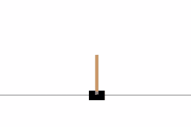
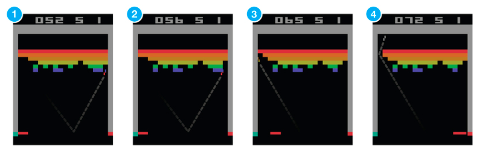
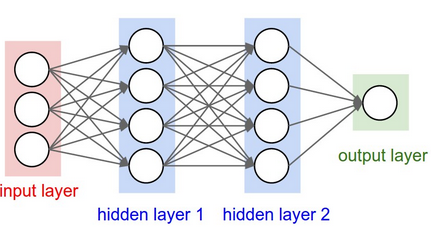
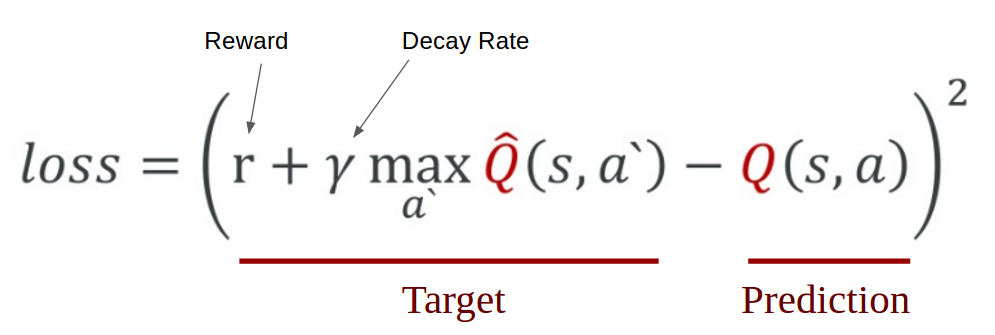
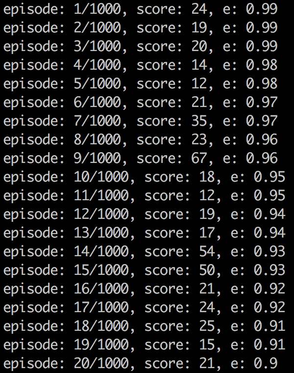
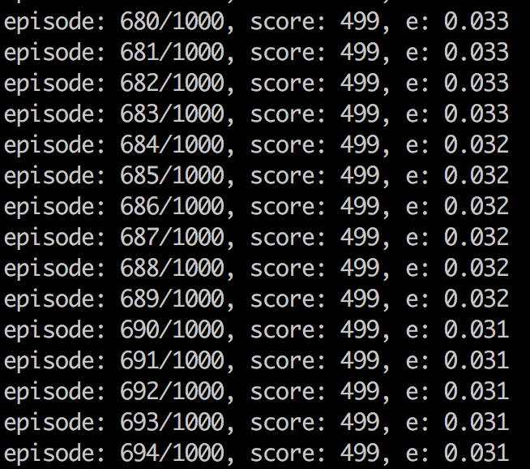

# 如何让人工智能玩CartPole

这是一个经典的立竿子游戏，如下图所示。



(来源: [Deep Q-Learning with Keras and Gym
](https://keon.io/deep-q-learning/))

## 什么是强化学习


强化学习是机器学习的一种，它会训练一个人工智能代理，这个代理通过与环境的交互来学习。这个过程如同我们学习骑自行车，是一个试错的过程。

(来源: [Deep Q-Learning with Keras and Gym
](https://keon.io/deep-q-learning/))

如上图所示，其中的大脑代表人工智能代理。在每一步行动之后，代理会收到反馈。反馈由奖励和新的环境状态组成。奖励通常由人来定义，例如对于骑自行车，我们可以把奖励定义为离开原点的距离。

## 什么是深度强化学习

在Google的DeepMind在2013年发表的论文[《通过深度强化学习来玩游戏》](https://arxiv.org/abs/1312.5602)中介绍了Deep Q Network。论文中介绍的人工智能代理能够在没有任何游戏背景知识的基础上通过观察屏幕来学会玩游戏。

[](http://www.youtube.com/watch?v=V1eYniJ0Rnk "")



(来源: [Deep Q-Learning with Keras and Gym
](https://keon.io/deep-q-learning/))


在Q学习算法中，需要定义一个基于状态评估奖励的Q函数。在Q(s,a)中，S代表状态，a代表行动，Q函数的值是对未来的预期。

## 如何与立竿子游戏交互

我们通常需要几个小时到几天来训练一个能够玩红白机游戏的代理，因此我们使用立竿子这样一个简单的游戏来举例子。

立竿子游戏也是OpenAI Gym里面最简单的游戏之一。这个游戏的目标是平衡一个小车上面连接的杆子。除了像素信息，我们还有四个状态信息，例如杆子的角度和小车的位置。一个代理可以有两个操作：0代表向左走，1代表向右走。

Gym中与游戏环境交互的方式如下：

```python
next_state, reward, done, info = env.step(action)
```

其中，action是0或1。我们输入action，会返回结果。next_state是指下一个状态，reward是指奖励；info是相关的信息；done表示游戏是否结束。

## 如何实现神经网络

我们把神经网络当成有输出和输出的黑盒子。它通过对输入数据和输出数据的学习，从中找出特征，从而能够预测出新的输入数据的输出结果。



(来源: [Deep Q-Learning with Keras and Gym
](https://keon.io/deep-q-learning/))

我们构建的神经网络如上图类似，但是输入层有四个点，中间两层有24个点，输出层有两个点（表示两个按钮）。

我们可以基于Keras实现这样的神经网络。具体代码如下，

```python

# 神经网络
# Sequential() 创建最基本的结构
model = Sequential()
# 'Dense' 表示神经网络的一层
# 输入层是4个点，隐藏层有24个点
model.add(Dense(24, input_dim=self.state_size, activation='relu'))
# 再添加一个有24个点的隐藏层
model.add(Dense(24, activation='relu'))
# 输出层有两个点，表示左边和右边
model.add(Dense(self.action_size, activation='linear'))
# 基于上述的信息创建模型
model.compile(loss='mse',
              optimizer=Adam(lr=self.learning_rate))

```

我们现在需要训练这个网络，fit()会输入input和output的数据到模型中，进行训练，从而得到能够预测的模型。

```python

model.fit(state, reward_value, epochs=1, verbose=0)

```

## 如何实现DQN

得分往往是游戏的奖励，在我们立竿子的游戏中，当杆子向右倾斜的时候，我们向右移动的奖励应该大于向左移动的奖励，从而让我们存活的更长久。

为了能够训练代理，我们需要从数学上进行表示。Loss表示的是我们的预测值与实际目标之间的差异。于是，我们的定义如下：



(来源: [Mathematical representation of Q-learning from Taehoon Kim’s](https://www.slideshare.net/carpedm20/ai-67616630))

我们执行动作a，然后观察奖励r和新的状态s'。然后我们能够计算出最大的Q，并且进行衰减，从而保证了未来的奖励权重要小于当前的奖励。于是，我们把当前的奖励和衰减后的未来奖励求和，得到了目标值；我们进而减去当前的预测值，从而得到了loss。对这个值求平方让我们关注在预测的差异，并且更加惩罚更大的差异。

Keras会计算整个过程，我们只需要定义出target：

```python
target = reward + gamma * np.amax(model.predict(next_state))
```

Keras会进行减法和平方运算，并且应用之前定义的学习率。这些都在fit函数中被执行。一步一步的基于学习率减少我们的预测值与真是值之间的差异。于是loss越来越小。

## 如何记忆

接下来，我们会介绍DQN另外两个核心算法：记忆和重放。

DQN的一个问题在于总是会用新的记忆覆盖旧的记忆，于是我们保存之前的一系列经历进行重新训练。记录这些记忆的函数称之为memory，我们通过remember函数把state、action、reward、next state加入到memory。在我们例子中memory的代码如下：

```python
memory = [(state, action, reward, next_state, done)...]
```

而remember的代码如下：

```python
def remember(self, state, action, reward, next_state, done):
    self.memory.append((state, action, reward, next_state, done))
```


## 如何重放

我们之后可以使用replay利用memory中的记忆进行训练。我们首先从memory中读取一部分记忆，保存在minibatch中。

```python
minibatch = random.sample(self.memory, batch_size)
```

在我们的这个例子中，我们设置batch_size为32。

为了能够让模型考虑到长期的情况，我们还需要考虑到未来的reward。因此我们需要有一个衰减比率。于是我们的代理可以最大化未来的衰减。

```python
# 从memory中抽取sample
minibatch = random.sample(self.memory, batch_size)
# 对于minibatch的每一个记忆进行训练
for state, action, reward, next_state, done in minibatch:
    target = reward
    if not done: # 如果没有停止
      # 预测未来的奖励
      target = reward + self.gamma * \
               np.amax(self.model.predict(next_state)[0])
    # 计算我们的目标target_f
    target_f = self.model.predict(state)
    target_f[0][action] = target
    # 基于状态state和目标target_f进行训练
    self.model.fit(state, target_f, epochs=1, verbose=0)
```

## 如何决定行为

我们的代理会按照exploration rate也就是epsilon来随机选择行为。因为一开始最好是探索这个世界。探索期后，代理会基于当前状态选择预期reward最大的行为。np.argmax()会在act_values[0]中选择最大的值。

```python
def act(self, state):
    if np.random.rand() <= self.epsilon:
        # 随机选择
        return env.action_space.sample()
    # 基于当前状态预测reward
    act_values = self.model.predict(state)
    # 选择reward最大的
    return np.argmax(act_values[0])
```
act_values[0]的结果类似于：[0.67, 0.2]，表示的是选择某个行为后预测的奖励，argmax选择出最高值的index。在这个例子中会返回0。

## 超参

一些参数被用于强化学习。
- episodes - 代理玩的游戏次数
- gamma - 未来奖励的衰减因子
- epsilon - 随机行动的概率
- epsilon_decay - 随机行动概率的衰减因子
- epsilon_min - 至少随机探索的概率
- learning_rate - 学习率


Putting It All Together: Coding The Deep Q-Learning Agent
I explained each part of the agent in the above. The code below implements everything we’ve talked about as a nice and clean class called DQNAgent.

# 代理的代码

```python
class DQNAgent:
    def __init__(self, state_size, action_size):
        self.state_size = state_size
        self.action_size = action_size
        self.memory = deque(maxlen=2000)
        self.gamma = 0.95    # 衰减因子
        self.epsilon = 1.0  # 探索概率
        self.epsilon_min = 0.01 # 最少随机探索概率
        self.epsilon_decay = 0.995 # 随机行动概率的衰减因子
        self.learning_rate = 0.001 # 学习率
        self.model = self._build_model() # 建立几个架构
    def _build_model(self):
        # 构建神经网络
        model = Sequential()
        model.add(Dense(24, input_dim=self.state_size, activation='relu'))
        model.add(Dense(24, activation='relu'))
        model.add(Dense(self.action_size, activation='linear'))
        model.compile(loss='mse',
                      optimizer=Adam(lr=self.learning_rate))
        return model
    def remember(self, state, action, reward, next_state, done):
        self.memory.append((state, action, reward, next_state, done))
    def act(self, state):
        if np.random.rand() <= self.epsilon:
            return random.randrange(self.action_size)
        act_values = self.model.predict(state)
        return np.argmax(act_values[0])  # returns action
    def replay(self, batch_size):
        minibatch = random.sample(self.memory, batch_size)
        for state, action, reward, next_state, done in minibatch:
            target = reward
            if not done:
              target = reward + self.gamma * \
                       np.amax(self.model.predict(next_state)[0])
            target_f = self.model.predict(state)
            target_f[0][action] = target
            self.model.fit(state, target_f, epochs=1, verbose=0)
        if self.epsilon > self.epsilon_min:
            self.epsilon *= self.epsilon_decay
```

## 训练过程的代码

```python

if __name__ == "__main__":
    # 初始化GYM的环境
    env = gym.make('CartPole-v0')
    agent = DQNAgent(env)
    # 迭代游戏
    for e in range(episodes):
        # 首先重制状态
        state = env.reset()
        state = np.reshape(state, [1, 4])
        # time_t 游戏的每一帧
        # 目标：立竿子直到得到500分
        for time_t in range(500):
            # 是否画图，可以打开
            # env.render()
            # 决定行为
            action = agent.act(state)
            # 基于当前状态进入下一个状态
            # 每存活一帧，奖励1分
            next_state, reward, done, _ = env.step(action)
            next_state = np.reshape(next_state, [1, 4])
            # 记录之前的state、action、reward、done
            agent.remember(state, action, reward, next_state, done)
            # 仅需下一个状态
            state = next_state
            # 结束的两个可能：杆子倒下或者得到500分
            if done:
                # print the score and break out of the loop
                print("episode: {}/{}, score: {}"
                      .format(e, episodes, time_t))
                break
        # 重放训练
        agent.replay(32)
```

## 结果展示

游戏一开始是随机的行为：



经历了多轮学习后，
- 小车能够平衡杆子
- 走出边界失败
- 当过于靠近边界时，尝试离开，但是会掉下来杆子
- 开始平衡的操作
- 经历了几百轮（大概10分钟）的学习，终于开始成为大师




于是，一位立竿子大师诞生了。


(来源: [Deep Q-Learning with Keras and Gym
](https://keon.io/deep-q-learning/))

## 后记

到目前为止其实只是一个开始，让我们访问github，看到最新的进展：[keon/deep-q-learning](https://github.com/keon/deep-q-learning)

## 参考资料
- [Deep Q-Learning with Keras and Gym
](https://keon.io/deep-q-learning/)
- [My Journey Into Deep Q-Learning with Keras and Gym](https://medium.com/@gtnjuvin/my-journey-into-deep-q-learning-with-keras-and-gym-3e779cc12762)
