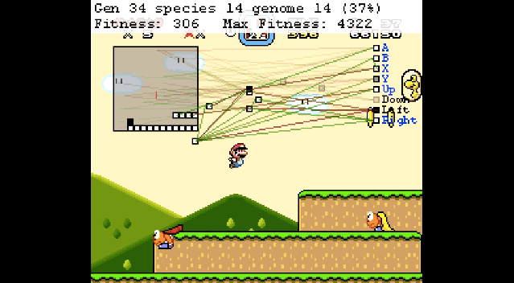
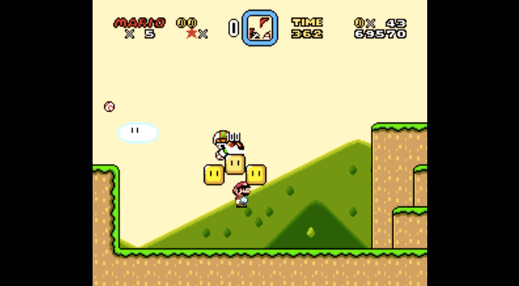
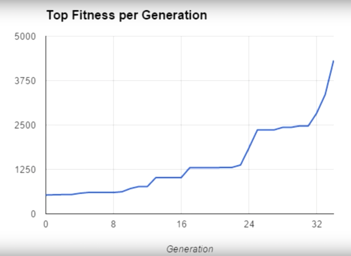
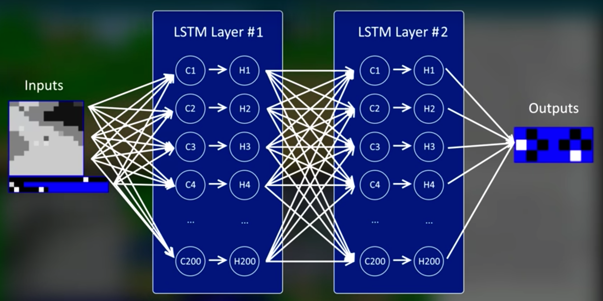
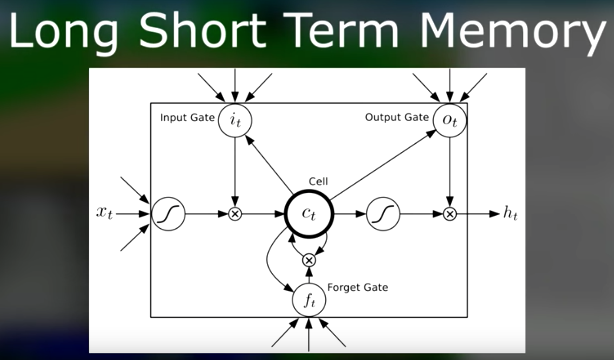
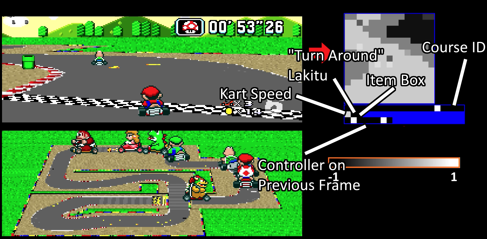
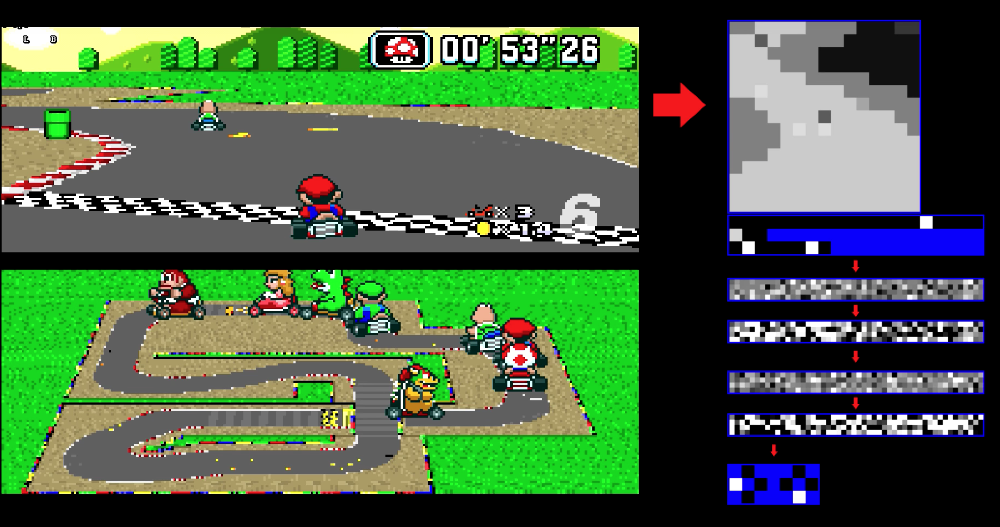
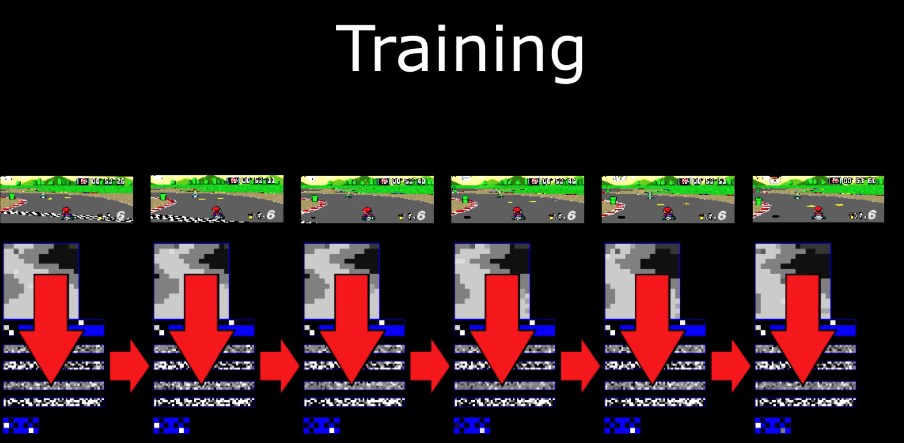
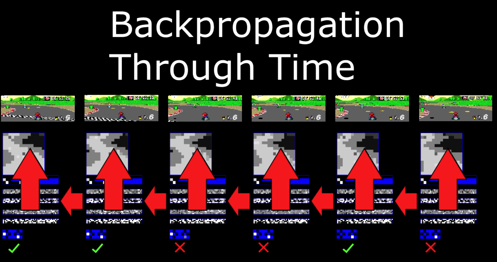
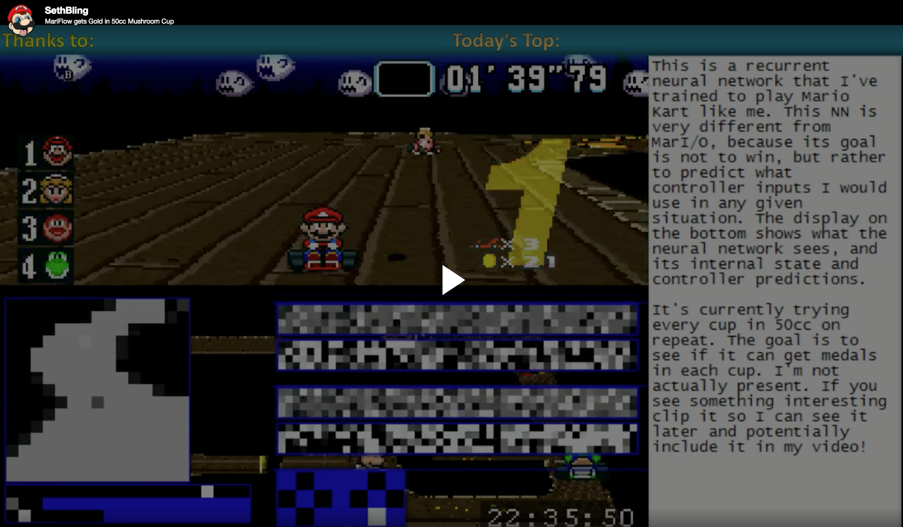

# 如何让人工智能通关马里奥

## 观看视频

上篇：

## 马里奥世界

想深入了解如何通关马里奥，不得不提起SethBling。他在2015年6月设计了人工智能算法Marl/O。

上面的视频就是SethBling对整个算法的讲解，一共用了24个小时的学习达到了当前的水准。这个算法每一代尝试300种基因，然后分类到不同的类别中。每个基因代表一个神经网络，而神经网络的适应度是马里奥能够到达右侧多远的距离，以及到达的时间。只有最适应的一批基因能够遗传到下一代。

(来源: [MarI/O running Super Mario World. ](https://www.youtube.com/watch?v=qv6UVOQ0F44))

神经网络的输入数据是什么？我们从上图左侧的方框内能够看到，其中的白色是能够站在上面的标记，其中的黑色是能够伤害到马里奥的标记（当然能够吃的蘑菇也是黑色的），而其中的红线表示马里奥当前的位置。

在整个神经网络中，绿色表示正向的联系，红色表示负向的联系。最右侧的一列表示按键，白色表示按下了这个按钮。

虽然上图中的马里奥英明神武，但是当马里奥刚刚开始学习的时候，十分小心翼翼，这让我想起了我一岁女儿探索世界的经历。如下图所示，马里奥在一步一停的看着世界。

(来源: [MarI/O running Super Mario World. ](https://www.youtube.com/watch?v=qv6UVOQ0F44))

当然啦，随着马里奥的学习，他逐渐掌握了高级的技能，比如下图中，能够抓准时机从几个敌人中间跳过去。

(来源: [MarI/O running Super Mario World. ](https://www.youtube.com/watch?v=qv6UVOQ0F44))

我们用到的神经网络算法叫做[NEAT（NeuroEvolution of Augmenting Topologies）](http://www.cs.ucf.edu/~kstanley/neat.html)，大家可以点击链接去深入了解。

(来源: [MarI/O running Super Mario World. ](https://www.youtube.com/watch?v=qv6UVOQ0F44))

我们能够从上图中看出随着每一代的进化，马里奥的适应度在逐渐增强，这也往往是一个量变到质变的过程，会发生连续很多代没有显著提升的情况。

好啦，现在[下载源码](https://pastebin.com/ZZmSNaHX)，自己跑一下吧。

我们也要看出，这时候的马里奥依然接受了大量的标记。如何让马里奥在一个更不可知的世界里探索呢？大家可以通过最新的[OpenAI的挑战赛](../../RetroContest/README.md)来深入探索。

## 马里奥赛车

有了马里奥世界的经历，在2017年11月，SethBling又挑战了马里奥赛车，设计了MariFlow，经历了50个小时的训练，人工智能最终能够在50cc Mushroom Cup中赢得了金牌。现在让我们先视频。

与之前的马里奥世界不同的是这里的AI要观察SethBling的行为，学习他按键的关键点。因为AI很可能卡在某些地方，因此SethBling为AI录制了15小时的教学视频。于是我们可以得知，MarI/O的优化目标是最大的适应度，也就是最快的到达最远的距离；而MariFlow的最优化目标是临摹SethBling玩游戏的行为。

另外，这次使用的是RNN(recurrent neural network)的算法，并且使用了TensorFlow的平台。因此，与MarI/O不同的是，MariFlow的网络结构是固定的，如下图所示，一共四层，其中第二层到第三层是全连通的；而其中每个节点是一个LSTM。

(来源: [MariFlow - Self-Driving Mario Kart w/Recurrent Neural Network
](https://www.youtube.com/watch?v=Ipi40cb_RsI))

(来源: [MariFlow - Self-Driving Mario Kart w/Recurrent Neural Network
](https://www.youtube.com/watch?v=Ipi40cb_RsI))

那么AI是如何运行的呢？首先是输入数据，如下图所示，当前的游戏场景被转化为一个灰度图，灰度图的每一个节点是一个原始输入；然后还有一些特殊的数据，例如当前的速度，上一帧的操作等等。紧接着我们对这些原始的输入数据通过sigmod的函数进行转换，得到了200个正式的输入数据。

(来源: [MariFlow - Self-Driving Mario Kart w/Recurrent Neural Network
](https://www.youtube.com/watch?v=Ipi40cb_RsI))

紧接着如下图所示，我们的200个输入数据会经历四层的神经网络，最终输出8个按键的动作。在实际比赛中，我们每秒预测15次。

(来源: [MariFlow - Self-Driving Mario Kart w/Recurrent Neural Network
](https://www.youtube.com/watch?v=Ipi40cb_RsI))

让我们来看一看具体的训练过程。我们把SethBling玩游戏的过程拆解为一帧一帧的图像，利用当前帧的数据和之前帧的数据来预测下一步的行为。

预测之后，我们能够判断作者真实的行为和预测行为之间的差异，然后基于这个差异调整整个神经网络，并且还会向之前帧进行传递。

(来源: [MariFlow - Self-Driving Mario Kart w/Recurrent Neural Network
](https://www.youtube.com/watch?v=Ipi40cb_RsI))

(来源: [MariFlow - Self-Driving Mario Kart w/Recurrent Neural Network
](https://www.youtube.com/watch?v=Ipi40cb_RsI))

这样做看起来很完美，但是有一个重大缺陷。如果MariFlow碰到了一个之前没有遇到过的场景，就会束手无策。SethBling的方法是让自己和AI轮流玩，首先让AI开一会，然后换成自己。这样能够不断的调教AI在各种情况下所要进行的反应。于是我们的马里奥最终具备了夺冠的能力，就让我们来一睹他夺冠的风采吧。

好啦，现在就开始[下载文档](https://docs.google.com/document/d/1p4ZOtziLmhf0jPbZTTaFxSKdYqE91dYcTNqTVdd6es4/edit)，开始你的马里奥之旅吧。

## 参考资料
- [This Computer Learned 'Super Mario' From Scratch — And Now It Can Kick Your Ass
](https://mic.com/articles/120657/this-computer-learned-super-mario-from-scratch-and-now-it-can-kick-your-ass#.vz7rF3iAs)
- [MarI/O running Super Mario World. ](https://www.youtube.com/watch?v=qv6UVOQ0F44)
- [Here’s Mario Kart, as played by a neural network](https://www.polygon.com/2017/11/5/16610012/mario-kart-mariflow-neural-network-video)
