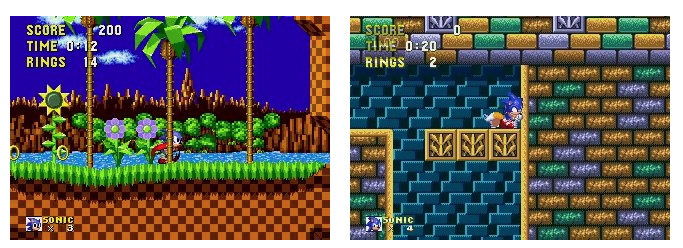
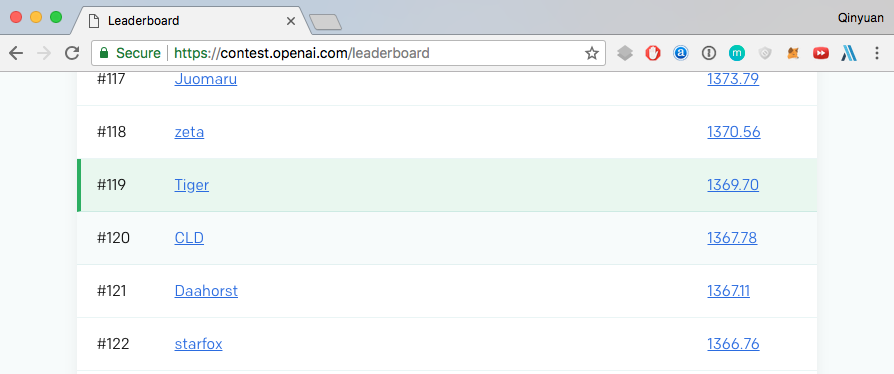
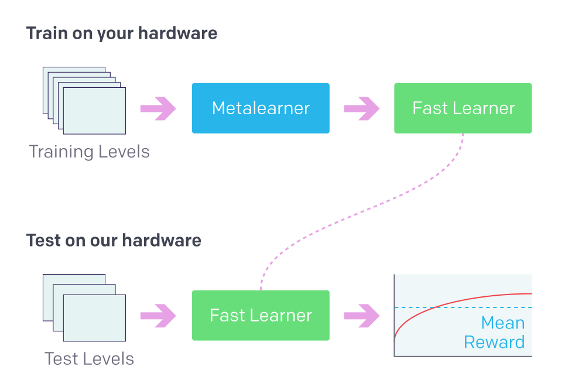
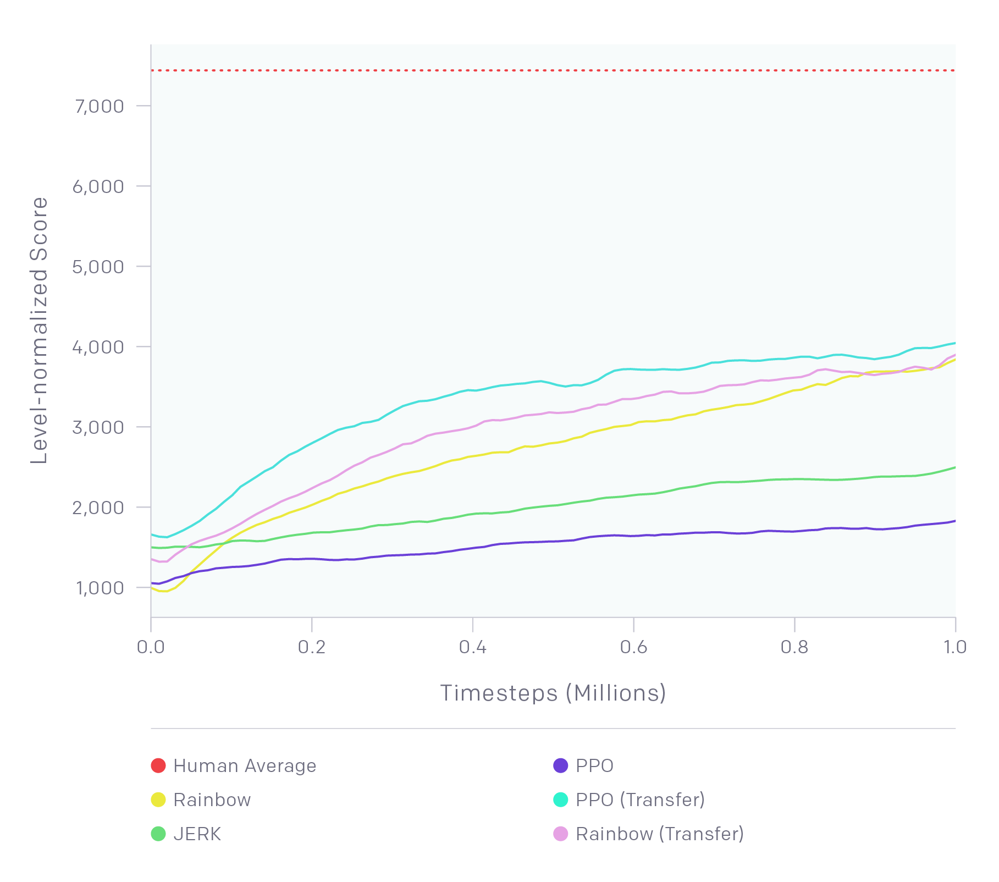
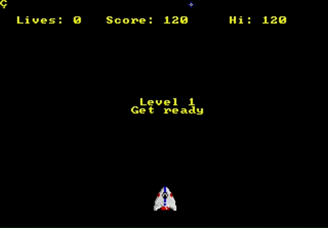
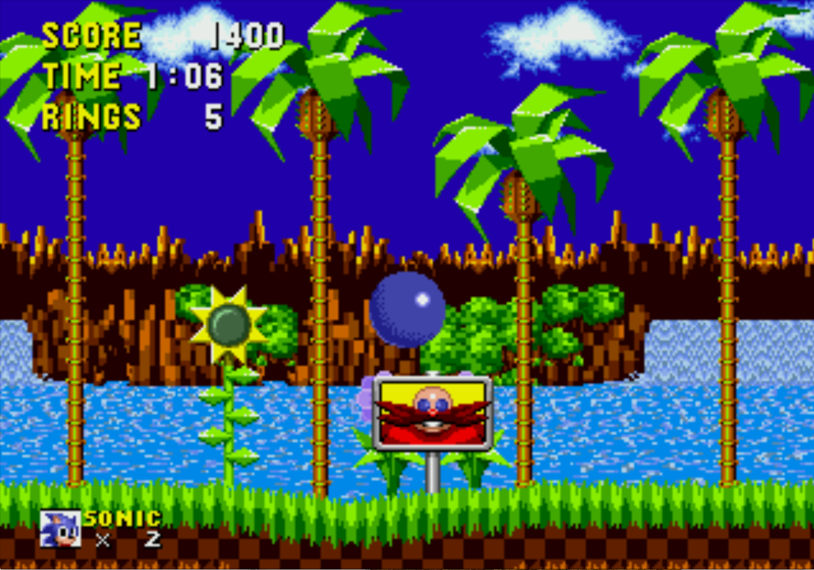
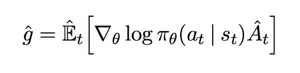
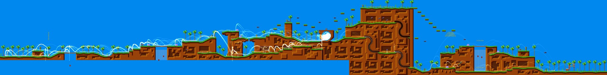
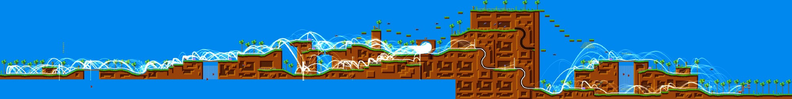

# 如何实现挑战索尼克的人工智能



(来源: [OpenAI Retro Contest](https://contest.openai.com/))

上图是训练索尼克的截图，这个项目的起源是我参加的OpenAI举办的挑战赛。下图是我当时跑通基本case后的ranking。



## 学习路径

首先进入官方网站，了解这次比赛的介绍：[挑战赛官方主页](https://contest.openai.com/)

整个比赛的重点是在有限的学习场景下，如何训练一个有效的迁移学习模型。但是我们要如何设计一套这样的竞赛呢？



(来源: [OpenAI Retro Contest](https://contest.openai.com/))

我们可以首先看一下参赛的流程
- 基于索尼克的游戏进行训练
- 通过docker提交你的agent
- 测试平台通过一系列新的关卡评估你的agent
- 基于你的agenet前进的距离进行排名

为了构建整个比赛的baseline，主办方不仅评估了当前主流的AI算法的结果，同时也找真人参与到了评估。从下图可以看出，即使让机器在新的关卡中玩18个小时，他们的结果远差于先玩两个小时的训练关卡，然后玩一个小时新关卡的人类。



(来源: [OpenAI Retro Contest](https://blog.openai.com/retro-contest/))

然后可以跟随者Tristan的参赛笔记来开启你的旅程：

[第一天](https://medium.com/@tristansokol/day-one-of-the-openai-retro-contest-1651ddcd6aa5)

首先是配置python3的环境，然后从github获得比赛的[code](https://github.com/openai/retro#gym-retro)。再配合本地的游戏ROM，你就可以看到游戏画面了。



(来源: [Day one of the OpenAI Retro Contest.](https://medium.com/@tristansokol/day-one-of-the-openai-retro-contest-1651ddcd6aa5))

[第三天](https://medium.com/@tristansokol/openai-retro-contest-day-3-7a75289a1c9c)

作者最终还是在STEAM购买了游戏，其实我买的是任天堂的大礼包，一共有几十个游戏，重温一下经典。但是作者发现自己居然不会玩Sonic，其实我自己也很惭愧，也从来没有通关过。于是从Apple的APP Store购买了一个版本，玩了3天，终于到了第四个关卡。

作者开始基于jerk的智能代码进行修改，这个算法不停的向右走，当得不到reward时，向左移动一点。经历了一阵与reward相关逻辑的搏斗，sonic终于能够正常移动了，但是被卡在了一个需要加速度的圈圈，如下图所示：


(来源: [OpenAI Retro Contest Day 3](https://medium.com/@tristansokol/openai-retro-contest-day-3-7a75289a1c9c))

于是开启了下一步的优化：跳起的频率、回溯的距离、回退前的尝试数，最终sonic赢得了这一关。



(来源: [OpenAI Retro Contest Day 3](https://medium.com/@tristansokol/openai-retro-contest-day-3-7a75289a1c9c))

于是作者的得分也从1344.64跃升到了3712.11。

[第四天和第五天](https://medium.com/@tristansokol/day-4-5-of-the-openai-retro-contest-a3e36e04d467)

基于之前的小胜利，作者开始对rainbow的agent进行调教，但是这次会遇到tensorflow的搏斗。我最早和tensorflow的搏斗起源于deepfake项目，当时在os、python、tensorflow、cuda的各个版本中经历了数个小时的纠结才走出迷雾。

简而言之，作者遇到的也是libcuda.so.1的错误。之后作者也拼搏了本地不用GPU，但是提交版本使用GPU的方案。这些都是一个真正的engineer在现实中会遇到的种种问题，相信对你也会是一个切肤的体验。


[第六天](https://medium.com/@tristansokol/day-6-of-the-openai-retro-contest-playback-tooling-3844ba655919)

基于之前两个agnet的成功，作者开始构建帮助自己更好迭代的工具。第一个工具是replay功能，这样能够查看agent的愚蠢和可爱。同时作者也加入了MP4转换、批量播放比较、播放加速等功能。让我们看一看sonic的真实表现吧。

[](http://www.youtube.com/watch?v=R_1nMJM4Dl8 "")

[第九天和第十天](https://medium.com/@tristansokol/days-9-10-of-the-openai-retro-contest-e8352ea6aafb)

作者开始深入解读rainbow算法是什么。在对import的一阵解读之后，作者决定把重点转到PPO算法上。

[第十一天到第十四天](https://medium.com/@tristansokol/day-11-ac14a299e69d)

作者首先和一堆公式进行了搏斗，如下图所示：



(来源: [Days 11–14 of the OpenAI Retro Contest
](https://medium.com/@tristansokol/day-11-ac14a299e69d))

简单来说，策略梯度方法是通过梯度下降来优化策略的参数，以达到长期累积收益的最大化。

```python

def main():
    """Run PPO until the environment throws an exception."""
    config = tf.ConfigProto()
    config.gpu_options.allow_growth = True # pylint: disable=E1101
    with tf.Session(config=config):
        # Take more timesteps than we need to be sure that
        # we stop due to an exception.
        ppo2.learn(policy=policies.CnnPolicy,
                   env=DummyVecEnv([make_env]),
                   nsteps=4096,
                   nminibatches=8,
                   lam=0.95,
                   gamma=0.99,
                   noptepochs=3,
                   log_interval=1,
                   ent_coef=0.01,
                   lr=lambda _: 2e-4,
                   cliprange=lambda _: 0.1,
                   total_timesteps=int(1e7))

```

作者深入解读了这部分代码，从开始的环境配置，到后续的ppo2算法的参数。

[第十六天到第十八天](https://medium.com/@tristansokol/running-the-ppo-baseline-and-giving-up-on-local-evaluation-1c7d171e5bc8)

作者已经能够在本地构建docker并且评估了，结果很惊人，让我们看一看第一次和第700次迭代的差距：

[](http://www.youtube.com/watch?v=03yqHZjsgcA "")

但是作者遇到的挑战是，基于本地的mac，每次都要数小时的学习，在一阵挣扎后，作者决定开始寻求远程的gpu解决方案，这个也是我选择google cloud的gpu的原因，性能一下子提升了10倍以上。

[第二十二天到第二十五天](https://medium.com/@tristansokol/a-deep-dive-into-the-jerk-agent-3c553dbab442)

经历了对PPO的各种参数调整，但是没有显著效果。作者决定利用已经学到的经验，重新尝试最初的jerk agent。作者首先对整个代码进行了完整的分析，包括初始化的过程、记录的行为奖励的参数、前进后退的策略、输出行为的方式、随机的选取，然后探寻自己能够改进的入口。

[第二十六天到第二十九天](https://medium.com/@tristansokol/making-fun-visuals-history-maps-and-other-tool-improvements-eb5ffe187fd3)

在进行下一步的探索前，作者想要再一次更新的工具集。毕竟磨刀不误砍柴工。

作者的第一个工具是记录下来sonic的运动轨迹，基于replay功能的帮助，我们得到了如下的结果：



(来源: [Days 26–29 of the OpenAI Retro Contest
](https://medium.com/@tristansokol/making-fun-visuals-history-maps-and-other-tool-improvements-eb5ffe187fd3))



(来源: [Days 26–29 of the OpenAI Retro Contest
](https://medium.com/@tristansokol/making-fun-visuals-history-maps-and-other-tool-improvements-eb5ffe187fd3))

上面的图是20次迭代后的结果，下面的图是200次迭代后的结果，我们看到sonic在第二张图可以跑到了结尾，并且路线也和最早的有很大的差异。

### 总结

到此为止，我们已经跟上了作者的脚步，比赛还在进行，你也来尝试一下呀。
