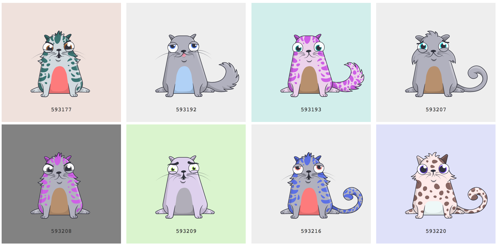
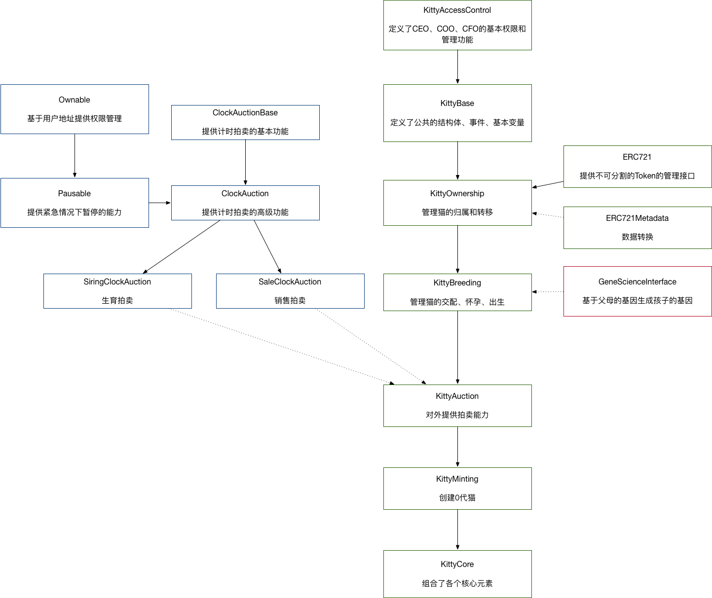

# 如何实现CryptoKitties谜恋猫

- 作者：冯沁原
- 网站：[www.BitTiger.io](https://www.BitTiger.io)
- 原文：[https://github.com/Fabsqrt/Blockchain](https://github.com/Fabsqrt/Blockchain)
- 邮箱：Qinyuan@BitTiger.io
- 微信：zhaxisangbo

## 观看课程视频

[](http://www.youtube.com/watch?v=gdEx5nxkiRk "沁原教学：用区块链做一个火爆全球的以太猫（CryptoKitties）")

## 简介

从区块链社区起步，全世界对CryptoKitties展现出了浓厚的兴趣。据第三方网站CryptoKitties Sales数据显示，截至2018年3月7日已经售出24万多只小猫，交易额超2280万美元，成交均价大约在71美元，小猫的最高售价为253ETH，目前折合美元是19万。具体统计如下：

- 总交易数: 318970
- 总交易的不同的猫的数量: 249208
- 交易总值（ETH）: 41539.38 ether
- 交易总值（USD）: $22831066.89
- 平均价格: $71.58
- 中位价格: $15.38

### 基本玩法


（来源: [Crypto Kitties](https://www.cryptokitties.co/marketplace)）

在平台中你可以使用ETH购买、繁衍、拍卖迷恋猫。

### 制作团队

制作了迷恋猫的团队是创始于2013年位于加拿大的Axiom Zen，让我们看一下他们的团队。


（来源: [CryptoKittes For Press / Team](https://www.cryptokitties.co/press)）

## 核心玩法

### 经济体系

#### 创始团队如何挣钱？


（来源：[CryptoKitties have the digital currency world purring, The San Francisco Chronicle](http://www.sfchronicle.com/news/article/CryptoKitties-have-the-digital-currency-world-12462575.php)）

- 拍卖前100个0代猫的收入。如上图所示，创始猫的拍卖价格是11万美元。
- 在2018年11月之前，每15分钟拍卖一只新的0代猫，一共拍卖50,000只。每一只猫的起始拍卖价格是之前五只0代猫平均拍卖价格的1.5倍。
- 每次交易活动收税3.75%，例如买卖猫、繁衍猫。

#### 用户如何挣钱？

- 低价买猫，高价卖猫。
- 让你的猫提供繁衍的服务，你收取对方的服务费，对方获得繁衍的猫。越珍贵的猫，服务价格越高。
- 你付出服务费，获得繁衍出的猫，然后卖出去。

额外的费用
- 因为迷恋猫运行在以太坊，因此你的操作需要支付Gas费用，例如拍卖猫、购买猫、提供繁衍服务、选择繁衍服务、取消拍卖、取消繁衍等。

#### 拍卖逻辑

在游戏中，你可以设置拍卖的起始价格、终止价格、拍卖时长；然后拍卖的当前价格是在拍卖时长的范围内从起始价格线性变化到终止价格。如果有人在一个时刻使用当前价格进行了购买，他就能获得这只猫。

#### 价格因素

什么决定了一只猫的价格呢？物以稀为贵。每只猫都会有自己的“代”、繁衍速度、基因特征、稀有度等等。猜一猜，下面哪只猫的价格更高呢？




（来源：[CryptoKittydex](https://cryptokittydex.com/)）

### 繁衍体系

#### 第几代

每只猫都有自己的代，由创始团队发布的猫是0代猫。一个x代猫和y代猫繁衍的下一代是```max(x,y)+1```。比较特殊的是，一只猫是不分性别的。

#### 修养时间

每当猫繁衍之后，她需要修养一段时间，这是由Cooldown的特征所决定，不同的特征，需要的修养时间不同，具体如下表：

| 代        |  特征  | 修养时间          |
|-----------|------------|-----------------|
|   0 · 1   | Fast       | 1分钟        |
|   2 · 3   | Swift      | 2分钟       |
|   4 · 5   | Swift      | 5分钟       |
|   6 · 7   | Snappy     | 10分钟      |
|   8 · 9   | Snappy     | 30分钟      |
|  10 · 11  | Brisk      | 1小时         |
|  12 · 13  | Brisk      | 2小时        |  
|  14 · 15  | Plodding   | 4小时         |
|  16 · 17  | Plodding   | 8小时         |
|  18 · 19  | Slow       | 16小时        |
|  20 · 21  | Slow       | 24小时        |
|  22 · 23  | Sluggish   | 2天         |
|  24 · 45  | Sluggish   | 4天          |
|  26+      | Catatonic  | 1周          |

一只猫的修养特征由她的代所决定。一只3代的猫的修养特征是Swift。当这只猫繁衍后，它的特征会变化。每次繁衍等同于增加了一个代。如果这只3代猫繁衍了3次，她的修养特征会变成第6代的Snappy。这样就限制了一只猫的繁衍速度，增加了低代的稀有价值，也限制了稀有基因的遗传效率。

### 基因特征

#### 基因性状


（来源：[CryptoKittydex](https://cryptokittydex.com/kitties/9181)）

一只猫的基因示例如上图中的最下面一行。基因一共被分为了12块，除了前三块的效果不详，后面几块基因分别对应了不同的性状：


|  基因块        |  性状  | 例子          |
|-----------|------------|-----------------|
|   1   | Undocumented     | ^_^      |
|   2   | Undocumented     | ^_^       |
|   3   | Undocumented     | ^_^       |
|   4   | Mouth     | Happygokitty      |
|   5   | Wild     | Santa       |
|   6   | Color     | Granitegrey       |
|   7   | Pattern Color     | Lemonade      |
|   8   | Body Color     | Cloudwhite      |
|   9  | Eye Type      | Simple         |
|  10  | Eye Color      |  Sizzurp        |  
|  11  | Pattern   | Luckystripe         |
|  12  | Body   | Munchkin         |

#### 基因编码

针对一个256位的基因编码，去掉前16位的0，剩余240位。将每五位通过kai编码，形成48的kai编码。每四个一组，形成12块。对应了上节所说的基因块。在每一个基因块中，第四位表示了当前猫的显性性状，其它倒数第二位、第三位、第四位分别表示了第一、第二、第三隐性性状。

在这里特别的Kai编码使用了数字和小写字母，为了肉眼识别时可能引入的误看，因此Kai编码没有使用0和L。于是基于5个二进制，一共有32种字符表示，具体如下：

|Kai    |二进制 |十进制|Kai    |二进制 |十进制|
|-------|-------|---|-------|-------|---|
| **1** | 00000 | 0 | **h** | 10000 |16 |
| **2** | 00001 | 1 | **i** | 10001 |17 |
| **3** | 00010 | 2 | **j** | 10010 |18 |
| **4** | 00011 | 3 | **k** | 10011 |19 |
| **5** | 00100 | 4 | **m** | 10100 |20 |
| **6** | 00101 | 5 | **n** | 10101 |21 |
| **7** | 00110 | 6 | **o** | 10110 |22 |
| **8** | 00111 | 7 | **p** | 10111 |23 |
| **9** | 01000 | 8 | **q** | 11000 |24 |
| **a** | 01001 | 9 | **r** | 11001 |25 |
| **b** | 01010 | 10| **s** | 11010 |26 |
| **c** | 01011 | 11| **t** | 11011 |27 |
| **d** | 01100 | 12| **u** | 11100 |28 |
| **e** | 01101 | 13| **v** | 11101 |29 |
| **f** | 01110 | 14| **w** | 11110 |30 |
| **g** | 01111 | 15| **x** | 11111 |31 |

有兴趣的朋友可以在这里延展阅读：[Base58百科](https://en.wikipedia.org/wiki/Base58)。

在这个基础上，我们可以通过一只猫的基因编码确定她的性状。让我们通过眼睛的颜色来举例子：


|Kai    |眼睛颜色 |Kai    |眼睛颜色|
|-------|-------|-------|-------|
| **1** | Thundergrey | **h** | Pumpkin |
| **2** | Gold | **i** | Limegreen |
| **3** | Topaz | **j** | ^_^ |
| **4** | Mintgreen | **k** | Bubblegem |
| **5** | ^_^ | **m** | Twilightsparkle |
| **6** | Sizzurp | **n** | ^_^ |
| **7** | Chestnut | **o** | ^_^ |
| **8** | Strawberry | **p** | ^_^ |
| **9** | Sapphire | **q** | Babypuke |
| **a** | Forgetmenot | **r** | ^_^ |
| **b** | ^_^ | **s** | ^_^ |
| **c** | Coralsunrise | **t** | ^_^ |
| **d** | ^_^ | **u** | ^_^ |
| **e** | ^_^ | **v** | ^_^ |
| **f** | ^_^ | **w** | ^_^ |
| **g** | Cyan | **x** | ^_^ |

#### 基因遗传


```python

def mixGenes(mGenes[48], sGenes[48], babyGenes[48]):
  # PARENT GENE SWAPPING
  for (i = 0; i < 12; i++):
    index = 4 * i
    for (j = 3; j > 0; j--):
      if random() < 0.25:
        swap(mGenes, index+j, index+j-1)
      if random() < 0.25:
        swap(sGenes, index+j, index+j-1)
  # BABY GENES
  for (i = 0; i < 48; i++):
    mutation = 0
    # CHECK MUTATION
    if i % 4 == 0:
      gene1 = mGene[i]
      gene2 = sGene[i]
      if gene1 > gene2:
        gene1, gene2 = gene2, gene1
      if (gene2 - gene1) == 1 and iseven(gene1):
        probability = 0.25
        if gene1 > 23:
          probability /= 2
        if random() < probability:
          mutation = (gene1 / 2) + 16
    # GIVE BABY GENES
    if mutation:
      baby[i] = mutation
    else:
      if random() < 0.5:
        babyGenes[i] = mGene[i]
      else:
        babyGenes[i] = sGene[i]

```

（来源：[CryptoKitties mixGenes Function](https://medium.com/@sean.soria/cryptokitties-mixgenes-function-69207883fc80)）

基因遗传的具体算法并没有被公开，但是很多牛人基于推断得到了上述的伪码。简单来说，分为三步：
1. 双亲的基因基于75%的概率进行轮转，从而有可能让隐性性状便成了显性性状
2. 当双亲的基因相差1的时候，有一定概率会进行变异，产生新的性状
3. 如果没有发生变异，各有50%的概率从双亲继承一段基因

## 区块链开发

### 基本规则

- 非兄妹父母关系的两只猫可以生育
- 两只猫可以来自同一个主人，或者一只猫被她的拥有者提供服务
- 任何一只都可以做父亲（sire）或者母亲（matron）
- 猫没有性别
- 交配后，母亲会怀孕，并且进入修养期；父亲也同样会进入修养期
- 修养期内不能再次剩余，修养期会随着生育次数而增长
- 母亲的修养期结束后，会生出小猫，并且可以再次生育
- 主人可以选择拍卖猫或者赠送猫


### 核心流程

1. COO每隔15分钟产生一个0代的猫，并进行拍卖（Main `createGen0Auction()`）
1. 用户可以购买0代猫（Sale Auction `bid()`）
1. 用户可以查询猫的数据（Main `getKitty()`）
1. 用户可以自己繁衍猫（Main `breedWith()` or `breedWithAuto()`）
1. 修养期后，用户可以得到新的猫（Main `giveBirth()`）
1. 用户可以把一只猫作为父亲，拍卖他的生育服务（Main `createSiringAuction()`）
1. 用户把一只猫作为父亲，为某个以太坊地址提供生育服务（Main `approveSiring()`）
1. 用户可以购买一只猫的生育服务（Main `createSiringAuction()`）
1. 用户可以拍卖他的猫（Main `createSaleAuction()`）
1. 用户可以购买被拍卖的猫（Sale Auction `bid()`）
1. 用户可以查看被拍卖猫的信息（Sale/Siring Auction `getAuction()`）
1. 用户能够取消拍卖（Sale/Siring Auction `cancelAuction()`）
1. 用户能够赠送猫（Main `transfer()`）
1. 用户能够指定另一个用户能够获得他的猫的权限（Main `approve()`）
1. 用户可以认领自己被指定获得权限的猫（Main `transferFrom()`）
1. 只有CEO能够替换COO或者CTO（Main `setCEO()` `setCFO()` `setCOO()`）
1. COO能够创建和操作特殊的猫（Main `createPromoKitty()`）
1. COO能够转移拍卖的收入（Main `withdrawAuctionBalances()`）
1. CFO能够转移主协议的收益（Main `withdrawBalance()`）

### 核心协议

迷恋猫的协议关系如下图。



在整个结构中分成三条线
- 中间的主线，定义了迷恋猫的各个核心操作。为了拆解简化，有多个contract完成各自的任务，同时通过协议继承继承了整个关系
- 左侧的拍卖线，提供了单独的拍卖协议能力
- 右侧的基因线，仅仅提供新猫基因生成的功能；这样做能够部分实现基因算法的加密，但是也很快被人逆向工程了

我们在本节会逐一讲解这些协议。

#### KittyAccessControl

```solidity

/// @title KittyCore协议中管理特殊权限的功能群
/// @author Axiom Zen (https://www.axiomzen.co)
/// @dev 查看KittyCore来了解协议之间的关系
contract KittyAccessControl {
    // CryptoKitties的核心角色的权限管理
    //     - CEO：能够调整其他角色和修改协议地址，唯一能够重启协议；
    //       初始值是KittyCore的创建者
    //
    //     - The CFO：能够从KittyCore和拍卖协议中取资金
    //     - The COO：能够生成和拍卖0代猫
    //
    // 这些角色是按照职能划分的，每个角色仅有以上能力。
    // 特别是CEO能够指派每一个角色的地址，但他不能履行这些角色的能力。
    // 这能够限制我们让CEO成为一个“超级用户”，从而增加了安全性。
    /// @dev 协议升级时的事件
    event ContractUpgrade(address newContract);

    // 执行每个角色的协议地址
    address public ceoAddress;
    address public cfoAddress;
    address public cooAddress;

    // @dev 管理协议是否被暂定，暂停时大多数行动都会被阻塞
    bool public paused = false;

    /// @dev 提供只有CEO能够使用的功能的权限检查
    modifier onlyCEO() {
        require(msg.sender == ceoAddress);
        _;
    }

    /// @dev 提供只有CFO能够使用的功能的权限检查
    modifier onlyCFO() {
        require(msg.sender == cfoAddress);
        _;
    }

    /// @dev 提供只有COO能够使用的功能的权限检查
    modifier onlyCOO() {
        require(msg.sender == cooAddress);
        _;
    }

    /// @dev 提供只有C?O能够使用的功能的权限检查    
    modifier onlyCLevel() {
        require(
            msg.sender == cooAddress ||
            msg.sender == ceoAddress ||
            msg.sender == cfoAddress
        );
        _;
    }

    /// @dev 让当前CEO指派一名新的CEO
    /// @param _newCEO 新的CEO的地址
    function setCEO(address _newCEO) external onlyCEO {
        require(_newCEO != address(0));

        ceoAddress = _newCEO;
    }

    /// @dev 让CEO指派一名新的CFO
    /// @param _newCFO 新的CFO的地址
    function setCFO(address _newCFO) external onlyCEO {
        require(_newCFO != address(0));

        cfoAddress = _newCFO;
    }

    /// @dev 让CEO指派一名新的COO
    /// @param _newCOO 新的COO的地址
    function setCOO(address _newCOO) external onlyCEO {
        require(_newCOO != address(0));

        cooAddress = _newCOO;
    }

    /*** Pausable功能的设计方法来自于OpenZeppelin ***/

    /// @dev 提供没有被暂定的状态检查
    modifier whenNotPaused() {
        require(!paused);
        _;
    }

    /// @dev 提供被暂定的状态检查
    modifier whenPaused {
        require(paused);
        _;
    }

    /// @dev "C-level"能够启动暂定操作，用以应对潜在的bug和缺陷，以降低损失
    function pause() external onlyCLevel whenNotPaused {
        paused = true;
    }

    /// @dev 只有CEO能够取消暂停状态，用来规避当CFO或COO被攻破的情况
    /// @notice 把功能设置为public，可以让衍生的协议也能发起操作
    function unpause() public onlyCEO whenPaused {
        // 协议升级后是无法取消暂定的
        paused = false;
    }
}

```

#### KittyBase

```solidity

/// @title CryptoKitties的基础，保存了公用的结构体、事件、基本变量
/// @author Axiom Zen (https://www.axiomzen.co)
/// @dev 查看KittyCore来了解协议之间的关系
contract KittyBase is KittyAccessControl {
    /*** EVENTS ***/

    /// @dev 小猫出生时的事件，包括giveBirth和0代猫的创建
    event Birth(address owner, uint256 kittyId, uint256 matronId, uint256 sireId, uint256 genes);

    /// @dev ERC721定义的转让事件，当kitty的主人变换时调用（包括出生）
    event Transfer(address from, address to, uint256 tokenId);

    /*** 数据类型 ***/

    /// @dev 迷恋猫的数据结构，因为这是每只猫的基本结构，所以设计为恰好两个256位的字
    ///  因为以太坊的编码方案，所以成员的顺序也很重要
    ///  参考资料：http://solidity.readthedocs.io/en/develop/miscellaneous.html
    struct Kitty {
        // 迷恋猫的基因是256-bits，并且不会改变
        uint256 genes;

        // 迷恋猫创建时来自区块的时间戳
        uint64 birthTime;

        // 这只猫可以再次生育的最小时间戳
        uint64 cooldownEndBlock;

        // 双亲的ID，0代的双亲ID是0
        // 32位无符号整数看似只能有40亿只猫
        // 但是以太坊每年只能支持5亿次交易，因此未来几年不会出问题
        uint32 matronId;
        uint32 sireId;

        // 当这只猫是雌性时的雄性的ID，0表示没有怀孕，非0表示已经怀孕
        // 主要在生成小猫时获得父亲的基因数据
        uint32 siringWithId;

        // 修养时长的编号，初始值为 generation/2
        // 每次生育，父母都会把编号加一
        uint16 cooldownIndex;

        // 猫的代，创始团队创建的猫是0代，其她猫是双亲最大的代加一
        // 也就是，max(matron.generation, sire.generation) + 1
        uint16 generation;
    }

    /*** 常量 ***/

    /// @dev 不同编号的修养时间
    ///  每次生育后差不多翻一倍，从而规避主人不断的用同一只猫生育，最长是1周
    uint32[14] public cooldowns = [
        uint32(1 minutes),
        uint32(2 minutes),
        uint32(5 minutes),
        uint32(10 minutes),
        uint32(30 minutes),
        uint32(1 hours),
        uint32(2 hours),
        uint32(4 hours),
        uint32(8 hours),
        uint32(16 hours),
        uint32(1 days),
        uint32(2 days),
        uint32(4 days),
        uint32(7 days)
    ];

    // 对块之间时间差的估算，大概15秒
    uint256 public secondsPerBlock = 15;

    /*** 持久存储 ***/

    /// @dev 保存所有迷恋猫的数组，ID是索引，
    ///  ID为0是不存在的生物，但又是0代猫的双亲
    Kitty[] kitties;

    /// @dev 从猫的ID到主人的地址的映射
    ///  所有猫都有一个非0地址的主人，包括0代猫
    mapping (uint256 => address) public kittyIndexToOwner;

    // @dev 从主人地址到他拥有的猫的个数的映射
    //  在函数balanceOf()中使用
    mapping (address => uint256) ownershipTokenCount;

    /// @dev 从猫的ID到被允许领养的主人地址的映射，在transferFrom()中使用
    ///  每只猫在任何时候只能有一个被允许的领养者的地址
    ///  0表示没有人被批准
    mapping (uint256 => address) public kittyIndexToApproved;

    /// @dev 从猫的ID到能被一起生育的主人的地址的映射，在breedWith()中使用
    ///  每只猫在任何时候只能有一个被允许一起生育的主人的地址
    ///  0表示没有人被批准
    mapping (uint256 => address) public sireAllowedToAddress;

    /// @dev ClockAuction协议的地址，用来买卖猫
    ///  这个协议处理了用户之间的买卖以及0代猫的初始买卖
    ///  每15分钟被调用一次
    SaleClockAuction public saleAuction;

    /// @dev ClockAuction协议的地址，用来交易生育服务
    ///  需要两个交易服务是因为买卖和生育有很多不同
    SiringClockAuction public siringAuction;

    /// @dev 设置一只猫的主人地址
    function _transfer(address _from, address _to, uint256 _tokenId) internal {
        // 因为猫的数量最大是2^32，我们不会溢出
        ownershipTokenCount[_to]++;
        // 设置主人
        kittyIndexToOwner[_tokenId] = _to;
        // 需要规避原来主人是0x0的情况，尽管这个不应该发生
        if (_from != address(0)) {
            ownershipTokenCount[_from]--;
            // 同时清空允许生育的主人地址
            delete sireAllowedToAddress[_tokenId];
            // 同时清空允许领养的主人地址
            delete kittyIndexToApproved[_tokenId];
        }
        // 发出主人转换事件
        Transfer(_from, _to, _tokenId);
    }

    /// @dev 内部方法，创建一只猫，它不做安全检查，因此输入数据要保证正确
    ///  会产生Birth事件和Transfer事件
    /// @param _matronId 母亲ID（0代的母亲是0）
    /// @param _sireId 父亲ID（0代的父亲是0）
    /// @param _generation 这只猫的代，有调用者计算
    /// @param _genes 基因编码
    /// @param _owner 初始主人的地址，非0
    function _createKitty(
        uint256 _matronId,
        uint256 _sireId,
        uint256 _generation,
        uint256 _genes,
        address _owner
    )
        internal
        returns (uint)
    {
        // 这些require并非必要，因为调用者需要保证正确
        // 但是因为_createKitty()的存储相对昂贵，因此增加检查也有价值
        require(_matronId == uint256(uint32(_matronId)));
        require(_sireId == uint256(uint32(_sireId)));
        require(_generation == uint256(uint16(_generation)));

        // 新猫的修养边贸是代数除以2
        uint16 cooldownIndex = uint16(_generation / 2);
        if (cooldownIndex > 13) {
            cooldownIndex = 13;
        }

        Kitty memory _kitty = Kitty({
            genes: _genes,
            birthTime: uint64(now),
            cooldownEndBlock: 0,
            matronId: uint32(_matronId),
            sireId: uint32(_sireId),
            siringWithId: 0,
            cooldownIndex: cooldownIndex,
            generation: uint16(_generation)
        });
        // ID是递增的
        uint256 newKittenId = kitties.push(_kitty) - 1;

        // 虽然超过40亿只猫不太会发生，但是还是检查一下
        require(newKittenId == uint256(uint32(newKittenId)));

        // 发出Birth事件
        Birth(
            _owner,
            newKittenId,
            uint256(_kitty.matronId),
            uint256(_kitty.sireId),
            _kitty.genes
        );

        // 设置主人，并且发出Transfer事件
        // 遵循ERC721草案
        _transfer(0, _owner, newKittenId);

        return newKittenId;
    }

    // C?O可以调整每块多少秒
    function setSecondsPerBlock(uint256 secs) external onlyCLevel {
        require(secs < cooldowns[0]);
        secondsPerBlock = secs;
    }
}

```

#### ERC721

```solidity

/// @title 定义符合ERC-721的接口：不可分割的token
/// @author Dieter Shirley <dete@axiomzen.co> (https://github.com/dete)
contract ERC721 {
    // 必要的方法
    function totalSupply() public view returns (uint256 total);
    function balanceOf(address _owner) public view returns (uint256 balance);
    function ownerOf(uint256 _tokenId) external view returns (address owner);
    function approve(address _to, uint256 _tokenId) external;
    function transfer(address _to, uint256 _tokenId) external;
    function transferFrom(address _from, address _to, uint256 _tokenId) external;

    // Events
    event Transfer(address from, address to, uint256 tokenId);
    event Approval(address owner, address approved, uint256 tokenId);

    // Optional
    // function name() public view returns (string name);
    // function symbol() public view returns (string symbol);
    // function tokensOfOwner(address _owner) external view returns (uint256[] tokenIds);
    // function tokenMetadata(uint256 _tokenId, string _preferredTransport) public view returns (string infoUrl);

    // ERC-165 Compatibility (https://github.com/ethereum/EIPs/issues/165)
    function supportsInterface(bytes4 _interfaceID) external view returns (bool);
}

```

#### ERC721Metadata

```solidity

/// @title 生成迷恋猫元数据的外部协议
///  产生数据的byte结果
contract ERC721Metadata {
    /// @dev 输入Token的Id，返回byte数组
    function getMetadata(uint256 _tokenId, string) public view returns (bytes32[4] buffer, uint256 count) {
        if (_tokenId == 1) {
            buffer[0] = "Hello World! :D";
            count = 15;
        } else if (_tokenId == 2) {
            buffer[0] = "I would definitely choose a medi";
            buffer[1] = "um length string.";
            count = 49;
        } else if (_tokenId == 3) {
            buffer[0] = "Lorem ipsum dolor sit amet, mi e";
            buffer[1] = "st accumsan dapibus augue lorem,";
            buffer[2] = " tristique vestibulum id, libero";
            buffer[3] = " suscipit varius sapien aliquam.";
            count = 128;
        }
    }
}

```

#### KittyOwnership

```solidity

/// @title 基于ERC-721草案，管理猫的所有权
/// @author Axiom Zen (https://www.axiomzen.co)
/// @dev Ref: https://github.com/ethereum/EIPs/issues/721
///  查看KittyCore来了解协议之间的关系
contract KittyOwnership is KittyBase, ERC721 {

    /// @notice 基于ERC721，Name和symbol都是不可分割的Token
    string public constant name = "CryptoKitties";
    string public constant symbol = "CK";

    // 返回猫的元数据
    ERC721Metadata public erc721Metadata;

    bytes4 constant InterfaceSignature_ERC165 =
        bytes4(keccak256('supportsInterface(bytes4)'));

    bytes4 constant InterfaceSignature_ERC721 =
        bytes4(keccak256('name()')) ^
        bytes4(keccak256('symbol()')) ^
        bytes4(keccak256('totalSupply()')) ^
        bytes4(keccak256('balanceOf(address)')) ^
        bytes4(keccak256('ownerOf(uint256)')) ^
        bytes4(keccak256('approve(address,uint256)')) ^
        bytes4(keccak256('transfer(address,uint256)')) ^
        bytes4(keccak256('transferFrom(address,address,uint256)')) ^
        bytes4(keccak256('tokensOfOwner(address)')) ^
        bytes4(keccak256('tokenMetadata(uint256,string)'));

    /// @notice ERC-165相关接口 (https://github.com/ethereum/EIPs/issues/165)
    ///  判断是否是自己支持的ERC721或ERC165接口
    function supportsInterface(bytes4 _interfaceID) external view returns (bool)
    {
        // DEBUG ONLY
        //require((InterfaceSignature_ERC165 == 0x01ffc9a7) && (InterfaceSignature_ERC721 == 0x9a20483d));

        return ((_interfaceID == InterfaceSignature_ERC165) || (_interfaceID == InterfaceSignature_ERC721));
    }

    /// @dev 设置跟踪元数据的协议地址
    ///  只能CEO操作
    function setMetadataAddress(address _contractAddress) public onlyCEO {
        erc721Metadata = ERC721Metadata(_contractAddress);
    }

    // 内部函数：假设所有输入参数有效
    // 公共方法负责验证数据

    /// @dev 判断一个地址是否是猫的主人
    /// @param _claimant 判断的用户的地址
    /// @param _tokenId 猫的ID，需要大于0
    function _owns(address _claimant, uint256 _tokenId) internal view returns (bool) {
        return kittyIndexToOwner[_tokenId] == _claimant;
    }

    /// @dev 判断一个地址能否领养一个猫
    /// @param _claimant 判断的用户的地址
    /// @param _tokenId 猫的ID，需要大于0
    function _approvedFor(address _claimant, uint256 _tokenId) internal view returns (bool) {
        return kittyIndexToApproved[_tokenId] == _claimant;
    }

    /// @dev 设置transferFrom()函数用到的可以领养的地址
    ///  设为0，可以清除之前的设置
    ///  NOTE: _approve() 仅是内部使用，并不发送Approval事件
    ///  因为_approve()和transferFrom()共同用于拍卖
    ///  没有必要额外多加事件
    function _approve(uint256 _tokenId, address _approved) internal {
        kittyIndexToApproved[_tokenId] = _approved;
    }

    /// @notice 返回一个地址拥有的猫的数量
    /// @param _owner 判断的地址
    /// @dev 用于兼容ERC-721
    function balanceOf(address _owner) public view returns (uint256 count) {
        return ownershipTokenCount[_owner];
    }

    /// @notice 把猫转到另一个地址，要确保ERC-721兼容，否则可能丢失猫
    /// @param _to 接受者地址
    /// @param _tokenId 猫的ID
    /// @dev 用于兼容ERC-721
    function transfer(
        address _to,
        uint256 _tokenId
    )
        external
        whenNotPaused
    {
        // 放置转移到0x0
        require(_to != address(0));
        // 不能把猫转给协议本身
        // 协议不拥有猫（特例是，0代猫刚被创建，进入拍卖前）
        require(_to != address(this));
        require(_to != address(saleAuction));
        require(_to != address(siringAuction));

        // 你只能转让自己的猫
        require(_owns(msg.sender, _tokenId));

        // 修改主人，清除领养列表，发出Transfer事件
        _transfer(msg.sender, _to, _tokenId);
    }

    /// @notice 赋予一个地址通过transferFrom()获得猫的权利
    /// @param _to 被授权的地址，ID为0是取消授权
    /// @param _tokenId 猫的ID
    /// @dev 用于兼容ERC-721
    function approve(
        address _to,
        uint256 _tokenId
    )
        external
        whenNotPaused
    {
        // 只有主人能够给予授权
        require(_owns(msg.sender, _tokenId));

        // 注册授权
        _approve(_tokenId, _to);

        // 发出Approval事件
        Approval(msg.sender, _to, _tokenId);
    }

    /// @notice 从另一个主人手上获得他的一只猫的所有权，需要通过approval授权
    /// @param _from 猫的当前主人的地址
    /// @param _to 猫的新主人的地址
    /// @param _tokenId 猫的ID
    /// @dev 用于兼容ERC-721
    function transferFrom(
        address _from,
        address _to,
        uint256 _tokenId
    )
        external
        whenNotPaused
    {
        // 安全检查，防止转给地址0
        require(_to != address(0));
        // 不能把猫转给协议本身
        // 协议不拥有猫（特例是，0代猫刚被创建，进入拍卖前）
        require(_to != address(this));
        require(_approvedFor(msg.sender, _tokenId));
        require(_owns(_from, _tokenId));

        // 修改主人，清除领养列表，发出Transfer事件
        _transfer(_from, _to, _tokenId);
    }

    /// @notice 返回当前猫的总数
    /// @dev 兼容ERC-721
    function totalSupply() public view returns (uint) {
        return kitties.length - 1;
    }

    /// @notice 返回一个猫的主人
    /// @dev 兼容ERC-721
    function ownerOf(uint256 _tokenId)
        external
        view
        returns (address owner)
    {
        owner = kittyIndexToOwner[_tokenId];

        require(owner != address(0));
    }

    /// @notice 返回一个主人的猫的列表
    /// @param _owner 主人的地址
    /// @dev 这个方法不要被协议调用，因为过于昂贵
    ///  需要遍历所有的猫，而且结果的长度是动态的
    function tokensOfOwner(address _owner) external view returns(uint256[] ownerTokens) {
        uint256 tokenCount = balanceOf(_owner);

        if (tokenCount == 0) {
            // 如果没有猫，则为空
            return new uint256[](0);
        } else {
            uint256[] memory result = new uint256[](tokenCount);
            uint256 totalCats = totalSupply();
            uint256 resultIndex = 0;

            // 猫的ID从1开始自增
            uint256 catId;

            for (catId = 1; catId <= totalCats; catId++) {
                if (kittyIndexToOwner[catId] == _owner) {
                    result[resultIndex] = catId;
                    resultIndex++;
                }
            }

            return result;
        }
    }

    /// @dev 源自memcpy() @arachnid (Nick Johnson <arachnid@notdot.net>)
    ///  这个方法遵循Apache License.
    ///  参考资料： https://github.com/Arachnid/solidity-stringutils/blob/2f6ca9accb48ae14c66f1437ec50ed19a0616f78/strings.sol
    function _memcpy(uint _dest, uint _src, uint _len) private view {
        // 尽量32位的拷贝
        for(; _len >= 32; _len -= 32) {
            assembly {
                mstore(_dest, mload(_src))
            }
            _dest += 32;
            _src += 32;
        }

        // 拷贝剩余内容
        uint256 mask = 256 ** (32 - _len) - 1;
        assembly {
            let srcpart := and(mload(_src), not(mask))
            let destpart := and(mload(_dest), mask)
            mstore(_dest, or(destpart, srcpart))
        }
    }

    /// @dev 源自toString(slice) @arachnid (Nick Johnson <arachnid@notdot.net>)
    ///  这个方法遵循Apache License.
    ///  参考资料： https://github.com/Arachnid/solidity-stringutils/blob/2f6ca9accb48ae14c66f1437ec50ed19a0616f78/strings.sol
    function _toString(bytes32[4] _rawBytes, uint256 _stringLength) private view returns (string) {
        var outputString = new string(_stringLength);
        uint256 outputPtr;
        uint256 bytesPtr;

        assembly {
            outputPtr := add(outputString, 32)
            bytesPtr := _rawBytes
        }

        _memcpy(outputPtr, bytesPtr, _stringLength);

        return outputString;
    }

    /// @notice 返回一个URI，指向该token遵循的ERC-721的元数据包
    ///  (https://github.com/ethereum/EIPs/issues/721)
    /// @param _tokenId 猫的ID
    function tokenMetadata(uint256 _tokenId, string _preferredTransport) external view returns (string infoUrl) {
        require(erc721Metadata != address(0));
        bytes32[4] memory buffer;
        uint256 count;
        (buffer, count) = erc721Metadata.getMetadata(_tokenId, _preferredTransport);

        return _toString(buffer, count);
    }
}

```

#### KittyBreeding


```solidity

/// @title 管理猫的交配、怀孕、出生
/// @author Axiom Zen (https://www.axiomzen.co)
/// @dev 查看KittyCore来了解协议之间的关系
contract KittyBreeding is KittyOwnership {

    /// @dev 当两只猫成功交配，母亲怀孕期设定后，发出Pregnant事件
    event Pregnant(address owner, uint256 matronId, uint256 sireId, uint256 cooldownEndBlock);

    /// @notice 交配方式breedWithAuto()的最小付款额
    ///  这是giveBirth()调用者支付的gas，可以由COO随时调整
    uint256 public autoBirthFee = 2 finney;

    // 记录多少只怀孕的猫
    uint256 public pregnantKitties;

    /// @dev 实现基因算法的协议
    GeneScienceInterface public geneScience;

    /// @dev 升级基因算法的地址，只能CEO调用
    /// @param _address 新的GeneScience协议实例的地址
    function setGeneScienceAddress(address _address) external onlyCEO {
        GeneScienceInterface candidateContract = GeneScienceInterface(_address);

        // NOTE: 确认协议是否符合标准 - https://github.com/Lunyr/crowdsale-contracts/blob/cfadd15986c30521d8ba7d5b6f57b4fefcc7ac38/contracts/LunyrToken.sol#L117
        require(candidateContract.isGeneScience());

        // Set the new contract address
        geneScience = candidateContract;
    }

    /// @dev 检查一只猫能否生育，需要判断不在修养期，并且不在生育前
    function _isReadyToBreed(Kitty _kit) internal view returns (bool) {
        // 除了检查cooldownEndBlock的修养期，还要检查是否在等待出生
        return (_kit.siringWithId == 0) && (_kit.cooldownEndBlock <= uint64(block.number));
    }

    /// @dev 判断雄性是否被授权与雌性交配
    ///  条件是：是否是同一个主人，或者被授权 approveSiring()
    function _isSiringPermitted(uint256 _sireId, uint256 _matronId) internal view returns (bool) {
        address matronOwner = kittyIndexToOwner[_matronId];
        address sireOwner = kittyIndexToOwner[_sireId];

        // 是否是同一个主人，或者被授权
        return (matronOwner == sireOwner || sireAllowedToAddress[_sireId] == matronOwner);
    }

    /// @dev 基于修养指数cooldownIndex，设置修养时间cooldownEndTime
    ///  同时调整修养指数
    /// @param _kitten 需要调整的猫的状态
    function _triggerCooldown(Kitty storage _kitten) internal {
        // 基于cooldownIndex和secondsPerBlock，判断结束时的区块
        _kitten.cooldownEndBlock = uint64((cooldowns[_kitten.cooldownIndex]/secondsPerBlock) + block.number);

        // 增加修养指数，最大到13
        // 我们可以动态检查cooldowns的大小，但是硬编码来节省gas
        if (_kitten.cooldownIndex < 13) {
            _kitten.cooldownIndex += 1;
        }
    }

    /// @notice 允许另一个用户和你的猫交配
    /// @param _addr 另一个用户的地址，设置为0来清楚授权
    /// @param _sireId 你自己可以被交配的猫的地址
    function approveSiring(address _addr, uint256 _sireId)
        external
        whenNotPaused
    {
        require(_owns(msg.sender, _sireId));
        sireAllowedToAddress[_sireId] = _addr;
    }

    /// @dev 修改调用giveBirthAuto()的付费，只能COO调用
    ///  提供生育猫所必须的gas
    function setAutoBirthFee(uint256 val) external onlyCOO {
        autoBirthFee = val;
    }

    /// @dev 判断一个猫是否可以产出小猫
    function _isReadyToGiveBirth(Kitty _matron) private view returns (bool) {
        return (_matron.siringWithId != 0) && (_matron.cooldownEndBlock <= uint64(block.number));
    }

    /// @notice 判断一只猫能否交配
    /// @param _kittyId 猫的ID
    function isReadyToBreed(uint256 _kittyId)
        public
        view
        returns (bool)
    {
        require(_kittyId > 0);
        Kitty storage kit = kitties[_kittyId];
        return _isReadyToBreed(kit);
    }

    /// @dev 判断一只猫是否怀孕
    /// @param _kittyId 猫的ID
    function isPregnant(uint256 _kittyId)
        public
        view
        returns (bool)
    {
        require(_kittyId > 0);
        // 只有siringWithId被设置，才是怀孕中
        return kitties[_kittyId].siringWithId != 0;
    }

    /// @dev 检查能否符合伦理的交配，并不检查所有权
    /// @param _matron 潜在的母亲
    /// @param _matronId 目前的ID
    /// @param _sire A 潜在的父亲
    /// @param _sireId 父亲的ID
    function _isValidMatingPair(
        Kitty storage _matron,
        uint256 _matronId,
        Kitty storage _sire,
        uint256 _sireId
    )
        private
        view
        returns(bool)
    {
        // 不能和自己交配
        if (_matronId == _sireId) {
            return false;
        }

        // 不能和父母交配
        if (_matron.matronId == _sireId || _matron.sireId == _sireId) {
            return false;
        }
        if (_sire.matronId == _matronId || _sire.sireId == _matronId) {
            return false;
        }

        // 特殊处理0代猫
        if (_sire.matronId == 0 || _matron.matronId == 0) {
            return true;
        }

        // 不能和兄妹交配
        if (_sire.matronId == _matron.matronId || _sire.matronId == _matron.sireId) {
            return false;
        }
        if (_sire.sireId == _matron.matronId || _sire.sireId == _matron.sireId) {
            return false;
        }

        // 一切正常
        return true;
    }

    /// @dev 内部检查是否能够通过拍卖支持交配服务
    function _canBreedWithViaAuction(uint256 _matronId, uint256 _sireId)
        internal
        view
        returns (bool)
    {
        Kitty storage matron = kitties[_matronId];
        Kitty storage sire = kitties[_sireId];
        return _isValidMatingPair(matron, _matronId, sire, _sireId);
    }

    /// @notice 检查两只猫能否生育，包括所有权和授予权
    ///  并不检查猫是否可以生育
    /// @param _matronId 潜在母亲的ID
    /// @param _sireId 潜在父亲的ID
    function canBreedWith(uint256 _matronId, uint256 _sireId)
        external
        view
        returns(bool)
    {
        require(_matronId > 0);
        require(_sireId > 0);
        Kitty storage matron = kitties[_matronId];
        Kitty storage sire = kitties[_sireId];
        return _isValidMatingPair(matron, _matronId, sire, _sireId) &&
            _isSiringPermitted(_sireId, _matronId);
    }

    /// @dev 在所有检查通过后，内部发起生育的函数
    function _breedWith(uint256 _matronId, uint256 _sireId) internal {
        // Grab a reference to the Kitties from storage.
        Kitty storage sire = kitties[_sireId];
        Kitty storage matron = kitties[_matronId];

        // 标记母亲怀孕，以及父亲的ID
        matron.siringWithId = uint32(_sireId);

        // 设置修养期.
        _triggerCooldown(sire);
        _triggerCooldown(matron);

        // 清除交配的授权
        // but it's likely to avoid confusion!
        delete sireAllowedToAddress[_matronId];
        delete sireAllowedToAddress[_sireId];

        // 增加怀孕的猫的数量
        pregnantKitties++;

        // 发出Pregnant事件
        Pregnant(kittyIndexToOwner[_matronId], _matronId, _sireId, matron.cooldownEndBlock);
    }

    /// @notice 用你的猫作为母亲与你的猫或者你被授权的猫交配
    ///  或者会成功，或者会彻底失败，需要giveBirth()的调用者预付gas
    /// @param _matronId 母亲的ID
    /// @param _sireId 父亲的ID
    function breedWithAuto(uint256 _matronId, uint256 _sireId)
        external
        payable
        whenNotPaused
    {
        // 检查费用
        require(msg.value >= autoBirthFee);

        // 调用者需要拥有母亲
        require(_owns(msg.sender, _matronId));

        // 怀孕中的父母不能再次参与交配服务的拍卖，但我们也不需要明确的检查
        // 因为拍卖时的主人是拍卖房
        // 因此我们不需要浪费gas来做检查

        // 检查是否是同一个主人，或者被授权
        require(_isSiringPermitted(_sireId, _matronId));

        // 获得潜在的母亲的数据
        Kitty storage matron = kitties[_matronId];

        // 确认母亲可以交配
        require(_isReadyToBreed(matron));

        // 获得潜在的父亲的数据
        Kitty storage sire = kitties[_sireId];

        // 确认父亲可以交配
        require(_isReadyToBreed(sire));

        // 确认符合伦理
        require(_isValidMatingPair(
            matron,
            _matronId,
            sire,
            _sireId
        ));

        // 开始生育
        _breedWith(_matronId, _sireId);
    }

    /// @notice 生出一个小猫
    /// @param _matronId 母亲的ID
    /// @return 新的小猫的ID
    /// @dev 检查哦母亲是否可以生出小猫
    ///  计算小猫的基因，并且把小猫给予母亲的主人
    ///  任何人都可以调用生育，但是需要支付gas，尽管小猫只是归属母亲的主人
    function giveBirth(uint256 _matronId)
        external
        whenNotPaused
        returns(uint256)
    {
        // 获得母亲的数据
        Kitty storage matron = kitties[_matronId];

        // 检查母亲数据是否有效
        require(matron.birthTime != 0);

        // 检查母亲是否可以生出小猫
        require(_isReadyToGiveBirth(matron));

        // 获得父亲的数据
        uint256 sireId = matron.siringWithId;
        Kitty storage sire = kitties[sireId];

        // 确认父母中最大的代
        uint16 parentGen = matron.generation;
        if (sire.generation > matron.generation) {
            parentGen = sire.generation;
        }

        // 生成小猫的基因
        uint256 childGenes = geneScience.mixGenes(matron.genes, sire.genes, matron.cooldownEndBlock - 1);

        // 生成新的小猫
        address owner = kittyIndexToOwner[_matronId];
        uint256 kittenId = _createKitty(_matronId, matron.siringWithId, parentGen + 1, childGenes, owner);

        // 清除怀孕中父亲的ID，从而标记能够交配
        delete matron.siringWithId;

        // 减少怀孕中猫的数量
        pregnantKitties--;

        // 把费用发给对应的地址
        msg.sender.send(autoBirthFee);

        // 返回小猫的ID
        return kittenId;
    }
}

```

#### GeneScienceInterface

这部分代码并没有公开，但是可以参考之前讨论的逆向工程的伪码。

#### Ownable

```solidity

/**
 * @title Ownable
 * @dev 提供关于主人的基本权限认证
 */
contract Ownable {
  address public owner;


  /**
   * @dev 把主人设置为发起者
   */
  function Ownable() {
    owner = msg.sender;
  }


  /**
   * @dev 要求发起者是主人
   */
  modifier onlyOwner() {
    require(msg.sender == owner);
    _;
  }


  /**
   * @dev 允许当前的主人转换新的主人
   * @param 新主人的地址
   */
  function transferOwnership(address newOwner) onlyOwner {
    if (newOwner != address(0)) {
      owner = newOwner;
    }
  }

}

```

#### Pausable


```solidity

/**
 * @title Pausable
 * @dev 允许紧急暂停协议的机制
 */
contract Pausable is Ownable {
  event Pause();
  event Unpause();

  bool public paused = false;


  /**
   * @dev 在没有暂停时可以执行
   */
  modifier whenNotPaused() {
    require(!paused);
    _;
  }

  /**
   * @dev 在暂停时可以执行
   */
  modifier whenPaused {
    require(paused);
    _;
  }

  /**
   * @dev 主人可以开启暂定
   */
  function pause() onlyOwner whenNotPaused returns (bool) {
    paused = true;
    Pause();
    return true;
  }

  /**
   * @dev 主人可以取消暂停
   */
  function unpause() onlyOwner whenPaused returns (bool) {
    paused = false;
    Unpause();
    return true;
  }
}

```

#### ClockAuctionBase

```solidity

/// @title Auction Core
/// @dev 关于拍卖的模块、变量、内部方法
/// @notice 我们实现了召回功能以规避错误的操作
contract ClockAuctionBase {

    // 对NFT的拍卖结构
    struct Auction {
        // 当前NFT的主人
        address seller;
        // 起始价格（wei）
        uint128 startingPrice;
        // 结束价格（wei）
        uint128 endingPrice;
        // 时长（秒）
        uint64 duration;
        // 开始时间，0表示拍卖结束
        uint64 startedAt;
    }

    // 对NFT协议的引用
    ERC721 public nonFungibleContract;

    // 交易所的税率，0-10,000表示0%-100%
    uint256 public ownerCut;

    // 从TokenID到拍卖的映射
    mapping (uint256 => Auction) tokenIdToAuction;

    event AuctionCreated(uint256 tokenId, uint256 startingPrice, uint256 endingPrice, uint256 duration);
    event AuctionSuccessful(uint256 tokenId, uint256 totalPrice, address winner);
    event AuctionCancelled(uint256 tokenId);

    /// @dev 判断一个人是否拥有token
    /// @param _claimant 用户地址
    /// @param _tokenId - Token的ID
    function _owns(address _claimant, uint256 _tokenId) internal view returns (bool) {
        return (nonFungibleContract.ownerOf(_tokenId) == _claimant);
    }

    /// @dev 把NFT的token转给协议
    /// Throws if the escrow fails.
    /// @param _owner 当前的owner
    /// @param _tokenId 转移的token的Id
    function _escrow(address _owner, uint256 _tokenId) internal {
        nonFungibleContract.transferFrom(_owner, this, _tokenId);
    }

    /// @dev 把协议的NFT转给另一个地址
    /// 转移成功返回true
    /// @param _receiver NFT的接收者
    /// @param _tokenId 转移的Token的Id
    function _transfer(address _receiver, uint256 _tokenId) internal {
        nonFungibleContract.transfer(_receiver, _tokenId);
    }

    /// @dev 增加一个公开拍卖，同时发出AuctionCreated事件
    /// @param _tokenId 参加拍卖的Token的Id
    /// @param _auction 添加的拍卖
    function _addAuction(uint256 _tokenId, Auction _auction) internal {
        // 要求至少还有1分钟的时长
        require(_auction.duration >= 1 minutes);

        tokenIdToAuction[_tokenId] = _auction;

        AuctionCreated(
            uint256(_tokenId),
            uint256(_auction.startingPrice),
            uint256(_auction.endingPrice),
            uint256(_auction.duration)
        );
    }

    /// @dev 无条件取消一个拍卖
    function _cancelAuction(uint256 _tokenId, address _seller) internal {
        _removeAuction(_tokenId);
        _transfer(_seller, _tokenId);
        AuctionCancelled(_tokenId);
    }

    /// @dev Computes the price and transfers winnings.
    /// Does NOT transfer ownership of token.
    function _bid(uint256 _tokenId, uint256 _bidAmount)
        internal
        returns (uint256)
    {
        // 获得拍卖的数据
        Auction storage auction = tokenIdToAuction[_tokenId];

        // 判断拍卖是否有效
        // 因为以太坊的map失效的返回是全0的object，因此我们需要进一步的判断
        require(_isOnAuction(auction));

        // 判断出价是否高于定价
        uint256 price = _currentPrice(auction);
        require(_bidAmount >= price);

        // 在删除拍卖前预存卖家的地址
        address seller = auction.seller;

        // 转账前先删除拍卖以规避风险
        _removeAuction(_tokenId);

        // 转账
        if (price > 0) {
            // 计算拍卖所的税
            // 注意：_computeCut()会保证value <= price
            uint256 auctioneerCut = _computeCut(price);
            uint256 sellerProceeds = price - auctioneerCut;

            // 在复杂的操作中包含transfer()是有风险的
            // 我们通过提前删除Auction来规避
            seller.transfer(sellerProceeds);
        }

        // 计算多付的货币，如果足够多，则转回支付者
        uint256 bidExcess = _bidAmount - price;

        // 退钱
        msg.sender.transfer(bidExcess);

        // 告诉世界～
        AuctionSuccessful(_tokenId, price, msg.sender);

        return price;
    }

    /// @dev 移除一个token的拍卖
    /// @param _tokenId 拍卖的token的Id
    function _removeAuction(uint256 _tokenId) internal {
        delete tokenIdToAuction[_tokenId];
    }

    /// @dev 判断一个拍卖是否有效
    /// @param _auction 判断的拍卖
    function _isOnAuction(Auction storage _auction) internal view returns (bool) {
        return (_auction.startedAt > 0);
    }

    /// @dev 返回拍卖的价格
    ///  这个只是计算时间，另一个函数计算价格，从而便于查错
    function _currentPrice(Auction storage _auction)
        internal
        view
        returns (uint256)
    {
        uint256 secondsPassed = 0;

        // 规避负数
        if (now > _auction.startedAt) {
            secondsPassed = now - _auction.startedAt;
        }

        return _computeCurrentPrice(
            _auction.startingPrice,
            _auction.endingPrice,
            _auction.duration,
            secondsPassed
        );
    }

    /// @dev 计算当前拍卖的价格
    ///  可以通过把这个函数标记为public来进行单元测试
    function _computeCurrentPrice(
        uint256 _startingPrice,
        uint256 _endingPrice,
        uint256 _duration,
        uint256 _secondsPassed
    )
        internal
        pure
        returns (uint256)
    {
        // 我们没有使用SafeMath，因为我们的设计规避了溢出风险
        if (_secondsPassed >= _duration) {
            // 已经超过了结束时间
            return _endingPrice;
        } else {
            // 起始价格可以大于终止价格，因此可能为负数
            int256 totalPriceChange = int256(_endingPrice) - int256(_startingPrice);

            int256 currentPriceChange = totalPriceChange * int256(_secondsPassed) / int256(_duration);
            int256 currentPrice = int256(_startingPrice) + currentPriceChange;

            return uint256(currentPrice);
        }
    }

    /// @dev 计算交易所的收入
    /// @param _price NFT的价格
    function _computeCut(uint256 _price) internal view returns (uint256) {
        return _price * ownerCut / 10000;
    }

}

```

#### ClockAuction


```solidity

/// @title 针对NFT的计时拍卖
/// @notice 我们实现了召回功能以规避错误的操作
contract ClockAuction is Pausable, ClockAuctionBase {

    /// @dev ERC-165用于ERC-721的接口签名
    ///  参考资料：https://github.com/ethereum/EIPs/issues/165
    ///  参考资料：https://github.com/ethereum/EIPs/issues/721
    bytes4 constant InterfaceSignature_ERC721 = bytes4(0x9a20483d);

    /// @dev 对接NFT协议，并且验证交易税合规
    /// @param _nftAddress 实现了Nonfungible接口的协议地址
    /// @param _cut 交易税
    function ClockAuction(address _nftAddress, uint256 _cut) public {
        require(_cut <= 10000);
        ownerCut = _cut;

        ERC721 candidateContract = ERC721(_nftAddress);
        require(candidateContract.supportsInterface(InterfaceSignature_ERC721));
        nonFungibleContract = candidateContract;
    }

    /// @dev 转移所有的以太币到NFT的协议地址，可以被NFT的地址或者本地址调用
    function withdrawBalance() external {
        address nftAddress = address(nonFungibleContract);

        require(
            msg.sender == owner ||
            msg.sender == nftAddress
        );
        // 使用boolean，从而在错误情况下依然能够正常运行
        bool res = nftAddress.send(this.balance);
    }

    /// @dev 创建一个拍卖
    /// @param _tokenId 拍卖的token的Id
    /// @param _startingPrice 起始价格
    /// @param _endingPrice 终止价格
    /// @param _duration 拍卖时长（秒）
    /// @param _seller 卖家
    function createAuction(
        uint256 _tokenId,
        uint256 _startingPrice,
        uint256 _endingPrice,
        uint256 _duration,
        address _seller
    )
        external
        whenNotPaused
    {
        // 判断不会发生溢出
        require(_startingPrice == uint256(uint128(_startingPrice)));
        require(_endingPrice == uint256(uint128(_endingPrice)));
        require(_duration == uint256(uint64(_duration)));

        require(_owns(msg.sender, _tokenId));
        _escrow(msg.sender, _tokenId);
        Auction memory auction = Auction(
            _seller,
            uint128(_startingPrice),
            uint128(_endingPrice),
            uint64(_duration),
            uint64(now)
        );
        _addAuction(_tokenId, auction);
    }

    /// @dev 出价，如果出价足够，进行token的转移
    /// @param _tokenId 出价的token
    function bid(uint256 _tokenId)
        external
        payable
        whenNotPaused
    {
        // 失败会抛出
        _bid(_tokenId, msg.value);
        _transfer(msg.sender, _tokenId);
    }

    /// @dev 取消一个没有结束的拍卖
    ///  把NFT退回给原来的主人
    /// @notice 当协议被暂停时，依然可以执行
    /// @param _tokenId - 拍卖的token的Id
    function cancelAuction(uint256 _tokenId)
        external
    {
        Auction storage auction = tokenIdToAuction[_tokenId];
        require(_isOnAuction(auction));
        address seller = auction.seller;
        require(msg.sender == seller);
        _cancelAuction(_tokenId, seller);
    }

    /// @dev 当协议暂停时取消一个拍卖
    ///  只有主人能够调用，尽在紧急情况下使用
    /// @param _tokenId 要取消的token的Id
    function cancelAuctionWhenPaused(uint256 _tokenId)
        whenPaused
        onlyOwner
        external
    {
        Auction storage auction = tokenIdToAuction[_tokenId];
        require(_isOnAuction(auction));
        _cancelAuction(_tokenId, auction.seller);
    }

    /// @dev 获得一个token的Id的拍卖信息
    /// @param _tokenId 拍卖的token的Id
    function getAuction(uint256 _tokenId)
        external
        view
        returns
    (
        address seller,
        uint256 startingPrice,
        uint256 endingPrice,
        uint256 duration,
        uint256 startedAt
    ) {
        Auction storage auction = tokenIdToAuction[_tokenId];
        require(_isOnAuction(auction));
        return (
            auction.seller,
            auction.startingPrice,
            auction.endingPrice,
            auction.duration,
            auction.startedAt
        );
    }

    /// @dev 返回一个拍卖当前的价格
    /// @param _tokenId 查看的token的Id
    function getCurrentPrice(uint256 _tokenId)
        external
        view
        returns (uint256)
    {
        Auction storage auction = tokenIdToAuction[_tokenId];
        require(_isOnAuction(auction));
        return _currentPrice(auction);
    }

}

```


#### SiringClockAuction

```solidity

/// @title 交配拍卖功能
/// @notice 我们实现了召回功能以规避错误的操作
contract SiringClockAuction is ClockAuction {

    // @dev 提供验证我们是交配拍卖的服务setSiringAuctionAddress()
    bool public isSiringClockAuction = true;

    // 构造函数
    function SiringClockAuction(address _nftAddr, uint256 _cut) public
        ClockAuction(_nftAddr, _cut) {}

    /// @dev 创建一个拍卖，只有KittyCore能够调用
    /// @param _tokenId 拍卖的token的Id
    /// @param _startingPrice 起始价格
    /// @param _endingPrice 终止价格
    /// @param _duration 拍卖时长（秒）
    /// @param _seller 卖家
    function createAuction(
        uint256 _tokenId,
        uint256 _startingPrice,
        uint256 _endingPrice,
        uint256 _duration,
        address _seller
    )
        external
    {
        // 溢出检查
        require(_startingPrice == uint256(uint128(_startingPrice)));
        require(_endingPrice == uint256(uint128(_endingPrice)));
        require(_duration == uint256(uint64(_duration)));

        require(msg.sender == address(nonFungibleContract));
        _escrow(_seller, _tokenId);
        Auction memory auction = Auction(
            _seller,
            uint128(_startingPrice),
            uint128(_endingPrice),
            uint64(_duration),
            uint64(now)
        );
        _addAuction(_tokenId, auction);
    }

    /// @dev 出价，要求发起者是KittyCore，并且把猫送回主人
    function bid(uint256 _tokenId)
        external
        payable
    {
        require(msg.sender == address(nonFungibleContract));
        address seller = tokenIdToAuction[_tokenId].seller;
        // 检查tokenId是否有效
        _bid(_tokenId, msg.value);
        // 把猫送回主人，出价者获得繁衍的小猫
        _transfer(seller, _tokenId);
    }

}

```

#### SaleClockAuction

```solidity

/// @title 销售拍卖
/// @notice 我们实现了召回功能以规避错误的操作
contract SaleClockAuction is ClockAuction {

    // @dev 提供验证我们是销售拍卖的服务setSaleAuctionAddress()
    bool public isSaleClockAuction = true;

    // 记录最近5次0代猫的价格
    uint256 public gen0SaleCount;
    uint256[5] public lastGen0SalePrices;

    // 构造函数
    function SaleClockAuction(address _nftAddr, uint256 _cut) public
        ClockAuction(_nftAddr, _cut) {}

    /// @dev 创建一个拍卖
    /// @param _tokenId 拍卖的token的Id
    /// @param _startingPrice 起始价格
    /// @param _endingPrice 终止价格
    /// @param _duration 拍卖时长（秒）
    /// @param _seller 卖家
    function createAuction(
        uint256 _tokenId,
        uint256 _startingPrice,
        uint256 _endingPrice,
        uint256 _duration,
        address _seller
    )
        external
    {
        // 溢出检查
        require(_startingPrice == uint256(uint128(_startingPrice)));
        require(_endingPrice == uint256(uint128(_endingPrice)));
        require(_duration == uint256(uint64(_duration)));

        require(msg.sender == address(nonFungibleContract));
        _escrow(_seller, _tokenId);
        Auction memory auction = Auction(
            _seller,
            uint128(_startingPrice),
            uint128(_endingPrice),
            uint64(_duration),
            uint64(now)
        );
        _addAuction(_tokenId, auction);
    }

    /// @dev 如果卖家是NFT协议者，调整0代猫的价格记录
    function bid(uint256 _tokenId)
        external
        payable
    {
        // 验证token的ID
        address seller = tokenIdToAuction[_tokenId].seller;
        uint256 price = _bid(_tokenId, msg.value);
        _transfer(msg.sender, _tokenId);

        // 处理0代猫
        if (seller == address(nonFungibleContract)) {
            // 调整价格
            lastGen0SalePrices[gen0SaleCount % 5] = price;
            gen0SaleCount++;
        }
    }

    function averageGen0SalePrice() external view returns (uint256) {
        uint256 sum = 0;
        for (uint256 i = 0; i < 5; i++) {
            sum += lastGen0SalePrices[i];
        }
        return sum / 5;
    }

}

```

#### KittyAuction

```solidity

/// @title 处理销售拍卖和交配拍卖
contract KittyAuction is KittyBreeding {

    // @notice 拍卖协议中的变量在KittyBase中被定义，通过KittyOwnership来访问
    //  从而让我们能够避免错误交易
    //  销售拍卖用于0代猫和用户之间的交易
    //  交配拍卖用于猫之间的交配

    /// @dev 设置销售拍卖的地址
    /// @param _address 销售拍卖的地址
    function setSaleAuctionAddress(address _address) external onlyCEO {
        SaleClockAuction candidateContract = SaleClockAuction(_address);

        // 验证协议符合标准 https://github.com/Lunyr/crowdsale-contracts/blob/cfadd15986c30521d8ba7d5b6f57b4fefcc7ac38/contracts/LunyrToken.sol#L117
        require(candidateContract.isSaleClockAuction());

        // 设置销售拍卖协议地址
        saleAuction = candidateContract;
    }

    /// @dev 设置交配拍卖的地址
    /// @param _address 交配拍卖的地址
    function setSiringAuctionAddress(address _address) external onlyCEO {
        SiringClockAuction candidateContract = SiringClockAuction(_address);

        // 验证协议符合标准 https://github.com/Lunyr/crowdsale-contracts/blob/cfadd15986c30521d8ba7d5b6f57b4fefcc7ac38/contracts/LunyrToken.sol#L117
        require(candidateContract.isSiringClockAuction());

        // 设置交配拍卖协议地址
        siringAuction = candidateContract;
    }

    /// @dev 销售拍卖一只猫
    function createSaleAuction(
        uint256 _kittyId,
        uint256 _startingPrice,
        uint256 _endingPrice,
        uint256 _duration
    )
        external
        whenNotPaused
    {
        // 拍卖协议检查输入参数
        // 如果已经在拍卖，那么主人会是拍卖所，因此会失败
        require(_owns(msg.sender, _kittyId));
        // 确认猫没有怀孕，从而协议意外获得一只小猫
        // 注意：猫可以在修养期
        require(!isPregnant(_kittyId));
        _approve(_kittyId, saleAuction);

        saleAuction.createAuction(
            _kittyId,
            _startingPrice,
            _endingPrice,
            _duration,
            msg.sender
        );
    }

    /// @dev 交配拍卖一只猫
    ///  检查猫能否交配
    function createSiringAuction(
        uint256 _kittyId,
        uint256 _startingPrice,
        uint256 _endingPrice,
        uint256 _duration
    )
        external
        whenNotPaused
    {
      // 拍卖协议检查输入参数
      // 如果已经在拍卖，那么主人会是拍卖所，因此会失败
        require(_owns(msg.sender, _kittyId));
        require(isReadyToBreed(_kittyId));
        _approve(_kittyId, siringAuction);

        siringAuction.createAuction(
            _kittyId,
            _startingPrice,
            _endingPrice,
            _duration,
            msg.sender
        );
    }

    /// @dev 出价并关闭一个交配拍卖
    ///  将出价者的雄性和拍卖的猫交配
    /// @param _sireId 雌性猫的Id
    /// @param _matronId 雄性猫的Id
    function bidOnSiringAuction(
        uint256 _sireId,
        uint256 _matronId
    )
        external
        payable
        whenNotPaused
    {
        // 拍卖协议会检查参数
        require(_owns(msg.sender, _matronId));
        require(isReadyToBreed(_matronId));
        require(_canBreedWithViaAuction(_matronId, _sireId));

        // 定义当前拍卖的价格
        uint256 currentPrice = siringAuction.getCurrentPrice(_sireId);
        require(msg.value >= currentPrice + autoBirthFee);

        // 出价可能失败
        siringAuction.bid.value(msg.value - autoBirthFee)(_sireId);
        _breedWith(uint32(_matronId), uint32(_sireId));
    }

    /// @dev 转移拍卖的收入
    function withdrawAuctionBalances() external onlyCLevel {
        saleAuction.withdrawBalance();
        siringAuction.withdrawBalance();
    }
}

```


#### KittyMinting


```solidity

/// @title 创建猫
contract KittyMinting is KittyAuction {

    // 限制能够创建的0代猫数量
    uint256 public constant PROMO_CREATION_LIMIT = 5000;
    uint256 public constant GEN0_CREATION_LIMIT = 45000;

    // 0代猫价格拍卖初始值
    uint256 public constant GEN0_STARTING_PRICE = 10 finney;
    uint256 public constant GEN0_AUCTION_DURATION = 1 days;

    // 记录创建的猫的个数
    uint256 public promoCreatedCount;
    uint256 public gen0CreatedCount;

    /// @dev 只有COO能创建宣传猫
    /// @param _genes 猫的基因
    /// @param _owner 猫的主人，默认值是COO
    function createPromoKitty(uint256 _genes, address _owner) external onlyCOO {
        address kittyOwner = _owner;
        if (kittyOwner == address(0)) {
             kittyOwner = cooAddress;
        }
        require(promoCreatedCount < PROMO_CREATION_LIMIT);

        promoCreatedCount++;
        _createKitty(0, 0, 0, _genes, kittyOwner);
    }

    /// @dev 创建0代猫，并且发布拍卖
    function createGen0Auction(uint256 _genes) external onlyCOO {
        require(gen0CreatedCount < GEN0_CREATION_LIMIT);

        uint256 kittyId = _createKitty(0, 0, 0, _genes, address(this));
        _approve(kittyId, saleAuction);

        saleAuction.createAuction(
            kittyId,
            _computeNextGen0Price(),
            0,
            GEN0_AUCTION_DURATION,
            address(this)
        );

        gen0CreatedCount++;
    }

    /// @dev 计算0代猫的初始拍卖价格
    ///  之前5只0代猫的平均拍卖价格 * 150%.
    function _computeNextGen0Price() internal view returns (uint256) {
        uint256 avePrice = saleAuction.averageGen0SalePrice();

        // 溢出检查
        require(avePrice == uint256(uint128(avePrice)));

        uint256 nextPrice = avePrice + (avePrice / 2);

        // 不能小于默认价格
        if (nextPrice < GEN0_STARTING_PRICE) {
            nextPrice = GEN0_STARTING_PRICE;
        }

        return nextPrice;
    }
}

```


#### KittyCore

```solidity


/// @title 迷恋猫：在以太坊收集和繁衍迷恋猫
/// @author Axiom Zen (https://www.axiomzen.co)
/// @dev 主协议，管理整个猫王国
contract KittyCore is KittyMinting {

    // 这是迷恋猫的主协议，为了把代码解耦，我们用了两个方法：
    // 1. 拍卖协议和基因协议被独立出来，从而方便我们查错和升级
    // 2. 主协议由一条继承链构成，让每一个协议专心负责自己的逻辑，而不会过于复杂
    //      - KittyBase：定义了最基础的功能，包括数据存储、常量、类型、内部管理函数
    //      - KittyAccessControl：设置了CEO、CFO、COO的权限和对应的能力
    //      - KittyOwnership：提供了遵循ERC-721交易NFT的方法
    //        协议地址：https://github.com/ethereum/EIPs/issues/721
    //      - KittyBreeding: 管理交配和生育功能，通过外部基因协议来创建新的小猫
    //      - KittyAuctions：通过两个外部协议管理了交配拍卖和销售拍卖
    //      - KittyMinting：创建0代猫的协议
    // 升级协议时使用
    address public newContractAddress;

    /// @notice 创建CryptoKitties智能协议实例
    function KittyCore() public {
        // 暂停
        paused = true;

        // 创建CEO
        ceoAddress = msg.sender;

        // 创建COO
        cooAddress = msg.sender;

        // 出现0号猫
        _createKitty(0, 0, 0, uint256(-1), address(0));
    }

    /// @dev 标记协议是否升级
    ///   升级时会发出通知，并且老版本会被暂停
    /// @param _v2Address 新的协议地址
    function setNewAddress(address _v2Address) external onlyCEO whenPaused {
        newContractAddress = _v2Address;
        ContractUpgrade(_v2Address);
    }

    /// @notice 没有消费
    /// @dev 拒绝非拍卖税的其他收入
    function() external payable {
        require(
            msg.sender == address(saleAuction) ||
            msg.sender == address(siringAuction)
        );
    }

    /// @notice 返回一只猫的信息
    /// @param _id 猫的Id
    function getKitty(uint256 _id)
        external
        view
        returns (
        bool isGestating,
        bool isReady,
        uint256 cooldownIndex,
        uint256 nextActionAt,
        uint256 siringWithId,
        uint256 birthTime,
        uint256 matronId,
        uint256 sireId,
        uint256 generation,
        uint256 genes
    ) {
        Kitty storage kit = kitties[_id];

        // 0表示不在孕育
        isGestating = (kit.siringWithId != 0);
        isReady = (kit.cooldownEndBlock <= block.number);
        cooldownIndex = uint256(kit.cooldownIndex);
        nextActionAt = uint256(kit.cooldownEndBlock);
        siringWithId = uint256(kit.siringWithId);
        birthTime = uint256(kit.birthTime);
        matronId = uint256(kit.matronId);
        sireId = uint256(kit.sireId);
        generation = uint256(kit.generation);
        genes = kit.genes;
    }

    /// @dev 首先判断拍卖地址、基因地址是否有效，并且没有升级，才可能回复协议
    /// @notice public能够通过super.unpause节省gas
    function unpause() public onlyCEO whenPaused {
        require(saleAuction != address(0));
        require(siringAuction != address(0));
        require(geneScience != address(0));
        require(newContractAddress == address(0));

        // Actually unpause the contract.
        super.unpause();
    }

    // @dev 允许CFO取钱
    function withdrawBalance() external onlyCFO {
        uint256 balance = this.balance;
        // 预留生育费
        uint256 subtractFees = (pregnantKitties + 1) * autoBirthFee;

        if (balance > subtractFees) {
            cfoAddress.send(balance - subtractFees);
        }
    }
}

```

## 参考资料
- [CryptoKitties资料合集](https://github.com/openblockchains/awesome-cryptokitties)
- [CryptoKitties代码](https://github.com/axiomzen/cryptokitties-bounty)
- [CryptoKitties百科](http://cryptokitties.wikia.com/wiki/CryptoKitties_Wiki)
- [CryptoKitties官方网站](https://www.cryptokitties.co/)
- [Kitty Sales统计平台](https://kittysales.herokuapp.com/)
- [CryptoKitties白皮书](https://www.dropbox.com/s/a5h3zso545wuqkm/CryptoKitties_WhitePapurr_V2.pdf?dl=0)
- [CryptoKitties基因图谱](https://cryptokittydex.com/)
- [CryptoKitties基因算法分析](https://medium.com/@kaigani/the-cryptokitties-genome-project-on-dominance-inheritance-and-mutation-b73059dcd0a4)
