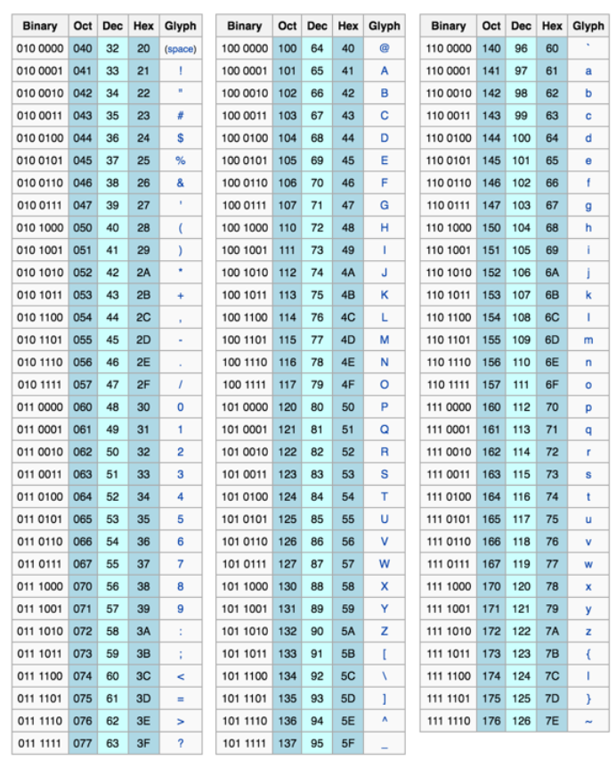
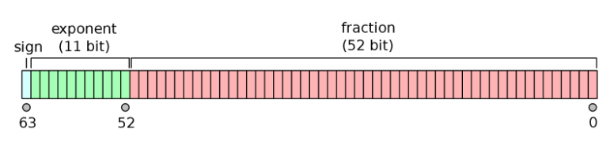

# Java中int的最大值是多少

计算机是如何保存数字的？用一些电磁信号的不同状态来表示不同的数字。

计算机能否使用十进制来保存数字？可以，但是错误率可能升高，错误率最低的方式是表示两位（0／1），因此计算机是二进制。

如何用二进制来表示英文呢？我们需要表示的不仅仅是26*2＝52个不同的英文字母，也要表示各种标点符号和控制符号，这些加在一起会有一百多个不同的符号。那么如果使用二进制表示，至少需要2^7=128，也就是至少需要7位，这就是ASCII。

(来源: [ASCII Wikipedia](https://en.wikipedia.org/wiki/ASCII))

扩展思考：ASCII中的大小写字母为什么不是连在一起的？这样进行大小写转换的时候只需要修改一个bit位。

ASCII只是7位，为什么Byte是8位？因为8更美啊，而且是2指数。当然这个只是一个美好的幻想，至于真相我曾经在课上讲过。

如何用二进制表示中文呢？我们常用的中文字有几万个，8位自然不够。于是我们需要更多的位数，你会选择10、16、20、32呢？于是产生了Unicode和一系列的变体。

我们怎么对二进制进行计算呢？
- 加法运算：11+11＝110
- 减法运算：100-11=1

如何用二进制表示负数呢？+1可以表示为1，但是-1如何表示呢？

假设我们使用4个bit表示数字，那么第一直觉是利用最前面的一位表示符号，后面三位表示大小。于是我们可以使用0001表示+1，使用1001表示-1。
- 此时如何计算1+1？0001+0001=0010
- 此时如何计算1-1？0001-0001=0000

但是如何计算1+(-1)？0001+(1001)=? 我们会发现此时不能再进行之前直觉的计算了，因为我们把符号位混到数字里了。

有没有一种方法，让我们在计算的时候，依然可以在进行加法运算的时候，直接按位进行求和呢？

让我们逆推一下，假设存在的话，会要求-1是多少呢？
- 假设：(0001)+(-1)＝0000
- 因此，我们可以推导出-1=1111

但是这里依然有两个问题：
- 我们求和的时候，进位在最前面会丢掉一个1，可能需要硬件的特殊处理。
- 我们其它的负数也可以这么做吗？

为了回答第二个问题，我们尝试2+(-2)
- 假设：(0010)+(-2)=0000
- 那么：(-2)=1110

这个表示能否继续求和呢？
- 我们试一下(-2)+(+1)=(1110)+(0001)=(1111)
- 居然和我们刚才求得的-1匹配了。

那么我们能看出来一个数的负数要如何求的呢？
- 1=0001 -1=1111
- 2=0010 -2=1110

结合之前的整个计算过程，我们会发现求一个数的负数需要两步
- 将原来的数1/0互换，因此0001变成了1110
- 在最后一位加上1，于是最后变成1111

其实这两步过程得到的就是反码和补码，而且更本质的是用10000减去了对应的正数。

那么我们能够从数学上证明这套方案是正确的吗？当然没问题。（可以通过基于4个bit的模运算来证明，假设有一个2^4的环，向后走k步也就等于向前走2^5-k步；有兴趣的同学可以让我在课上给大家证明，怀念一下我小学搞数学竞赛的时光）

这套方案的好处是，可以使用加法的运算单元来计算减法，从而简化了CPU的设计。

延展阅读：
- https://www.zhihu.com/question/20159860
- http://www.cnblogs.com/zhangziqiu/archive/2011/03/30/ComputerCode.html

二进制是如何计算乘法和除法？这就留给大家做思考题啦。（小提示：都是移位求和哦）

讲了什么多，Java的int最大值到底是多少呢？如果用3bit表示整数，那么能够表示的是：000=0、001=1、010=2、011=3、100=-4、101=-3、110=-2、111=-1

其实这里存疑的是-4，因为我们也完全可以将其定义为+4的，因为从环上来讲是没有区别的。但是如果把它定义为-4，一个好处是可以保证第一个标示位也能表示符号位。

Java使用32位表示整数，如果是有符号的话，结合我们之前的分析，最大的正整数是
01111111111111111111111111111111。这个就是2^31-1=2,147,483,647。

我们能手动估算2^31?
- 2^10=1024
- 2^30=1024^3=10^9
- 2^31=2*10^9

如何表示非整数？
- 1234.5 = 1.23456*10^3
- 1234.5 => 10011010010.1 ＝ 1.00110100101 \* 2^10 = 1.00110100101\*(10)^(1010)
- 2.2 = 10.00110011001100110011… （0.2\*2\*2\*2...）
- 0.2*2=0.4, 0.4*2=0.8, 0.8*2=1.6, 1.6-1=0.6, 0.6*2=1.2, 1.2-1=0.2

因此我们可以使用指数位＋小数位的方式来表示，如下图。

(来源: [Wikipedia Floating](https://en.wikipedia.org/wiki/Double-precision_floating-point_format))

思考题？
- 我们表示出来的2.2是对的吗？
- 如何表示infinity？
- 如何表示NaN？

有兴趣的同学，请选择以下资料进行延伸阅读：
- https://en.wikipedia.org/wiki/Double-precision_floating-point_format

如何表示字符串呢？最基本的是Char（16bit），Char组成数组，数组变成字符串。在这里可以延展阅读：
- https://www.ibm.com/developerworks/cn/java/j-lo-optmizestring/

2G内存能否放下100万个URL？URL的平均长度是多少？400Byte
- 400 Byte \* 10^6 = 400MB，因此放得下。
