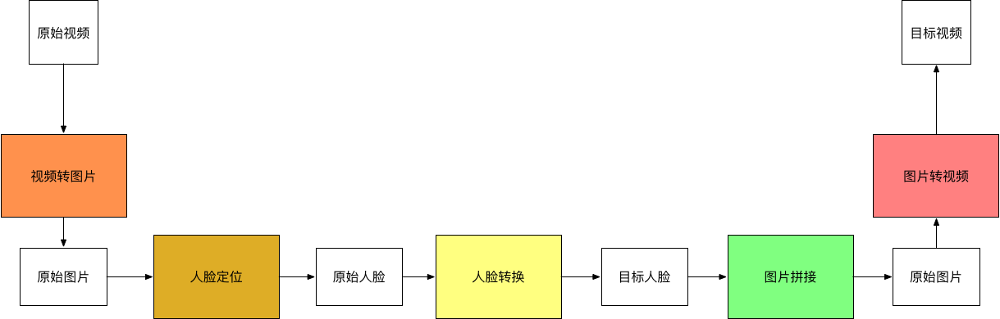
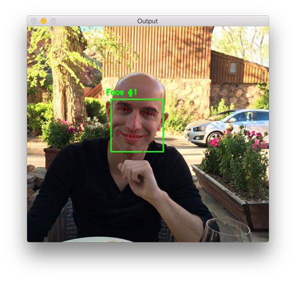
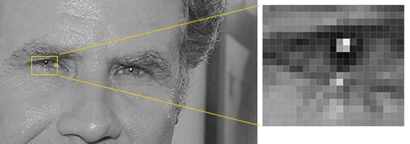
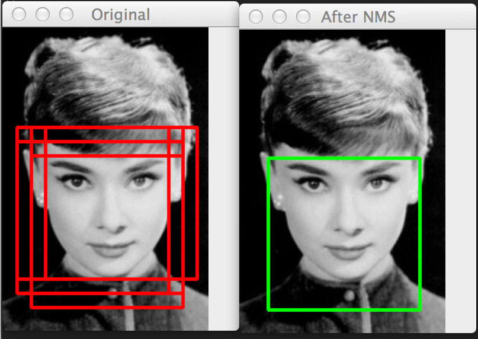
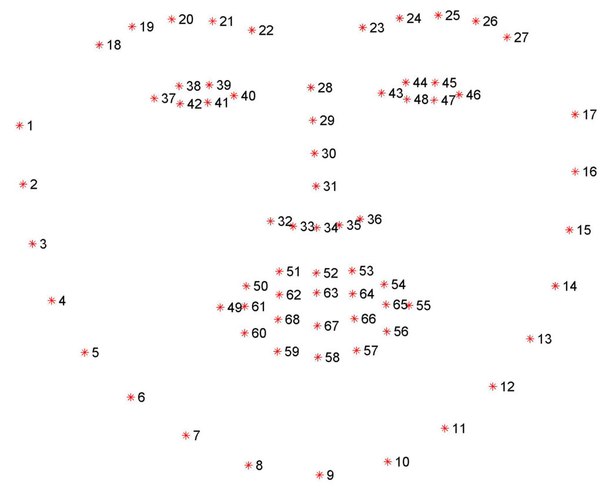
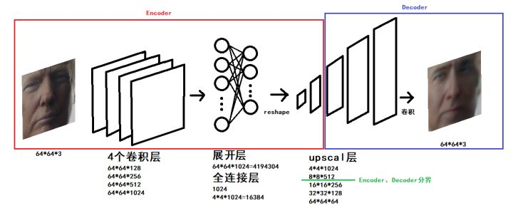

# 如何实现人工智能换脸DeepFake

- 作者：冯沁原
- 网站：[www.BitTiger.io](https://www.BitTiger.io)
- 原文：[github.com/Fabsqrt/BitTigerLab](https://github.com/Fabsqrt/BitTigerLab)
- 邮箱：Qinyuan@BitTiger.io

## 报名直播

报名地址：

[https://www.bittiger.io/events/6BMNCF2wyY3kX2aNN](https://www.bittiger.io/events/6BMNCF2wyY3kX2aNN)

## 简介

什么是DeepFake？它能够在视频中把一个人的脸变成另一个人的脸。

（来源: [Family fun with deepfakes. Or how I got my wife onto the Tonight Show](http://svencharleer.com/blog/2018/02/02/family-fun-with-deepfakes-or-how-i-got-my-wife-onto-the-tonight-show/)）

你能看出来这是一个合成的视频吗？

[](https://www.youtube.com/watch?v=BU9YAHigNx8 "Nick Cage DeepFakes Movie Compilation")

如果你是第一次听说DeepFake，一定要点击上面的视频，亲自感受一下尼古拉斯的脸是如何占据全世界的每一个影片。

[](https://www.youtube.com/watch?v=RdH7JoZZC2M "Deepfakes real time side by side comparison Amy Adams & Nick Cage")

让我们再来看一个歌唱版，仔细感受人物的表情和声音的同步，以及和原始视频的相似与差异。

## 项目实战

我们要如何实现视频里的变脸呢？

因为视频是连续的图片，那么我们只需要把每一张图片中的脸切换了，就能得到变脸的新视频了。

那么如何切换一个视频中的图片呢？这需要我们首先找到视频中的脸，然后把脸进行切换。

我们会发现，变脸这件事可以拆解成如下的流程。



于是，在我们后续的讲解中，会按照这五个步骤进行介绍。

### 视频转图像

#### FFmpeg

FFmpeg提供了处理音频、视频、字幕和相关源数据的工具库。

核心的库包括：
- libavcodec提供了处理编码的能力
- libavformat实现了流协议、容器类型、基本的I/O访问
- libavutil包括哈希、解压缩等多样的功能
- libavfilter提供了链式修改音频和视频的能力
- libavdevice提供了对设备访问的抽象
- libswresample实现了混音等能力
- libswscale实现了颜色和尺度变换的能力

对外主要提供了三个工具
- ffmpeg用来处理多媒体内容
- ffplay是一个极简的播放器
- ffprobe是多媒体内容的分析工具

于是，我们的视频转图片的功能，可以通过一下命令来实现，

```

ffmpeg -i clipname -vf fps=framerate -qscale:v 2 "imagename%04d.jpg"

```

具体来说，上面的命令可以把一个视频，按照固定的频率生成图片。


### 人脸定位

#### 基本算法

人脸定位是一个相对成熟的领域，主要是应用dlib库的相关功能。我们虽然可以定制一个人脸识别的算法，但是我们也可以使用已有的通用的人脸识别的函数库。

有两类算法，一类是HOG的脸部标记算法。


（来源: [Facial landmarks with dlib, OpenCV, and Python](https://www.pyimagesearch.com/2017/04/03/facial-landmarks-dlib-opencv-python/)）

该算法的效果如上图。它将人脸分成了如下的区域：
- 眼睛（左/右）
- 眉毛（左/右）
- 鼻子
- 嘴
- 下巴

基于这些标记，我们不仅能够进行后续的换脸，也能检测脸的具体形态，眨眼状态等。例如，我们可以把这些点连在一起，得到更多的特征。


（来源: [Real-Time Face Pose Estimation
](http://blog.dlib.net/2014/08/real-time-face-pose-estimation.html)）

寻找脸部标记具体来说是一个预测问题，输入是一张图片和兴趣区域，输出是兴趣区域的关键点。

HOG是如何找到人脸的呢？其实这可以是一个通用的检测算法：
- 从数据集中找到正样本，并且计算HOG描述
- 从数据集中找到负样本，并且计算HOG描述
- 基于HOG的描述使用分类算法
- 在负样本上在不同的起点和尺度进行分类，并且找到误判的HOG
- 基于上一步的负样本，对模型进行重新的训练

这里有个问题，如何计算HOG的描述呢？我们可以计算每个点的亮度，然后把每个点表示为指向更黑的方向的向量。如下图所示：


（来源: [Machine Learning is Fun! Part 4: Modern Face Recognition with Deep Learning
](https://medium.com/@ageitgey/machine-learning-is-fun-part-4-modern-face-recognition-with-deep-learning-c3cffc121d78)）


（来源: [Machine Learning is Fun! Part 4: Modern Face Recognition with Deep Learning
](https://medium.com/@ageitgey/machine-learning-is-fun-part-4-modern-face-recognition-with-deep-learning-c3cffc121d78)）

我们为什么要这么做呢？因为每个点的绝对值会受到环境的影响，但是相对值则比较稳定。因此，我们通过变化梯度的方式，能够准备更优秀的数据。当然，我们也可以进一步的把相邻的点聚合在一起，从而产生更有代表性的数据。

现在可以进行检测了
- 首先在新的图片上基于不同的起点和尺度寻找可行的区间
- 基于非极大抑制的方法来减少冗余和重复的，下图就是一个有冗余和去除冗余的情况，这个方法说白了就是找一个最大概率的矩阵去覆盖掉和他过于重合的矩阵，并且不断重复这个过程



（来源: [Histogram of Oriented Gradients and Object Detection](https://www.pyimagesearch.com/2014/11/10/histogram-oriented-gradients-object-detection/)）

有了轮廓之后，我们可以找到脸部标记。而寻找脸部标记的算法是基于《One Millisecond Face Alignment with an Ensemble of Regression Trees》的论文。简单来说，它利用了已经标记好的训练集来训练一个回归树的组合，从而用来预测。


（来源: [One Millisecond Face Alignment with an Ensemble of Regression Trees](https://pdfs.semanticscholar.org/d78b/6a5b0dcaa81b1faea5fb0000045a62513567.pdf)）

在这个基础上，就能够标记出这68个点。


（来源: [Facial landmarks with dlib, OpenCV, and Python
](https://www.pyimagesearch.com/2017/04/03/facial-landmarks-dlib-opencv-python/)）

基于人脸的68个标记的坐标，可以计算人脸的角度，从而抠出摆正后的人脸。但是dlib要求识别的必须是全脸，因此会减少我们的样本集以及一些特定的样本场景。同时，因为人脸是64*64像素的尺寸，因此也要处理清晰度的问题。

另一种方法是用CNN训练一个识别脸部的模型。

#### 数据准备

我们的目标是把原始人脸转换为目标人脸，因此我们需要收集原始人脸的图片和目标人脸的图片。如果你选择的是一个名人，那么可以直接用Google image得到你想要的图片。虽然视频中的图片也能用，但是因为多样性不够，因此还是多多收集一下。当然，我用的是我和我老婆的图片，因此直接从我们的Photo中导出即可。当人脸数据生成后，最好仔细检查一下，避免不应该的脸或者其他出现在你的训练集中。


#### extract.py


```Python

import cv2 # 开源的计算机视觉库

from pathlib import Path # 提供面向对象方式的文件访问
from tqdm import tqdm # 提供进度条显示功能
import os # 提供操作系统相关的访问
import numpy as np # 提供科学计算相关的功能

from lib.cli import DirectoryProcessor, rotate_image # 处理一个目录的文件，然后保存到新的目录中；旋转图片，其实是在utils中
from lib.utils import get_folder # 获得一个folder，不存在则创建
from lib.multithreading import pool_process # 多进程并发计算
from lib.detect_blur import is_blurry # 判断图片是否模糊
from plugins.PluginLoader import PluginLoader # 加载对应的算法

class ExtractTrainingData(DirectoryProcessor): # 从训练集提取头像
    def create_parser(self, subparser, command, description):
        self.optional_arguments = self.get_optional_arguments()
        self.parser = subparser.add_parser(
            command,
            help="Extract the faces from a pictures.",
            description=description,
            epilog="Questions and feedback: \
            https://github.com/deepfakes/faceswap-playground"
            )

    @staticmethod
    def get_optional_arguments(): # 提取器的参数
        ''' Put the arguments in a list so that they are accessible from both argparse and gui '''
        argument_list = []
        argument_list.append({ "opts": ('-D', '--detector'),
                               "type": str,
                               "choices": ("hog", "cnn", "all"), #选择hog或者cnn
                               "default": "hog",
                               "help": "Detector to use. 'cnn' detects much more angles but will be much more resource intensive and may fail on large files."}) # cnn的能够检测更多的角度，但是
        argument_list.append({ "opts": ('-l', '--ref_threshold'),
                               "type": float,
                               "dest": "ref_threshold",
                               "default": 0.6,
                               "help": "Threshold for positive face recognition"}) # 选择脸的阈值
        argument_list.append({ "opts": ('-n', '--nfilter'),
                               "type": str,
                               "dest": "nfilter",
                               "nargs": '+',
                               "default": "nfilter.jpg",
                               "help": "Reference image for the persons you do not want to process. Should be a front portrait"}) # 想要过滤掉的脸
        argument_list.append({ "opts": ('-f', '--filter'),
                               "type": str,
                               "dest": "filter",
                               "nargs": '+',
                               "default": "filter.jpg",
                               "help": "Reference image for the person you want to process. Should be a front portrait"}) # 想要处理的脸
        argument_list.append({ "opts": ('-j', '--processes'),
                               "type": int,
                               "default": 1,
                               "help": "Number of processes to use."}) # 使用的进程数
        argument_list.append({ "opts": ('-s', '--skip-existing'),
                               "action": 'store_true',
                               "dest": 'skip_existing',
                               "default": False,
                               "help": "Skips frames already extracted."})
        argument_list.append({ "opts": ('-dl', '--debug-landmarks'),
                               "action": "store_true",
                               "dest": "debug_landmarks",
                               "default": False,
                               "help": "Draw landmarks for debug."}) # 是否画出脸部标记
        argument_list.append({ "opts": ('-r', '--rotate-images'),
                               "type": str,
                               "dest": "rotate_images",
                               "default": None,
                               "help": "If a face isn't found, rotate the images to try to find a face. Can find more faces at the "
                                 "cost of extraction speed.  Pass in a single number to use increments of that size up to 360, "
                                 "or pass in a list of numbers to enumerate exactly what angles to check."}) # 旋转脸的角度
        argument_list.append({ "opts": ('-ae', '--align-eyes'),
                               "action": "store_true",
                               "dest": "align_eyes",
                               "default": False,
                               "help": "Perform extra alignment to ensure left/right eyes lie at the same height"}) # 是否调齐眼睛的高度
        argument_list.append({ "opts": ('-bt', '--blur-threshold'),
                               "type": int,
                               "dest": "blur_thresh",
                               "default": None,
                               "help": "Automatically discard images blurrier than the specified threshold. Discarded images are moved into a \"blurry\" sub-folder. Lower values allow more blur"}) // 自动移除模糊的图片
        return argument_list

    def process(self):
        extractor_name = "Align" # 对应的是Extract_Align.py
        self.extractor = PluginLoader.get_extractor(extractor_name)()
        processes = self.arguments.processes
        try:
            if processes != 1: # 多进程处理图片
                files = list(self.read_directory())
                for filename, faces in tqdm(pool_process(self.processFiles, files, processes=processes), total = len(files)):
                    self.num_faces_detected += 1
                    self.faces_detected[os.path.basename(filename)] = faces
            else: # 单进程处理图片
                for filename in tqdm(self.read_directory()):
                    try:
                        image = cv2.imread(filename)
                        self.faces_detected[os.path.basename(filename)] = self.handleImage(image, filename)
                    except Exception as e:
                        if self.arguments.verbose:
                            print('Failed to extract from image: {}. Reason: {}'.format(filename, e))
                        pass
        finally:
            self.write_alignments()

    def processFiles(self, filename): # 处理一个单独的图片的函数
        try:
            image = cv2.imread(filename)
            return filename, self.handleImage(image, filename)
        except Exception as e:
            if self.arguments.verbose:
                print('Failed to extract from image: {}. Reason: {}'.format(filename, e))
            pass
        return filename, []

    def getRotatedImageFaces(self, image, angle): # 得到固定角度旋转后的图片的人脸
        rotated_image = rotate_image(image, angle)
        faces = self.get_faces(rotated_image, rotation=angle)
        rotated_faces = [(idx, face) for idx, face in faces]
        return rotated_faces, rotated_image

    def imageRotator(self, image): # 得到一系列旋转后的人脸
        ''' rotates the image through rotation_angles to try to find a face '''
        for angle in self.rotation_angles:
            rotated_faces, rotated_image = self.getRotatedImageFaces(image, angle)
            if len(rotated_faces) > 0:
                if self.arguments.verbose:
                    print('found face(s) by rotating image {} degrees'.format(angle))
                break
        return rotated_faces, rotated_image

    def handleImage(self, image, filename):
        faces = self.get_faces(image)
        process_faces = [(idx, face) for idx, face in faces]

        # 没有找到人脸，尝试旋转图片
        if self.rotation_angles is not None and len(process_faces) == 0:
            process_faces, image = self.imageRotator(image)

        rvals = []
        for idx, face in process_faces:
            # 画出人脸的标记
            if self.arguments.debug_landmarks:
                for (x, y) in face.landmarksAsXY():
                    cv2.circle(image, (x, y), 2, (0, 0, 255), -1)

            resized_image, t_mat = self.extractor.extract(image, face, 256, self.arguments.align_eyes)
            output_file = get_folder(self.output_dir) / Path(filename).stem

            # 检测图片是否模糊
            if self.arguments.blur_thresh is not None:
                aligned_landmarks = self.extractor.transform_points(face.landmarksAsXY(), t_mat, 256, 48)
                feature_mask = self.extractor.get_feature_mask(aligned_landmarks / 256, 256, 48)
                feature_mask = cv2.blur(feature_mask, (10, 10))
                isolated_face = cv2.multiply(feature_mask, resized_image.astype(float)).astype(np.uint8)
                blurry, focus_measure = is_blurry(isolated_face, self.arguments.blur_thresh)
                # print("{} focus measure: {}".format(Path(filename).stem, focus_measure))
                # cv2.imshow("Isolated Face", isolated_face)
                # cv2.waitKey(0)
                # cv2.destroyAllWindows()
                if blurry:
                    print("{}'s focus measure of {} was below the blur threshold, moving to \"blurry\"".format(Path(filename).stem, focus_measure))
                    output_file = get_folder(Path(self.output_dir) / Path("blurry")) / Path(filename).stem

            cv2.imwrite('{}_{}{}'.format(str(output_file), str(idx), Path(filename).suffix), resized_image) # 生成新图片
            f = {
                "r": face.r,
                "x": face.x,
                "w": face.w,
                "y": face.y,
                "h": face.h,
                "landmarksXY": face.landmarksAsXY()
            }
            rvals.append(f)
        return rvals

```
注意，基于特征标记的算法对于倾斜的脸效果不好，也可以引入CNN。

### 人脸转换

人脸转换的基本原理是什么？假设让你盯着一个人的视频连续看上100个小时，接着又给你看一眼另外一个人的照片，接着让你凭着记忆画出来刚才的照片，你一定画的会很像第一个人的。

我们使用的模型是Autoencoder。有趣的是，这个模型所做的是基于原始的图片再次生成原始的图片。Autoencoder的编码器把图片进行压缩，而解码器把图片进行还原，一个示例如下图：


（来源: [Building Autoencoders in Keras
](https://blog.keras.io/building-autoencoders-in-keras.html/)）

在这个基础上，即使我们输入的是另外一个人脸，也会被Autoencoder编码成为一个类似原来的脸。

为了提升我们最终的效果，我们还需要把人脸共性相关的属性和人脸特性相关的属性进行学习。因此，我们对所有的脸都用一个统一的编码器，这个编码器的目的是学习人脸共性的地方；然后，我们对每个脸有一个单独的解码器，这个解码器是为了学习人脸个性的地方。这样当你用B的脸通过编码器，再使用A的解码器的话，你会得到一个与B的表情一致，但是A的脸。

这个过程用公式表示如下：

```

X' = Decoder(Encoder(Shuffle(X)))
Loss = L1Loss(X'-X)

A' = Decoder_A(Encoder(Shuffle(A)))
Loss_A = L1Loss(A'-A)

B' = Decoder_B(Encoder(Shuffle(B)))
Loss_B = L1Loss(B'-B)


```

具体来说，在训练过程中，我们输入A的图片，通过编码器和解码器还原A的脸；然后我们输入B的图片，通过相同的编码器但是不同的解码器还原B的脸。不断迭代这个过程，直到loss降低到一个阈值。在模型训练的时候，我建议把loss降低到0.02，这样的效果会比较好。

这里用的是比较标准的建模方式。值得注意的是，作者通过加入PixelShuffler()的函数把图像进行了一定的扭曲，而这个扭曲增加了学习的难度，反而让模型能够实现最终的效果。仔细想想这背后的道理，如果你一直在做简单的题目，那么必然不会有什么解决难题的能力。但是，我只要把题目做一些变体，就足以让你成长。

因为在建模中使用的是原图A的扭曲来还原A，应用中是用B来还原A，所以扭曲的方式会极大的影响到最终的结果。因此，如何选择更好的扭曲方式，也是一个重要的问题。

当我们图片融合的时候，会有一个难题，如何又保证效果又防止图片抖动。

#### train.py


```python

import cv2 # 开源的计算机视觉库
import numpy # 提供科学计算相关的功能
import time # 提供时间相关的功能

import threading # 提供多线程相关的功能
from lib.utils import get_image_paths, get_folder # 得到一个目录下的图片；获得一个folder，不存在则创建
from lib.cli import FullPaths, argparse, os, sys
from plugins.PluginLoader import PluginLoader # 加载对应的算法

tf = None
set_session = None
def import_tensorflow_keras(): # 在需要的时候载入TensorFlow和keras模块
    ''' Import the TensorFlow and keras set_session modules only when they are required '''
    global tf
    global set_session
    if tf is None or set_session is None:
        import tensorflow
        import keras.backend.tensorflow_backend # keras依赖底层的tensorflow实现具体的运算
        tf = tensorflow
        set_session = keras.backend.tensorflow_backend.set_session

class TrainingProcessor(object): # 训练器
    arguments = None

    def __init__(self, subparser, command, description='default'): # 初始化训练器
        self.argument_list = self.get_argument_list()
        self.optional_arguments = self.get_optional_arguments()
        self.parse_arguments(description, subparser, command)
        self.lock = threading.Lock()

    def process_arguments(self, arguments):
        self.arguments = arguments
        print("Model A Directory: {}".format(self.arguments.input_A))
        print("Model B Directory: {}".format(self.arguments.input_B))
        print("Training data directory: {}".format(self.arguments.model_dir))

        self.process()

    @staticmethod
    def get_argument_list(): # 处理参数
        ''' Put the arguments in a list so that they are accessible from both argparse and gui '''
        argument_list = []
        argument_list.append({ "opts": ("-A", "--input-A"), # 训练数据A的目录
                               "action": FullPaths,
                               "dest": "input_A",
                               "default": "input_A",
                               "help": "Input directory. A directory containing training images for face A.\
                               Defaults to 'input'"})
        argument_list.append({ "opts": ("-B", "--input-B"), # 训练数据B的目录
                               "action": FullPaths,
                               "dest": "input_B",
                               "default": "input_B",
                               "help": "Input directory. A directory containing training images for face B.\
                               Defaults to 'input'"})
        argument_list.append({ "opts": ("-m", "--model-dir"), # 模型数据的目录
                               "action": FullPaths,
                               "dest": "model_dir",
                               "default": "models",
                               "help": "Model directory. This is where the training data will \
                               be stored. Defaults to 'model'"})
        argument_list.append({ "opts": ("-p", "--preview"), # 是否开启预览
                               "action": "store_true",
                               "dest": "preview",
                               "default": False,
                               "help": "Show preview output. If not specified, write progress \
                               to file."})
        argument_list.append({ "opts": ("-v", "--verbose"), # 是否给出更详细的信息
                               "action": "store_true",
                               "dest": "verbose",
                               "default": False,
                               "help": "Show verbose output"})
        argument_list.append({ "opts": ("-s", "--save-interval"), # 多少次迭代后保存结果
                               "type": int,
                               "dest": "save_interval",
                               "default": 100,
                               "help": "Sets the number of iterations before saving the model."})
        argument_list.append({ "opts": ("-w", "--write-image"), # 保存训练结果
                               "action": "store_true",
                               "dest": "write_image",
                               "default": False,
                               "help": "Writes the training result to a file even on preview mode."})
        argument_list.append({ "opts": ("-t", "--trainer"), # 选择训练器的类型
                               "type": str,
                               "choices": PluginLoader.get_available_models(),
                               "default": PluginLoader.get_default_model(),
                               "help": "Select which trainer to use, LowMem for cards < 2gb."})
        argument_list.append({ "opts": ("-pl", "--use-perceptual-loss"), # 使用感知损失
                               "action": "store_true",
                               "dest": "perceptual_loss",
                               "default": False,
                               "help": "Use perceptual loss while training"})
        argument_list.append({ "opts": ("-bs", "--batch-size"), # 每一批的大小
                               "type": int,
                               "default": 64,
                               "help": "Batch size, as a power of 2 (64, 128, 256, etc)"})
        argument_list.append({ "opts": ("-ag", "--allow-growth"),
                               "action": "store_true",
                               "dest": "allow_growth",
                               "default": False,
                               "help": "Sets allow_growth option of Tensorflow to spare memory on some configs"})
        argument_list.append({ "opts": ("-ep", "--epochs"), # 每一个时代的训练次数
                               "type": int,
                               "default": 1000000,
                               "help": "Length of training in epochs."})
        argument_list.append({ "opts": ("-g", "--gpus"), # 使用的GPU数量
                               "type": int,
                               "default": 1,
                               "help": "Number of GPUs to use for training"})
        # This is a hidden argument to indicate that the GUI is being used, so the preview window
        # should be redirected Accordingly
        argument_list.append({ "opts": ("-gui", "--gui"), # 是否使用GUI
                               "action": "store_true",
                               "dest": "redirect_gui",
                               "default": False,
                               "help": argparse.SUPPRESS})
        return argument_list

    @staticmethod
    def get_optional_arguments(): # 创建一个存放参数的数组
        ''' Put the arguments in a list so that they are accessible from both argparse and gui '''
        # Override this for custom arguments
        argument_list = []
        return argument_list

    def parse_arguments(self, description, subparser, command):
        parser = subparser.add_parser(
            command,
            help="This command trains the model for the two faces A and B.",
            description=description,
            epilog="Questions and feedback: \
            https://github.com/deepfakes/faceswap-playground")

        for option in self.argument_list:
            args = option['opts']
            kwargs = {key: option[key] for key in option.keys() if key != 'opts'}
            parser.add_argument(*args, **kwargs)

        parser = self.add_optional_arguments(parser)
        parser.set_defaults(func=self.process_arguments)

    def add_optional_arguments(self, parser):
        for option in self.optional_arguments:
            args = option['opts']
            kwargs = {key: option[key] for key in option.keys() if key != 'opts'}
            parser.add_argument(*args, **kwargs)
        return parser

    def process(self): # 具体的执行
        self.stop = False
        self.save_now = False

        thr = threading.Thread(target=self.processThread, args=(), kwargs={}) # 线程执行
        thr.start()

        if self.arguments.preview:
            print('Using live preview')
            while True:
                try:
                    with self.lock:
                        for name, image in self.preview_buffer.items():
                            cv2.imshow(name, image)

                    key = cv2.waitKey(1000)
                    if key == ord('\n') or key == ord('\r'):
                        break
                    if key == ord('s'):
                        self.save_now = True
                except KeyboardInterrupt:
                    break
        else:
            try:
                input() # TODO how to catch a specific key instead of Enter?
                # there isnt a good multiplatform solution: https://stackoverflow.com/questions/3523174/raw-input-in-python-without-pressing-enter
            except KeyboardInterrupt:
                pass

        print("Exit requested! The trainer will complete its current cycle, save the models and quit (it can take up a couple of seconds depending on your training speed). If you want to kill it now, press Ctrl + c")
        self.stop = True
        thr.join() # waits until thread finishes

    def processThread(self):
        try:
            if self.arguments.allow_growth:
                self.set_tf_allow_growth()

            print('Loading data, this may take a while...')
            # this is so that you can enter case insensitive values for trainer
            trainer = self.arguments.trainer
            trainer = "LowMem" if trainer.lower() == "lowmem" else trainer
            model = PluginLoader.get_model(trainer)(get_folder(self.arguments.model_dir), self.arguments.gpus) # 读取模型
            model.load(swapped=False)

            images_A = get_image_paths(self.arguments.input_A) # 图片A
            images_B = get_image_paths(self.arguments.input_B) # 图片B
            trainer = PluginLoader.get_trainer(trainer) # 创建训练器
            trainer = trainer(model, images_A, images_B, self.arguments.batch_size, self.arguments.perceptual_loss) # 设置训练器参数

            print('Starting. Press "Enter" to stop training and save model')

            for epoch in range(0, self.arguments.epochs):

                save_iteration = epoch % self.arguments.save_interval == 0

                trainer.train_one_step(epoch, self.show if (save_iteration or self.save_now) else None) # 进行一步训练

                if save_iteration:
                    model.save_weights()

                if self.stop:
                    break

                if self.save_now:
                    model.save_weights()
                    self.save_now = False

            model.save_weights()
            exit(0)
        except KeyboardInterrupt:
            try:
                model.save_weights()
            except KeyboardInterrupt:
                print('Saving model weights has been cancelled!')
            exit(0)
        except Exception as e:
            raise e
            exit(1)

    def set_tf_allow_growth(self):
        import_tensorflow_keras()
        config = tf.ConfigProto()
        config.gpu_options.allow_growth = True
        config.gpu_options.visible_device_list="0"
        set_session(tf.Session(config=config))

    preview_buffer = {}

    def show(self, image, name=''): # 提供预览
        try:
            if self.arguments.redirect_gui:
                scriptpath = os.path.realpath(os.path.dirname(sys.argv[0]))
                img = '.gui_preview.png'
                imgfile = os.path.join(scriptpath, img)
                cv2.imwrite(imgfile, image)
            elif self.arguments.preview:
                with self.lock:
                    self.preview_buffer[name] = image
            elif self.arguments.write_image:
                cv2.imwrite('_sample_{}.jpg'.format(name), image)
        except Exception as e:
            print("could not preview sample")
            raise e


```


#### Trainer.py

```python

import time
import numpy
from lib.training_data import TrainingDataGenerator, stack_images

class Trainer():
    random_transform_args = { # 初始化参数
        'rotation_range': 10,
        'zoom_range': 0.05,
        'shift_range': 0.05,
        'random_flip': 0.4,
    }

    def __init__(self, model, fn_A, fn_B, batch_size, *args):
        self.batch_size = batch_size
        self.model = model

        generator = TrainingDataGenerator(self.random_transform_args, 160) # 读取需要的数据
        self.images_A = generator.minibatchAB(fn_A, self.batch_size)
        self.images_B = generator.minibatchAB(fn_B, self.batch_size)

    def train_one_step(self, iter, viewer): # 训练一步
        epoch, warped_A, target_A = next(self.images_A)
        epoch, warped_B, target_B = next(self.images_B)

        loss_A = self.model.autoencoder_A.train_on_batch(warped_A, target_A) # 计算损失
        loss_B = self.model.autoencoder_B.train_on_batch(warped_B, target_B)
        print("[{0}] [#{1:05d}] loss_A: {2:.5f}, loss_B: {3:.5f}".format(time.strftime("%H:%M:%S"), iter, loss_A, loss_B),
            end='\r')

        if viewer is not None:
            viewer(self.show_sample(target_A[0:14], target_B[0:14]), "training")

    def show_sample(self, test_A, test_B):
        figure_A = numpy.stack([
            test_A,
            self.model.autoencoder_A.predict(test_A),
            self.model.autoencoder_B.predict(test_A),
        ], axis=1)
        figure_B = numpy.stack([
            test_B,
            self.model.autoencoder_B.predict(test_B),
            self.model.autoencoder_A.predict(test_B),
        ], axis=1)

        if test_A.shape[0] % 2 == 1:
            figure_A = numpy.concatenate ([figure_A, numpy.expand_dims(figure_A[0],0) ])
            figure_B = numpy.concatenate ([figure_B, numpy.expand_dims(figure_B[0],0) ])

        figure = numpy.concatenate([figure_A, figure_B], axis=0)
        w = 4
        h = int( figure.shape[0] / w)
        figure = figure.reshape((w, h) + figure.shape[1:])
        figure = stack_images(figure)

        return numpy.clip(figure * 255, 0, 255).astype('uint8')


``


#### AutoEncoder.py


```Python

# AutoEncoder的基础类

import os, shutil

encoderH5 = 'encoder.h5'
decoder_AH5 = 'decoder_A.h5'
decoder_BH5 = 'decoder_B.h5'

class AutoEncoder:
    def __init__(self, model_dir, gpus):
        self.model_dir = model_dir
        self.gpus = gpus

        self.encoder = self.Encoder()
        self.decoder_A = self.Decoder()
        self.decoder_B = self.Decoder()

        self.initModel()

    def load(self, swapped):
        (face_A,face_B) = (decoder_AH5, decoder_BH5) if not swapped else (decoder_BH5, decoder_AH5)

        try: # 加载权重
            self.encoder.load_weights(str(self.model_dir / encoderH5))
            self.decoder_A.load_weights(str(self.model_dir / face_A))
            self.decoder_B.load_weights(str(self.model_dir / face_B))
            print('loaded model weights')
            return True
        except Exception as e:
            print('Failed loading existing training data.')
            print(e)
            return False

    def save_weights(self): # 存储权重
        model_dir = str(self.model_dir)
        if os.path.isdir(model_dir + "_bk"):
            shutil.rmtree(model_dir + "_bk")
        shutil.move(model_dir,  model_dir + "_bk")
        os.mkdir(model_dir)
        self.encoder.save_weights(str(self.model_dir / encoderH5))
        self.decoder_A.save_weights(str(self.model_dir / decoder_AH5))
        self.decoder_B.save_weights(str(self.model_dir / decoder_BH5))
        print('saved model weights')

```

#### Model.py

```Python

# Based on the original https://www.reddit.com/r/deepfakes/ code sample + contribs

from keras.models import Model as KerasModel
from keras.layers import Input, Dense, Flatten, Reshape
from keras.layers.advanced_activations import LeakyReLU
from keras.layers.convolutional import Conv2D
from keras.optimizers import Adam

from .AutoEncoder import AutoEncoder
from lib.PixelShuffler import PixelShuffler

from keras.utils import multi_gpu_model

IMAGE_SHAPE = (64, 64, 3)
ENCODER_DIM = 1024

class Model(AutoEncoder):
    def initModel(self):
        optimizer = Adam(lr=5e-5, beta_1=0.5, beta_2=0.999)  # 深入理解Adam的优化
        x = Input(shape=IMAGE_SHAPE)

        self.autoencoder_A = KerasModel(x, self.decoder_A(self.encoder(x)))
        self.autoencoder_B = KerasModel(x, self.decoder_B(self.encoder(x)))

        if self.gpus > 1:
            self.autoencoder_A = multi_gpu_model( self.autoencoder_A , self.gpus)
            self.autoencoder_B = multi_gpu_model( self.autoencoder_B , self.gpus)

        self.autoencoder_A.compile(optimizer=optimizer, loss='mean_absolute_error')
        self.autoencoder_B.compile(optimizer=optimizer, loss='mean_absolute_error')

    def converter(self, swap):
        autoencoder = self.autoencoder_B if not swap else self.autoencoder_A
        return lambda img: autoencoder.predict(img)

    def conv(self, filters):
        def block(x):
            x = Conv2D(filters, kernel_size=5, strides=2, padding='same')(x)
            x = LeakyReLU(0.1)(x)
            return x
        return block

    def upscale(self, filters):
        def block(x):
            x = Conv2D(filters * 4, kernel_size=3, padding='same')(x)
            x = LeakyReLU(0.1)(x) # 使用 LeakyReLU 激活函数
            x = PixelShuffler()(x) # 将filter的大小变为原来的1/4，让高和宽变为原来的两倍
            return x
        return block

    def Encoder(self):
        input_ = Input(shape=IMAGE_SHAPE)
        x = input_
        x = self.conv(128)(x)
        x = self.conv(256)(x)
        x = self.conv(512)(x)
        x = self.conv(1024)(x)
        x = Dense(ENCODER_DIM)(Flatten()(x))
        x = Dense(4 * 4 * 1024)(x)
        x = Reshape((4, 4, 1024))(x)
        x = self.upscale(512)(x)
        return KerasModel(input_, x)

    def Decoder(self):
        input_ = Input(shape=(8, 8, 512))
        x = input_
        x = self.upscale(256)(x)
        x = self.upscale(128)(x)
        x = self.upscale(64)(x)
        x = Conv2D(3, kernel_size=5, padding='same', activation='sigmoid')(x)
        return KerasModel(input_, x)


```

整个网络的结构如下：



（来源: [刷爆朋友圈的视频人物换脸是怎样炼成的？](https://zhuanlan.zhihu.com/p/33424270)）

当然我们也可以用GAN进行进一步的优化。

#### convert.py

在训练的基础上，我们现在可以进行图片的转换了。

```Python

import cv2
import re
import os

from pathlib import Path
from tqdm import tqdm

from lib.cli import DirectoryProcessor, FullPaths
from lib.utils import BackgroundGenerator, get_folder, get_image_paths, rotate_image

from plugins.PluginLoader import PluginLoader

class ConvertImage(DirectoryProcessor):
    filename = ''
    def create_parser(self, subparser, command, description):
        self.optional_arguments = self.get_optional_arguments()
        self.parser = subparser.add_parser(
            command,
            help="Convert a source image to a new one with the face swapped.",
            description=description,
            epilog="Questions and feedback: \
            https://github.com/deepfakes/faceswap-playground"
        )

    @staticmethod
    def get_optional_arguments(): # 设置参数
        ''' Put the arguments in a list so that they are accessible from both argparse and gui '''
        argument_list = []
        argument_list.append({ "opts": ('-m', '--model-dir'), # 模型的地址
                               "action": FullPaths,
                               "dest": "model_dir",
                               "default": "models",
                               "help": "Model directory. A directory containing the trained model \
                               you wish to process. Defaults to 'models'"})
        argument_list.append({ "opts": ('-a', '--input-aligned-dir'), # 需要转换的图片
                               "action": FullPaths,
                               "dest": "input_aligned_dir",
                               "default": None,
                               "help": "Input \"aligned directory\". A directory that should contain the \
                               aligned faces extracted from the input files. If you delete faces from \
                               this folder, they'll be skipped during conversion. If no aligned dir is \
                               specified, all faces will be converted."})
        argument_list.append({ "opts": ('-t', '--trainer'), # 选择模型
                               "type": str,
                               "choices": PluginLoader.get_available_models(), # case sensitive because this is used to load a plug-in.
                               "default": PluginLoader.get_default_model(),
                               "help": "Select the trainer that was used to create the model."})
        argument_list.append({ "opts": ('-s', '--swap-model'),
                               "action": "store_true",
                               "dest": "swap_model",
                               "default": False,
                               "help": "Swap the model. Instead of A -> B, swap B -> A."})
        argument_list.append({ "opts": ('-c', '--converter'),
                               "type": str,
                               "choices": ("Masked", "Adjust"), # case sensitive because this is used to load a plugin.
                               "default": "Masked",
                               "help": "Converter to use."})
        argument_list.append({ "opts": ('-D', '--detector'), # 脸部检测器
                               "type": str,
                               "choices": ("hog", "cnn"), # case sensitive because this is used to load a plugin.
                               "default": "hog",
                               "help": "Detector to use. 'cnn' detects much more angles but will be much more resource intensive and may fail on large files."})
        argument_list.append({ "opts": ('-fr', '--frame-ranges'),
                               "nargs": "+",
                               "type": str,
                               "help": "frame ranges to apply transfer to e.g. For frames 10 to 50 and 90 to 100 use --frame-ranges 10-50 90-100. \
                               Files must have the frame-number as the last number in the name!"})
        argument_list.append({ "opts": ('-d', '--discard-frames'),
                               "action": "store_true",
                               "dest": "discard_frames",
                               "default": False,
                               "help": "When used with --frame-ranges discards frames that are not processed instead of writing them out unchanged."})
        argument_list.append({ "opts": ('-l', '--ref_threshold'),
                               "type": float,
                               "dest": "ref_threshold",
                               "default": 0.6,
                               "help": "Threshold for positive face recognition"})
        argument_list.append({ "opts": ('-n', '--nfilter'), # 删除不想转换的人脸
                               "type": str,
                               "dest": "nfilter",
                               "nargs": '+',
                               "default": "nfilter.jpg",
                               "help": "Reference image for the persons you do not want to process. Should be a front portrait"})
        argument_list.append({ "opts": ('-f', '--filter'), # 选择你想要的人脸
                               "type": str,
                               "dest": "filter",
                               "nargs": "+",
                               "default": "filter.jpg",
                               "help": "Reference images for the person you want to process. Should be a front portrait"})
        argument_list.append({ "opts": ('-b', '--blur-size'),
                               "type": int,
                               "default": 2,
                               "help": "Blur size. (Masked converter only)"})
        argument_list.append({ "opts": ('-S', '--seamless'),
                               "action": "store_true",
                               "dest": "seamless_clone",
                               "default": False,
                               "help": "Use cv2's seamless clone. (Masked converter only)"})
        argument_list.append({ "opts": ('-M', '--mask-type'),
                               "type": str.lower, #lowercase this, because its just a string later on.
                               "dest": "mask_type",
                               "choices": ["rect", "facehull", "facehullandrect"],
                               "default": "facehullandrect",
                               "help": "Mask to use to replace faces. (Masked converter only)"})
        argument_list.append({ "opts": ('-e', '--erosion-kernel-size'),
                               "dest": "erosion_kernel_size",
                               "type": int,
                               "default": None,
                               "help": "Erosion kernel size. (Masked converter only). Positive values apply erosion which reduces the edge of the swapped face. Negative values apply dilation which allows the swapped face to cover more space."})
        argument_list.append({ "opts": ('-mh', '--match-histgoram'),
                               "action": "store_true",
                               "dest": "match_histogram",
                               "default": False,
                               "help": "Use histogram matching. (Masked converter only)"})
        argument_list.append({ "opts": ('-sh', ),
                               "type": str.lower,
                               "dest": "sharpen_image",
                               "choices": ["bsharpen", "gsharpen"],
                               "default": None,
                               "help": "Use Sharpen Image - bsharpen = Box Blur, gsharpen = Gaussian Blur (Masked converter only)"})
        argument_list.append({ "opts": ('-sm', '--smooth-mask'),
                               "action": "store_true",
                               "dest": "smooth_mask",
                               "default": True,
                               "help": "Smooth mask (Adjust converter only)"})
        argument_list.append({ "opts": ('-aca', '--avg-color-adjust'),
                               "action": "store_true",
                               "dest": "avg_color_adjust",
                               "default": True,
                               "help": "Average color adjust. (Adjust converter only)"})
        argument_list.append({ "opts": ('-g', '--gpus'),
                               "type": int,
                               "default": 1,
                               "help": "Number of GPUs to use for conversion"})
        return argument_list

    def process(self):
        # Original & LowMem models go with Adjust or Masked converter
        # Note: GAN prediction outputs a mask + an image, while other predicts only an image
        model_name = self.arguments.trainer
        conv_name = self.arguments.converter
        self.input_aligned_dir = None

        model = PluginLoader.get_model(model_name)(get_folder(self.arguments.model_dir), self.arguments.gpus)
        if not model.load(self.arguments.swap_model):
            print('Model Not Found! A valid model must be provided to continue!')
            exit(1)

        input_aligned_dir = Path(self.arguments.input_dir)/Path('aligned')
        if self.arguments.input_aligned_dir is not None:
            input_aligned_dir = self.arguments.input_aligned_dir
        try:
            self.input_aligned_dir = [Path(path) for path in get_image_paths(input_aligned_dir)]
            if len(self.input_aligned_dir) == 0:
                print('Aligned directory is empty, no faces will be converted!')
            elif len(self.input_aligned_dir) <= len(self.input_dir)/3:
                print('Aligned directory contains an amount of images much less than the input, are you sure this is the right directory?')
        except:
            print('Aligned directory not found. All faces listed in the alignments file will be converted.')

        converter = PluginLoader.get_converter(conv_name)(model.converter(False),
            trainer=self.arguments.trainer,
            blur_size=self.arguments.blur_size,
            seamless_clone=self.arguments.seamless_clone,
            sharpen_image=self.arguments.sharpen_image,
            mask_type=self.arguments.mask_type,
            erosion_kernel_size=self.arguments.erosion_kernel_size,
            match_histogram=self.arguments.match_histogram,
            smooth_mask=self.arguments.smooth_mask,
            avg_color_adjust=self.arguments.avg_color_adjust
        )
Ç
        batch = BackgroundGenerator(self.prepare_images(), 1)

        # frame ranges stuff...
        self.frame_ranges = None

        # split out the frame ranges and parse out "min" and "max" values
        minmax = {
            "min": 0, # never any frames less than 0
            "max": float("inf")
        }

        if self.arguments.frame_ranges:
            self.frame_ranges = [tuple(map(lambda q: minmax[q] if q in minmax.keys() else int(q), v.split("-"))) for v in self.arguments.frame_ranges]

        # last number regex. I know regex is hacky, but its reliablyhacky(tm).
        self.imageidxre = re.compile(r'(\d+)(?!.*\d)')

        for item in batch.iterator():
            self.convert(converter, item)

    def check_skipframe(self, filename):
        try:
            idx = int(self.imageidxre.findall(filename)[0])
            return not any(map(lambda b: b[0]<=idx<=b[1], self.frame_ranges))
        except:
            return False

    def check_skipface(self, filename, face_idx):
        aligned_face_name = '{}_{}{}'.format(Path(filename).stem, face_idx, Path(filename).suffix)
        aligned_face_file = Path(self.arguments.input_aligned_dir) / Path(aligned_face_name)
        # TODO: Remove this temporary fix for backwards compatibility of filenames
        bk_compat_aligned_face_name = '{}{}{}'.format(Path(filename).stem, face_idx, Path(filename).suffix)
        bk_compat_aligned_face_file = Path(self.arguments.input_aligned_dir) / Path(bk_compat_aligned_face_name)
        return aligned_face_file not in self.input_aligned_dir and bk_compat_aligned_face_file not in self.input_aligned_dir

    def convert(self, converter, item):
        try:
            (filename, image, faces) = item

            skip = self.check_skipframe(filename)
            if self.arguments.discard_frames and skip:
                return

            if not skip: # process frame as normal
                for idx, face in faces:
                    if self.input_aligned_dir is not None and self.check_skipface(filename, idx):
                        print ('face {} for frame {} was deleted, skipping'.format(idx, os.path.basename(filename)))
                        continue
                    # Check for image rotations and rotate before mapping face
                    if face.r != 0:
                        height, width = image.shape[:2]
                        image = rotate_image(image, face.r)
                        image = converter.patch_image(image, face, 64 if "128" not in self.arguments.trainer else 128)
                        # TODO: This switch between 64 and 128 is a hack for now. We should have a separate cli option for size
                        image = rotate_image(image, face.r * -1, rotated_width=width, rotated_height=height)
                    else:
                        image = converter.patch_image(image, face, 64 if "128" not in self.arguments.trainer else 128)
                        # TODO: This switch between 64 and 128 is a hack for now. We should have a separate cli option for size

            output_file = get_folder(self.output_dir) / Path(filename).name
            cv2.imwrite(str(output_file), image)
        except Exception as e:
            print('Failed to convert image: {}. Reason: {}'.format(filename, e))

    def prepare_images(self):
        self.read_alignments()
        is_have_alignments = self.have_alignments()
        for filename in tqdm(self.read_directory()):
            image = cv2.imread(filename)

            if is_have_alignments:
                if self.have_face(filename):
                    faces = self.get_faces_alignments(filename, image)
                else:
                    tqdm.write ('no alignment found for {}, skipping'.format(os.path.basename(filename)))
                    continue
            else:
                faces = self.get_faces(image)
            yield filename, image, faces


```

### 从图片到视频

基于我们FFmpeg的讲解，可以使用一下命令讲一批图片合称为一个视频：

```

ffmpeg  -f image2 -i imagename%04d.jpg -vcodec libx264 -crf 15 -pix_fmt yuv420p output_filename.mp4

```

如果你希望新生成的视频有声音，那就可以在最后把有声音的视频中的声音拼接到你最后产生的目标视频上即可。

### 云平台部署

我们可以在Google Cloud中部署云平台。

## 社会影响

我们已经聊了Deepfake的原理，那么它到底有哪些真正的社会价值呢？我们可以用任何人来拍摄一个电影，然后变成我们想要的任何人。我们可以创建更加真实的虚拟人物。穿衣购物可以更加真人模拟。

## 总结

我们用到了如下的技术栈、框架、平台：

- Dlib：基于C++的机器学习算法库
- OpenCV：计算机视觉算法库
- Keras：在底层机器学习框架之上的高级API架构
- TensorFlow：Google开源的机器学习算法框架
- CUDA：Nvidia提供的针对GPU加速的开发环境
- Google Cloud Platform：Google提供的云计算服务平台
- Virtualenv：创建独立的Python环境
- FFmpeg：多媒体音视频处理开源库

## 参考资料

- [深度解密换脸应用Deepfake](https://zhuanlan.zhihu.com/p/34042498)
- [Deepfakes的Github](https://github.com/deepfakes/faceswap)
- [Dlib C++ Library](http://dlib.net/)
- [FakeApp官方网站](https://www.fakeapp.org/)
- [DeepFakes FakeApp Tutorial](https://www.deepfakes.club/tutorial/)
- [DeepFakes解读](https://www.youtube.com/watch?v=7XchCsYtYMQ)
- [Facial landmarks with dlib, OpenCV, and Python](https://www.pyimagesearch.com/2017/04/03/facial-landmarks-dlib-opencv-python/)

## 诗

```

真真假假谁人知，
梦来梦走

你的面具，
让我看不清容颜，

但又有谁
能看清你的心

```
