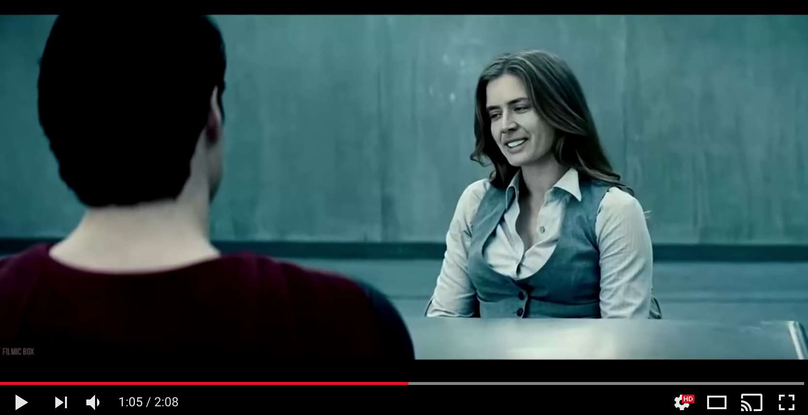
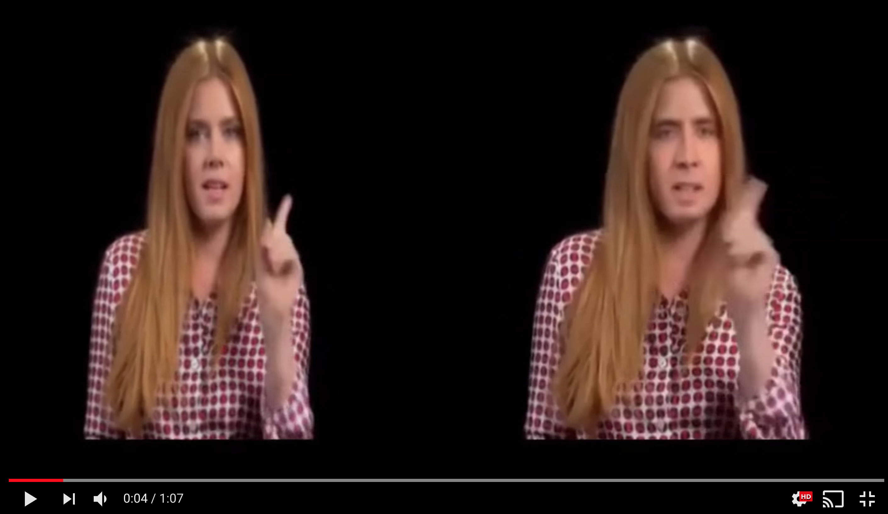

# 如何实现人工智能换脸DeepFake

- 作者：冯沁原
- 网站：[www.BitTiger.io](https://www.BitTiger.io)
- 邮箱：Qinyuan@BitTiger.io

## 简介

如果你是第一次听说DeepFake，一定要点击上面的视频，亲自感受一下尼古拉斯的脸是如何占据全世界的每一个影片。

让我们再来看一个歌唱版，仔细感受人物的表情和声音的同步，以及和原始视频的相似与差异。

是不是心动，想要自己也实现一个？那我们就开始吧。

## 基本原理

为了实现变脸，我们需要学习到一个函数能够把原始的脸变成目标的脸。我们要如何训练这个函数呢？收集大量的目标的脸的数据，然后把目标的脸扭曲了，最后训练模型把扭曲的脸恢复成目标的脸。因此，整个项目分为三个阶段：预处理、建模、应用。

### 预处理

在这个阶段，我们需要收集大量的视频或者图片，并且从中扣出目标的人脸。一个可用的库是Dlib，可以定位人脸，给出人脸的36个关键点坐标，从而计算人脸的角度，抠出摆正后的人脸。但是Dlib要求识别的必须是全脸，因此会减少我们的样本集以及一些特定的样本场景。同时，因为人脸是64*64像素的尺寸，因此也要处理清晰度的问题。

#### 定位人脸

### 建模

这里用的是比较标准的建模方式。值得注意的是，作者通过加入PixelShuffler()的函数把图像进行了一定的扭曲，而这个扭曲增加了学习的难度，反而让模型能够实现最终的效果。仔细想想这背后的道理，如果你一直在做简单的题目，那么必然不会有什么解决难题的能力。但是，我只要把题目做一些变体，就足以让你成长。

因为在建模中使用的是原图A的扭曲来还原A，应用中是用B来还原A，所以扭曲的方式会极大的影响到最终的结果。因此，如何选择更好的扭曲方式，也是一个重要的问题。

### 应用

当我们图片融合的时候，会有一个难题，如何又保证效果又放置图片抖动。

## 参考资料

- [深度解密换脸应用Deepfake](https://zhuanlan.zhihu.com/p/34042498)
- [Deepfakes的Github](https://github.com/deepfakes/faceswap)
- [Dlib C++ Library](http://dlib.net/)
- [FakeApp官方网站](https://www.fakeapp.org/)
- [DeepFakes FakeApp Tutorial](https://www.deepfakes.club/tutorial/)
- [DeepFakes解读](https://www.youtube.com/watch?v=7XchCsYtYMQ)
