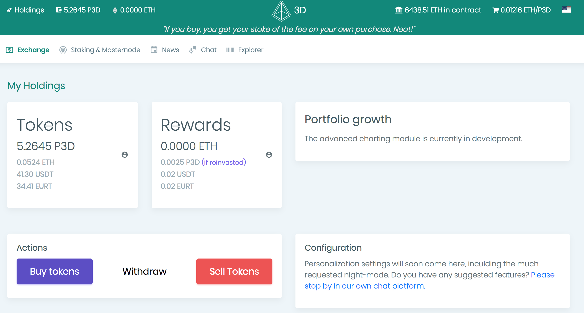
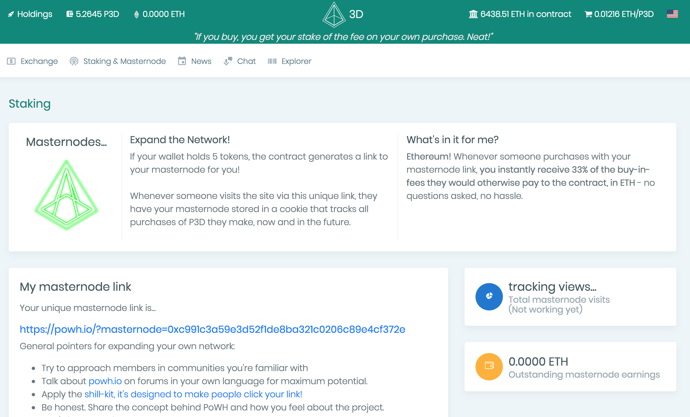
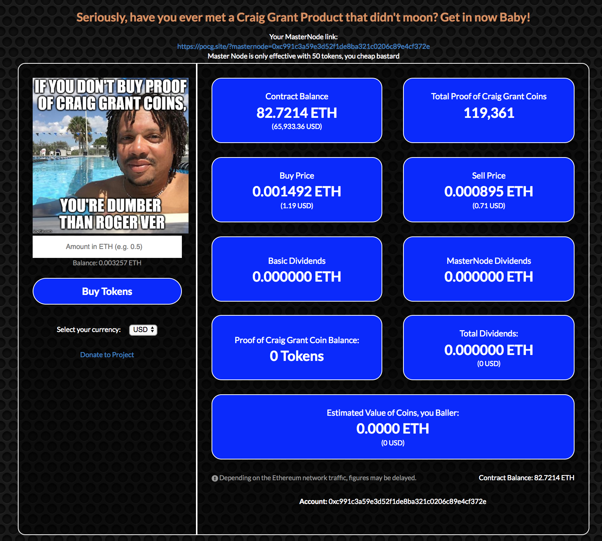
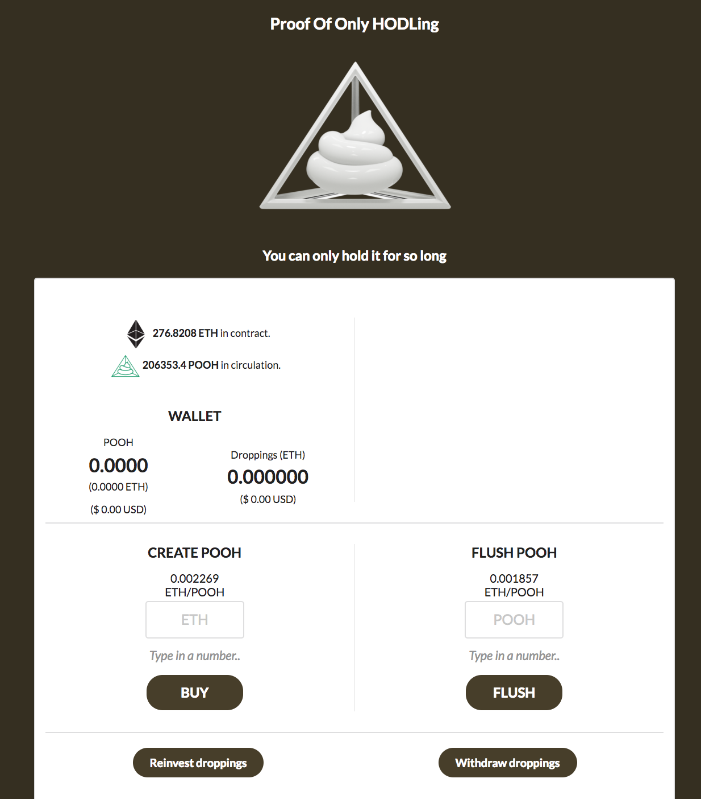

# 如何实现基于以太坊的旁氏骗局PoWH

Disclaimer: None of this is financial advice

- 作者：冯沁原
- 网站：[www.BitTiger.io](https://www.BitTiger.io)
- 原文：[github.com/Fabsqrt/BitTigerLab](https://github.com/Fabsqrt/BitTigerLab)
- 邮箱：Qinyuan@BitTiger.io

## POWH长什么样

（来源: [PoWH3D - exchange](https://exchange.powh.io/holdings)）

从图的左侧中部可以看出我拥有5.2645个P3D的token，我当前获得的reward是0.0025的P3D。从图的右上角可以看出当前系统一共拥有6438个ETH，当前每个token的价格是0.01216ETH。我们可以进行买、卖、提取的操作。


## 一个赌博的游戏

想象一个赌博的游戏，赌谁最后离手，赌谁更精通人性，赌谁更能操盘一手。

让我们看一看POWH的基本规则：

- 每当你买一个token，价格上涨到0.00000001ETH
- 每当你卖一个token，价格下降到0.00000001ETH
- 每次交易，都有10%的token分配给整个平台的已有的token持有者

现在是挑战你智商的时候了，如果系统中一共有50ETH，当前的价格是多少呢？

（来源: [PoWH3D - exchange](https://exchange.powh.io/my-masternode)）

进一步来说，如上图所示，当一个用户的token数到达5以后，他会获得一个特殊的地址，当有人通过这个地址购买的时候，该用户能够获得直接获得33%的交易费。说白了就是推荐费。

我更愿意把POWH理解成一个赌博，其实买彩票也是赌博，大多数的金融产品都是在赌博。在以太坊上跑着的自称金融产品、赌博产品或者游戏产品的形形色色的Dapp都在帮助我们更加认清金融的本质。

更有趣的是在区块链上的金融产品往往会给出自己的代码，也就是说我公开的告诉你这是一个"旁氏骗局"，你来判断你是否来玩。这是不是说明懂技术的人会更容易牟利呢？

## 起源

整个代码起源于[Jochen-Hoenicke](https://test.jochen-hoenicke.de/eth/ponzitoken/)（Trezor钱包的核心工程师），但是因为code中的一段bug，造成了[毁灭性的损失](https://blog.goodaudience.com/how-800k-evaporated-from-the-powh-coin-ponzi-scheme-overnight-1b025c33b530)。

```solidity

function sell(uint256 amount) internal {
    var numEthers = getEtherForTokens(amount);
    // remove tokens
    totalSupply -= amount;
    balanceOfOld[msg.sender] -= amount;

    // fix payouts and put the ethers in payout
    var payoutDiff = (int256) (earningsPerShare * amount + (numEthers * PRECISION));
    payouts[msg.sender] -= payoutDiff;
    totalPayouts -= payoutDiff;
}

```

具体来说，在上述代码中的第五行，使用了```msg.sender```。但是真正应该使用的是```_from```。这样造成的后果是，没有对```msg.sender```检测是否有足够的token。当一个攻击者从拥有0个token的钱包中发送1个token后，会形成数字越界，从而得到了拥有```2^256 — 1```个token的钱包。

在失败的基础上，新的代码被创建，于是有了PoWH3D。基于当下的统计，我们可以看到PoWH3D是以太坊当前日活跃第三大的Dapp。

（来源: [DappRadar](https://dappradar.com/)）


## HDT启示录

在一个虚拟社会，甚至对于很多的新技术，黄赌屠往往是他们最开始的应用。因为我们被贪婪所驱使。而当我们注视深渊的时候，深渊也在注视我们自己。

## 代码分析

整个项目的代码可以在[这里看到](https://etherscan.io/address/0xb3775fb83f7d12a36e0475abdd1fca35c091efbe#code)。

```solidity

pragma solidity ^0.4.20;

/*
* Team JUST presents..
* ====================================*
* _____     _ _ _ _____    ___ ____   *
*|  _  |___| | | |  |  |  |_  |    \  *
*|   __| . | | | |     |  |_  |  |  | *
*|__|  |___|_____|__|__|  |___|____/  *
*                                     *
* ====================================*
* -> What?
* The original autonomous pyramid, improved:
* [x] More stable than ever, having withstood severe testnet abuse and attack attempts from our community!.
* [x] Audited, tested, and approved by known community security specialists such as tocsick and Arc.
* [X] New functionality; you can now perform partial sell orders. If you succumb to weak hands, you don't have to dump all of your bags!
* [x] New functionality; you can now transfer tokens between wallets. Trading is now possible from within the contract!
* [x] New Feature: PoS Masternodes! The first implementation of Ethereum Staking in the world! Vitalik is mad.
* [x] Masternodes: Holding 100 PoWH3D Tokens allow you to generate a Masternode link, Masternode links are used as unique entry points to the contract!
* [x] Masternodes: All players who enter the contract through your Masternode have 30% of their 10% dividends fee rerouted from the master-node, to the node-master!
*
* -> What about the last projects?
* Every programming member of the old dev team has been fired and/or killed by 232.
* The new dev team consists of seasoned, professional developers and has been audited by veteran solidity experts.
* Additionally, two independent testnet iterations have been used by hundreds of people; not a single point of failure was found.
*
* -> Who worked on this project?
* - PonziBot (math/memes/main site/master)
* - Mantso (lead solidity dev/lead web3 dev)
* - swagg (concept design/feedback/management)
* - Anonymous#1 (main site/web3/test cases)
* - Anonymous#2 (math formulae/whitepaper)
*
* -> Who has audited & approved the projected:
* - Arc
* - tocisck
* - sumpunk
*/

contract Hourglass {
    /*=================================
    =            MODIFIERS            =
    =================================*/
    // only people with tokens
    modifier onlyBagholders() {
        require(myTokens() > 0);
        _;
    }

    // only people with profits
    modifier onlyStronghands() {
        require(myDividends(true) > 0);
        _;
    }

    // administrators can:
    // -> change the name of the contract
    // -> change the name of the token
    // -> change the PoS difficulty (How many tokens it costs to hold a masternode, in case it gets crazy high later)
    // they CANNOT:
    // -> take funds
    // -> disable withdrawals
    // -> kill the contract
    // -> change the price of tokens
    modifier onlyAdministrator(){
        address _customerAddress = msg.sender;
        require(administrators[keccak256(_customerAddress)]);
        _;
    }


    // ensures that the first tokens in the contract will be equally distributed
    // meaning, no divine dump will be ever possible
    // result: healthy longevity.
    modifier antiEarlyWhale(uint256 _amountOfEthereum){
        address _customerAddress = msg.sender;

        // are we still in the vulnerable phase?
        // if so, enact anti early whale protocol
        if( onlyAmbassadors && ((totalEthereumBalance() - _amountOfEthereum) <= ambassadorQuota_ )){
            require(
                // is the customer in the ambassador list?
                ambassadors_[_customerAddress] == true &&

                // does the customer purchase exceed the max ambassador quota?
                (ambassadorAccumulatedQuota_[_customerAddress] + _amountOfEthereum) <= ambassadorMaxPurchase_

            );

            // updated the accumulated quota    
            ambassadorAccumulatedQuota_[_customerAddress] = SafeMath.add(ambassadorAccumulatedQuota_[_customerAddress], _amountOfEthereum);

            // execute
            _;
        } else {
            // in case the ether count drops low, the ambassador phase won't reinitiate
            onlyAmbassadors = false;
            _;    
        }

    }


    /*==============================
    =            EVENTS            =
    ==============================*/
    event onTokenPurchase(
        address indexed customerAddress,
        uint256 incomingEthereum,
        uint256 tokensMinted,
        address indexed referredBy
    );

    event onTokenSell(
        address indexed customerAddress,
        uint256 tokensBurned,
        uint256 ethereumEarned
    );

    event onReinvestment(
        address indexed customerAddress,
        uint256 ethereumReinvested,
        uint256 tokensMinted
    );

    event onWithdraw(
        address indexed customerAddress,
        uint256 ethereumWithdrawn
    );

    // ERC20
    event Transfer(
        address indexed from,
        address indexed to,
        uint256 tokens
    );


    /*=====================================
    =            CONFIGURABLES            =
    =====================================*/
    string public name = "PowH3D";
    string public symbol = "P3D";
    uint8 constant public decimals = 18;
    uint8 constant internal dividendFee_ = 10;
    uint256 constant internal tokenPriceInitial_ = 0.0000001 ether;
    uint256 constant internal tokenPriceIncremental_ = 0.00000001 ether;
    uint256 constant internal magnitude = 2**64;

    // proof of stake (defaults at 100 tokens)
    uint256 public stakingRequirement = 100e18;

    // ambassador program
    mapping(address => bool) internal ambassadors_;
    uint256 constant internal ambassadorMaxPurchase_ = 1 ether;
    uint256 constant internal ambassadorQuota_ = 20 ether;


   /*================================
    =            DATASETS            =
    ================================*/
    // amount of shares for each address (scaled number)
    mapping(address => uint256) internal tokenBalanceLedger_;
    mapping(address => uint256) internal referralBalance_;
    mapping(address => int256) internal payoutsTo_;
    mapping(address => uint256) internal ambassadorAccumulatedQuota_;
    uint256 internal tokenSupply_ = 0;
    uint256 internal profitPerShare_;

    // administrator list (see above on what they can do)
    mapping(bytes32 => bool) public administrators;

    // when this is set to true, only ambassadors can purchase tokens (this prevents a whale premine, it ensures a fairly distributed upper pyramid)
    bool public onlyAmbassadors = true;


    /*=======================================
    =            PUBLIC FUNCTIONS            =
    =======================================*/
    /*
    * -- APPLICATION ENTRY POINTS --  
    */
    function Hourglass()
        public
    {
        // add administrators here
        administrators[0xdd8bb99b13fe33e1c32254dfb8fff3e71193f6b730a89dd33bfe5dedc6d83002] = true;

        // add the ambassadors here.
        // mantso - lead solidity dev & lead web dev.
        ambassadors_[0x8b4DA1827932D71759687f925D17F81Fc94e3A9D] = true;

        // ponzibot - mathematics & website, and undisputed meme god.
        ambassadors_[0x8e0d985f3Ec1857BEc39B76aAabDEa6B31B67d53] = true;

        // swagg - concept design, feedback, management.
        ambassadors_[0x7563A35d5610eE7c9CD330E255Da0e779a644C19] = true;

        // k-dawgz - shilling machine, meme maestro, bizman.
        ambassadors_[0x215e3C713BADb158A457e61f99325bBB5d278E57] = true;

        // elmojo - all those pretty .GIFs & memes you see? you can thank this man for that.
        ambassadors_[0xaFF8B5CDCB339eEf5e1100597740a394C7B9c6cA] = true;

        // capex - community moderator.
        ambassadors_[0x8dc6569c28521560EAF1890bC41b2F3FC2010E1b] = true;

        // jörmungandr - pentests & twitter trendsetter.
        ambassadors_[0xf14BE3662FE4c9215c27698166759Db6967De94f] = true;

        // inventor - the source behind the non-intrusive referral model.
        ambassadors_[0x18E90Fc6F70344f53EBd4f6070bf6Aa23e2D748C] = true;

        // tocsick - pentesting, contract auditing.
        ambassadors_[0x49Aae4D923207e80Fc91E626BCb6532502264dfC] = true;

        // arc - pentesting, contract auditing.
        ambassadors_[0x3a0cca1A832644B60730E5D4c27947C5De609d62] = true;

        // sumpunk - contract auditing.
        ambassadors_[0x7ac74Fcc1a71b106F12c55ee8F802C9F672Ce40C] = true;

        // randall - charts & sheets, data dissector, advisor.
        ambassadors_[0x2b219C2178f099dE4E9A3667d5cCc2cc64da0763] = true;

        // ambius - 3d chart visualization.
        ambassadors_[0x2A04C7335f90a6bd4e9c4F713DD792200e27F2E6] = true;

        // contributors that need to remain private out of security concerns.
        ambassadors_[0x35668818ba8F768D4C21787a6f45C86C69394dfD] = true; //dp
        ambassadors_[0xa3120da52e604aC3Fc80A63813Ef15476e0B6AbD] = true; //tc
        ambassadors_[0x924E71bA600372e2410285423F1Fe66799b717EC] = true; //ja
        ambassadors_[0x6Ed450e062C20F929CB7Ee72fCc53e9697980a18] = true; //sf
        ambassadors_[0x18864A6682c8EB79EEA5B899F11bC94ef9a85ADb] = true; //tb
        ambassadors_[0x9cC1BdC994b7a847705D19106287C0BF94EF04B5] = true; //sm
        ambassadors_[0x6926572813ec1438088963f208C61847df435a74] = true; //mc
        ambassadors_[0xE16Ab764a02Ae03681E351Ac58FE79717c0eE8C6] = true; //et
        ambassadors_[0x276F4a79F22D1BfC51Bd8dc5b27Bfd934C823932] = true; //sn
        ambassadors_[0xA2b4ed3E2f4beF09FB35101B76Ef4cB9D3eeCaCf] = true; //bt
        ambassadors_[0x147fc6b04c95BCE47D013c8d7a200ee434323669] = true; //al


    }


    /**
     * Converts all incoming ethereum to tokens for the caller, and passes down the referral addy (if any)
     */
    function buy(address _referredBy)
        public
        payable
        returns(uint256)
    {
        purchaseTokens(msg.value, _referredBy);
    }

    /**
     * Fallback function to handle ethereum that was send straight to the contract
     * Unfortunately we cannot use a referral address this way.
     */
    function()
        payable
        public
    {
        purchaseTokens(msg.value, 0x0);
    }

    /**
     * Converts all of caller's dividends to tokens.
     */
    function reinvest()
        onlyStronghands()
        public
    {
        // fetch dividends
        uint256 _dividends = myDividends(false); // retrieve ref. bonus later in the code

        // pay out the dividends virtually
        address _customerAddress = msg.sender;
        payoutsTo_[_customerAddress] +=  (int256) (_dividends * magnitude);

        // retrieve ref. bonus
        _dividends += referralBalance_[_customerAddress];
        referralBalance_[_customerAddress] = 0;

        // dispatch a buy order with the virtualized "withdrawn dividends"
        uint256 _tokens = purchaseTokens(_dividends, 0x0);

        // fire event
        onReinvestment(_customerAddress, _dividends, _tokens);
    }

    /**
     * Alias of sell() and withdraw().
     */
    function exit()
        public
    {
        // get token count for caller & sell them all
        address _customerAddress = msg.sender;
        uint256 _tokens = tokenBalanceLedger_[_customerAddress];
        if(_tokens > 0) sell(_tokens);

        // lambo delivery service
        withdraw();
    }

    /**
     * Withdraws all of the callers earnings.
     */
    function withdraw()
        onlyStronghands()
        public
    {
        // setup data
        address _customerAddress = msg.sender;
        uint256 _dividends = myDividends(false); // get ref. bonus later in the code

        // update dividend tracker
        payoutsTo_[_customerAddress] +=  (int256) (_dividends * magnitude);

        // add ref. bonus
        _dividends += referralBalance_[_customerAddress];
        referralBalance_[_customerAddress] = 0;

        // lambo delivery service
        _customerAddress.transfer(_dividends);

        // fire event
        onWithdraw(_customerAddress, _dividends);
    }

    /**
     * Liquifies tokens to ethereum.
     */
    function sell(uint256 _amountOfTokens)
        onlyBagholders()
        public
    {
        // setup data
        address _customerAddress = msg.sender;
        // russian hackers BTFO
        require(_amountOfTokens <= tokenBalanceLedger_[_customerAddress]);
        uint256 _tokens = _amountOfTokens;
        uint256 _ethereum = tokensToEthereum_(_tokens);
        uint256 _dividends = SafeMath.div(_ethereum, dividendFee_);
        uint256 _taxedEthereum = SafeMath.sub(_ethereum, _dividends);

        // burn the sold tokens
        tokenSupply_ = SafeMath.sub(tokenSupply_, _tokens);
        tokenBalanceLedger_[_customerAddress] = SafeMath.sub(tokenBalanceLedger_[_customerAddress], _tokens);

        // update dividends tracker
        int256 _updatedPayouts = (int256) (profitPerShare_ * _tokens + (_taxedEthereum * magnitude));
        payoutsTo_[_customerAddress] -= _updatedPayouts;       

        // dividing by zero is a bad idea
        if (tokenSupply_ > 0) {
            // update the amount of dividends per token
            profitPerShare_ = SafeMath.add(profitPerShare_, (_dividends * magnitude) / tokenSupply_);
        }

        // fire event
        onTokenSell(_customerAddress, _tokens, _taxedEthereum);
    }


    /**
     * Transfer tokens from the caller to a new holder.
     * Remember, there's a 10% fee here as well.
     */
    function transfer(address _toAddress, uint256 _amountOfTokens)
        onlyBagholders()
        public
        returns(bool)
    {
        // setup
        address _customerAddress = msg.sender;

        // make sure we have the requested tokens
        // also disables transfers until ambassador phase is over
        // ( we dont want whale premines )
        require(!onlyAmbassadors && _amountOfTokens <= tokenBalanceLedger_[_customerAddress]);

        // withdraw all outstanding dividends first
        if(myDividends(true) > 0) withdraw();

        // liquify 10% of the tokens that are transfered
        // these are dispersed to shareholders
        uint256 _tokenFee = SafeMath.div(_amountOfTokens, dividendFee_);
        uint256 _taxedTokens = SafeMath.sub(_amountOfTokens, _tokenFee);
        uint256 _dividends = tokensToEthereum_(_tokenFee);

        // burn the fee tokens
        tokenSupply_ = SafeMath.sub(tokenSupply_, _tokenFee);

        // exchange tokens
        tokenBalanceLedger_[_customerAddress] = SafeMath.sub(tokenBalanceLedger_[_customerAddress], _amountOfTokens);
        tokenBalanceLedger_[_toAddress] = SafeMath.add(tokenBalanceLedger_[_toAddress], _taxedTokens);

        // update dividend trackers
        payoutsTo_[_customerAddress] -= (int256) (profitPerShare_ * _amountOfTokens);
        payoutsTo_[_toAddress] += (int256) (profitPerShare_ * _taxedTokens);

        // disperse dividends among holders
        profitPerShare_ = SafeMath.add(profitPerShare_, (_dividends * magnitude) / tokenSupply_);

        // fire event
        Transfer(_customerAddress, _toAddress, _taxedTokens);

        // ERC20
        return true;

    }

    /*----------  ADMINISTRATOR ONLY FUNCTIONS  ----------*/
    /**
     * In case the amassador quota is not met, the administrator can manually disable the ambassador phase.
     */
    function disableInitialStage()
        onlyAdministrator()
        public
    {
        onlyAmbassadors = false;
    }

    /**
     * In case one of us dies, we need to replace ourselves.
     */
    function setAdministrator(bytes32 _identifier, bool _status)
        onlyAdministrator()
        public
    {
        administrators[_identifier] = _status;
    }

    /**
     * Precautionary measures in case we need to adjust the masternode rate.
     */
    function setStakingRequirement(uint256 _amountOfTokens)
        onlyAdministrator()
        public
    {
        stakingRequirement = _amountOfTokens;
    }

    /**
     * If we want to rebrand, we can.
     */
    function setName(string _name)
        onlyAdministrator()
        public
    {
        name = _name;
    }

    /**
     * If we want to rebrand, we can.
     */
    function setSymbol(string _symbol)
        onlyAdministrator()
        public
    {
        symbol = _symbol;
    }


    /*----------  HELPERS AND CALCULATORS  ----------*/
    /**
     * Method to view the current Ethereum stored in the contract
     * Example: totalEthereumBalance()
     */
    function totalEthereumBalance()
        public
        view
        returns(uint)
    {
        return this.balance;
    }

    /**
     * Retrieve the total token supply.
     */
    function totalSupply()
        public
        view
        returns(uint256)
    {
        return tokenSupply_;
    }

    /**
     * Retrieve the tokens owned by the caller.
     */
    function myTokens()
        public
        view
        returns(uint256)
    {
        address _customerAddress = msg.sender;
        return balanceOf(_customerAddress);
    }

    /**
     * Retrieve the dividends owned by the caller.
     * If `_includeReferralBonus` is to to 1/true, the referral bonus will be included in the calculations.
     * The reason for this, is that in the frontend, we will want to get the total divs (global + ref)
     * But in the internal calculations, we want them separate.
     */
    function myDividends(bool _includeReferralBonus)
        public
        view
        returns(uint256)
    {
        address _customerAddress = msg.sender;
        return _includeReferralBonus ? dividendsOf(_customerAddress) + referralBalance_[_customerAddress] : dividendsOf(_customerAddress) ;
    }

    /**
     * Retrieve the token balance of any single address.
     */
    function balanceOf(address _customerAddress)
        view
        public
        returns(uint256)
    {
        return tokenBalanceLedger_[_customerAddress];
    }

    /**
     * Retrieve the dividend balance of any single address.
     */
    function dividendsOf(address _customerAddress)
        view
        public
        returns(uint256)
    {
        return (uint256) ((int256)(profitPerShare_ * tokenBalanceLedger_[_customerAddress]) - payoutsTo_[_customerAddress]) / magnitude;
    }

    /**
     * Return the buy price of 1 individual token.
     */
    function sellPrice()
        public
        view
        returns(uint256)
    {
        // our calculation relies on the token supply, so we need supply. Doh.
        if(tokenSupply_ == 0){
            return tokenPriceInitial_ - tokenPriceIncremental_;
        } else {
            uint256 _ethereum = tokensToEthereum_(1e18);
            uint256 _dividends = SafeMath.div(_ethereum, dividendFee_  );
            uint256 _taxedEthereum = SafeMath.sub(_ethereum, _dividends);
            return _taxedEthereum;
        }
    }

    /**
     * Return the sell price of 1 individual token.
     */
    function buyPrice()
        public
        view
        returns(uint256)
    {
        // our calculation relies on the token supply, so we need supply. Doh.
        if(tokenSupply_ == 0){
            return tokenPriceInitial_ + tokenPriceIncremental_;
        } else {
            uint256 _ethereum = tokensToEthereum_(1e18);
            uint256 _dividends = SafeMath.div(_ethereum, dividendFee_  );
            uint256 _taxedEthereum = SafeMath.add(_ethereum, _dividends);
            return _taxedEthereum;
        }
    }

    /**
     * Function for the frontend to dynamically retrieve the price scaling of buy orders.
     */
    function calculateTokensReceived(uint256 _ethereumToSpend)
        public
        view
        returns(uint256)
    {
        uint256 _dividends = SafeMath.div(_ethereumToSpend, dividendFee_);
        uint256 _taxedEthereum = SafeMath.sub(_ethereumToSpend, _dividends);
        uint256 _amountOfTokens = ethereumToTokens_(_taxedEthereum);

        return _amountOfTokens;
    }

    /**
     * Function for the frontend to dynamically retrieve the price scaling of sell orders.
     */
    function calculateEthereumReceived(uint256 _tokensToSell)
        public
        view
        returns(uint256)
    {
        require(_tokensToSell <= tokenSupply_);
        uint256 _ethereum = tokensToEthereum_(_tokensToSell);
        uint256 _dividends = SafeMath.div(_ethereum, dividendFee_);
        uint256 _taxedEthereum = SafeMath.sub(_ethereum, _dividends);
        return _taxedEthereum;
    }


    /*==========================================
    =            INTERNAL FUNCTIONS            =
    ==========================================*/
    function purchaseTokens(uint256 _incomingEthereum, address _referredBy)
        antiEarlyWhale(_incomingEthereum)
        internal
        returns(uint256)
    {
        // data setup
        address _customerAddress = msg.sender;
        uint256 _undividedDividends = SafeMath.div(_incomingEthereum, dividendFee_);
        uint256 _referralBonus = SafeMath.div(_undividedDividends, 3);
        uint256 _dividends = SafeMath.sub(_undividedDividends, _referralBonus);
        uint256 _taxedEthereum = SafeMath.sub(_incomingEthereum, _undividedDividends);
        uint256 _amountOfTokens = ethereumToTokens_(_taxedEthereum);
        uint256 _fee = _dividends * magnitude;

        // no point in continuing execution if OP is a poorfag russian hacker
        // prevents overflow in the case that the pyramid somehow magically starts being used by everyone in the world
        // (or hackers)
        // and yes we know that the safemath function automatically rules out the "greater then" equasion.
        require(_amountOfTokens > 0 && (SafeMath.add(_amountOfTokens,tokenSupply_) > tokenSupply_));

        // is the user referred by a masternode?
        if(
            // is this a referred purchase?
            _referredBy != 0x0000000000000000000000000000000000000000 &&

            // no cheating!
            _referredBy != _customerAddress &&

            // does the referrer have at least X whole tokens?
            // i.e is the referrer a godly chad masternode
            tokenBalanceLedger_[_referredBy] >= stakingRequirement
        ){
            // wealth redistribution
            referralBalance_[_referredBy] = SafeMath.add(referralBalance_[_referredBy], _referralBonus);
        } else {
            // no ref purchase
            // add the referral bonus back to the global dividends cake
            _dividends = SafeMath.add(_dividends, _referralBonus);
            _fee = _dividends * magnitude;
        }

        // we can't give people infinite ethereum
        if(tokenSupply_ > 0){

            // add tokens to the pool
            tokenSupply_ = SafeMath.add(tokenSupply_, _amountOfTokens);

            // take the amount of dividends gained through this transaction, and allocates them evenly to each shareholder
            profitPerShare_ += (_dividends * magnitude / (tokenSupply_));

            // calculate the amount of tokens the customer receives over his purchase
            _fee = _fee - (_fee-(_amountOfTokens * (_dividends * magnitude / (tokenSupply_))));

        } else {
            // add tokens to the pool
            tokenSupply_ = _amountOfTokens;
        }

        // update circulating supply & the ledger address for the customer
        tokenBalanceLedger_[_customerAddress] = SafeMath.add(tokenBalanceLedger_[_customerAddress], _amountOfTokens);

        // Tells the contract that the buyer doesn't deserve dividends for the tokens before they owned them;
        //really i know you think you do but you don't
        int256 _updatedPayouts = (int256) ((profitPerShare_ * _amountOfTokens) - _fee);
        payoutsTo_[_customerAddress] += _updatedPayouts;

        // fire event
        onTokenPurchase(_customerAddress, _incomingEthereum, _amountOfTokens, _referredBy);

        return _amountOfTokens;
    }

    /**
     * Calculate Token price based on an amount of incoming ethereum
     * It's an algorithm, hopefully we gave you the whitepaper with it in scientific notation;
     * Some conversions occurred to prevent decimal errors or underflows / overflows in solidity code.
     */
    function ethereumToTokens_(uint256 _ethereum)
        internal
        view
        returns(uint256)
    {
        uint256 _tokenPriceInitial = tokenPriceInitial_ * 1e18;
        uint256 _tokensReceived =
         (
            (
                // underflow attempts BTFO
                SafeMath.sub(
                    (sqrt
                        (
                            (_tokenPriceInitial**2)
                            +
                            (2*(tokenPriceIncremental_ * 1e18)*(_ethereum * 1e18))
                            +
                            (((tokenPriceIncremental_)**2)*(tokenSupply_**2))
                            +
                            (2*(tokenPriceIncremental_)*_tokenPriceInitial*tokenSupply_)
                        )
                    ), _tokenPriceInitial
                )
            )/(tokenPriceIncremental_)
        )-(tokenSupply_)
        ;

        return _tokensReceived;
    }

    /**
     * Calculate token sell value.
     * It's an algorithm, hopefully we gave you the whitepaper with it in scientific notation;
     * Some conversions occurred to prevent decimal errors or underflows / overflows in solidity code.
     */
     function tokensToEthereum_(uint256 _tokens)
        internal
        view
        returns(uint256)
    {

        uint256 tokens_ = (_tokens + 1e18);
        uint256 _tokenSupply = (tokenSupply_ + 1e18);
        uint256 _etherReceived =
        (
            // underflow attempts BTFO
            SafeMath.sub(
                (
                    (
                        (
                            tokenPriceInitial_ +(tokenPriceIncremental_ * (_tokenSupply/1e18))
                        )-tokenPriceIncremental_
                    )*(tokens_ - 1e18)
                ),(tokenPriceIncremental_*((tokens_**2-tokens_)/1e18))/2
            )
        /1e18);
        return _etherReceived;
    }


    //This is where all your gas goes, sorry
    //Not sorry, you probably only paid 1 gwei
    function sqrt(uint x) internal pure returns (uint y) {
        uint z = (x + 1) / 2;
        y = x;
        while (z < y) {
            y = z;
            z = (x / z + z) / 2;
        }
    }
}

/**
 * @title SafeMath
 * @dev Math operations with safety checks that throw on error
 */
library SafeMath {

    /**
    * @dev Multiplies two numbers, throws on overflow.
    */
    function mul(uint256 a, uint256 b) internal pure returns (uint256) {
        if (a == 0) {
            return 0;
        }
        uint256 c = a * b;
        assert(c / a == b);
        return c;
    }

    /**
    * @dev Integer division of two numbers, truncating the quotient.
    */
    function div(uint256 a, uint256 b) internal pure returns (uint256) {
        // assert(b > 0); // Solidity automatically throws when dividing by 0
        uint256 c = a / b;
        // assert(a == b * c + a % b); // There is no case in which this doesn't hold
        return c;
    }

    /**
    * @dev Substracts two numbers, throws on overflow (i.e. if subtrahend is greater than minuend).
    */
    function sub(uint256 a, uint256 b) internal pure returns (uint256) {
        assert(b <= a);
        return a - b;
    }

    /**
    * @dev Adds two numbers, throws on overflow.
    */
    function add(uint256 a, uint256 b) internal pure returns (uint256) {
        uint256 c = a + b;
        assert(c >= a);
        return c;
    }
}

```
## Copycat

有人的地方就有COPY，毕竟我们都有镜像神经元。对这段历史感兴趣的朋友可以学习[这段视频](https://www.youtube.com/watch?v=_N-prO0FRxU)。下面就是两个鲜活的例子。

（来源: [Proof of Craig Grant Coin](https://pocg.site/coin)）
（来源: [Proof Of Only HODLing](https://www.number2.io/buy.html)）

## 对未来的预判

如果把整个过程想象成一个数学模型，什么时候入手，什么时候出手才能最大化利润呢？


## 参考资料

- [POWH3D](https://powh.io/)
